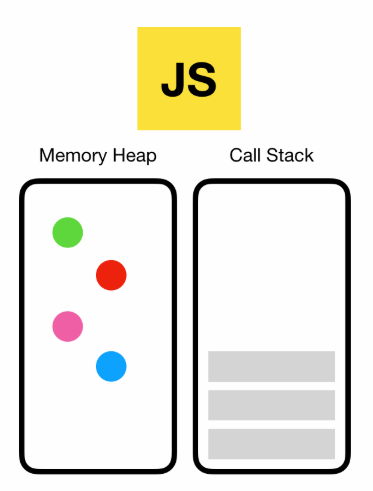
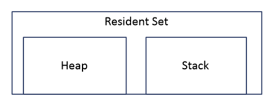
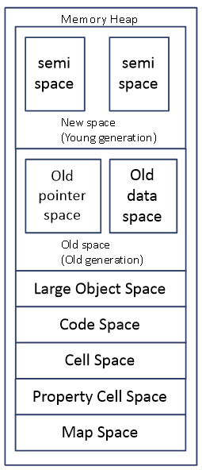
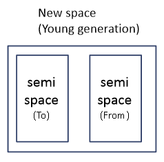
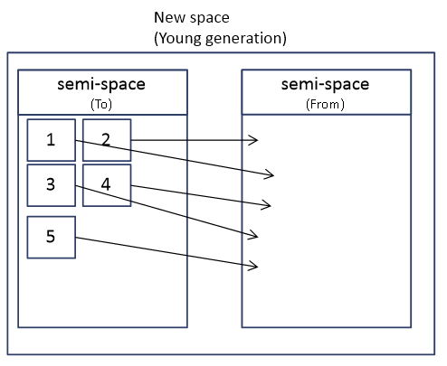
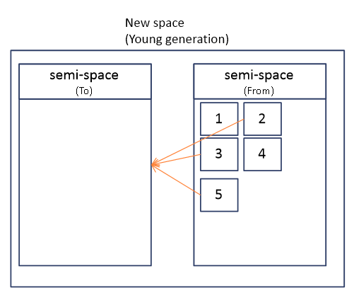
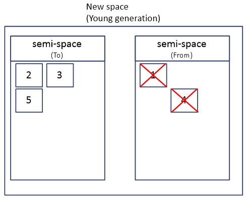
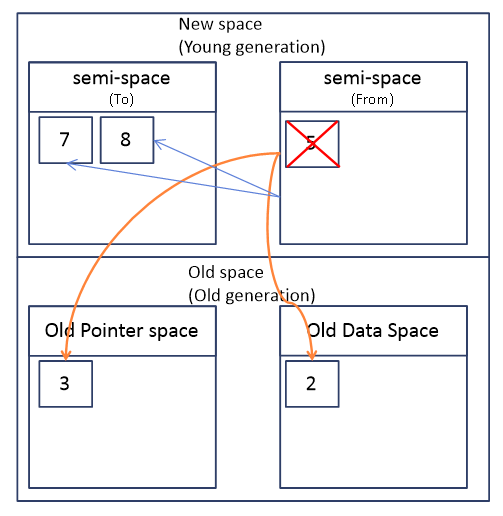

 

자바스크립트 엔진이라고 하면 위 그림과 같이 메모리 힙과 콜 스택으로 나뉘게 된다.
자바스크립트 엔진 중 하나인 V8의 메모리 구조에 대해 알아보기 전에 Stack 메모리와 Heap 메모리에 대해 간단히 짚고 넘어가보자.

### 1. Stack 메모리

우선 스택 메모리이다. 
스택 메모리는 주로 정적 메모리 할당에 이용된다.
이 스택 메모리에 함수에 대한 실행 데이터같은게 들어가는데, 이는 스택 프레임으로 저장된다.
각 스택 프레임은 해당 기능에 필요한 데이터가 저장되는 그런 블록으로, 실행 컨텍스트와 그 안의 변수 객체를 떠올리면 될 듯 하다.
다중 스레드 어플리케이션의 경우 스레드 당 스택메모리를 하나씩 가질 수 있다.
(자바스크립트의 경우 싱글스레드기에 스택메모리를 하나만 가진다고 보면 된다. 그게 콜 스택이다.)

### 2. Heap 메모리

이 힙 메모리는 동적 메모리 할당에 이용되는데, 주로 포인터를 사용하여 데이터를 조회하고, 스택보다 훨씬 많은 데이터의 저장이 가능하다.
일반적으로 힙 메모리에는 전역 변수, 객체, 문자열, 맵 등과 같은 참조 유형들이 저장되는데, 관리하기 굉장히 까다로워서 이 힙 메모리 부분은 자동으로 메모리 관리가 이루어진다.

### 3. V8의 메모리 구조

우선 V8로 어떠한 프로그램이 실행되고있다고 해보자. 이 프로그램은 당연히 메모리의 빈 공간에 할당될 것이다.
이 할당된 공간을 "Resident Set"이라고 부른다. 이 Resident Set을 V8은 여러가지 세그먼트로 나누게 되는데, 크게 보자면 힙 메모리와 스택 메모리이다.

 

위에서 말했던 것처럼 Heap 세그먼트의 경우 위에서 설명했던 Heap 메모리이다.
Stack 세그먼트의 경우 위에서 설명했던 Stack메모리이고, Execute Context가 들어가는 Call Stack을 생각하면 될 듯 하다.

여기서 Heap Memory를 자세히 한번 들여다보자.

 

위에서 이야기했던 것처럼 힙 메모리에 객체 등과 같은 동적인 데이터들이 저장된다.
그렇기에 가바지컬렉션 또한 이 곳에서 발생한다.(물론 New space와 Old Space에서만 발생한다.)
각 부분이 어떤 역할을 하는지 대강 알아보자.
밑에서부터 Map Space, Property Cell Space, Cell Space는 종류에 맞는 객체들을 분류해서 가지고있기 편하게 하는 역할을 하는 공간정도로 보면 된다.
Code Space는 실행될 실제 코드가 들어가는 부분이라고 보면 된다. JIT컴파일된 코드가 들어가있으며, 유일하게 실행 가능한 메모리가 있는 영역이다.
Large Object Space는 이름 그대로 좀 크기가 큰 객체가 들어가는 부분이다. 이 부분은 가비지컬렉션이 되지 않는다.

신경써서 보아야 할 부분은 New Space와 Old Space다.
New Space(Young generation)은 새로 만들어진 모든 객체가 우선 저장되는 곳이다.
이곳에 저장되는 객체들은 생명주기가 굉장히 짧고 위 그림처럼 2개의 semi-space로 이루어져 있다.
이 영억은 minor GC가 관리한다.

Old space(Old generation)은 마이너 GC가 두 번 발생한 뒤에 New space에서 남아있는 객체가 이동하는 곳이다. 이 영역은 Major GC가 관리한다.
이 Old Space는 Old pointer space와 Old data space라는 2개의 영역으로 나누어지는데, 이름에서 알 수 있듯 Old pointer space는 살아남은 객체들 중 다른 객체들을 참조하는 객체들이 들어가는 곳이고 
OId data space는 살아남은 객체들 중 데이터만 가진 객체들이 들어가는 곳이다. 데이터만 가졌다는 것은 다른 객체를 참조하지 않는 것들을 말하는데, 예를 들자면 문자열 등과 같은 것들을 말한다.

### 4. 가비지컬렉션(Garbage Collection) 동작원리

위 내용들을 보면 알 수 있겠지만 가비지컬렉션은 2번에 걸쳐 일어난다.
New Space와 Old Space에서 따로 일어나는데, 먼저 New Space에서 일어나는 GC부터 한번 알아보자.
V8의 New Space에서 일어나는 Minor GC는 체니의 알고리즘(Cheney's Algorithm)으로 구현되었는데, 
지금부터 쓰인 내용이 그냥 체니의 알고리즘이구나 생각하면 될 듯 하다.

 

위 그림은 아까 위 힙 메모리에서 봤던 New Space다. 그림처럼 이 New Space는 크기가 동일한 2개의 semi-space로 나누어져 있는데, 이 동일한 두 영역을 각각 To와 From이라는 이름으로 나누게 된다.
우리가 객체를 만들면 대부분 To영역인 Semi-space로 이동하게 된다.
객체들을 막 만들다가 To영역인 semi-space가 객체를 더 수용할 수 없는 상황이라고 해보자.

 

이런 상황이 발생하면 우선 마이너GC는 To영역인 semi-space에 있던 모든 객체를 From 영역인 semi-space으로 이동시킨다.
이후 마이너 GC는 GC 루트부터 From 영역인 semi-space 끝까지 객체 그래프를 순회하면서 메모리를 사용한 객체들을 전부 찾아낸다. (DFS 알고리즘을 생각하면 될 듯 하다.) 

 

여기서 찾아진 객체들은 모두 To 영역인 semi-space로 이동하게 된다.
이후 마지막 객체까지 찾아 옮기면 To영역인 semi-space는 자동으로 압축을 해서 조각화를 줄이게 된다.

 

여기서 From영역인 semi-space에 남은 객체들은 가비지로 인식하고 마이너 GC가 From영역인 semi-space를 통째로 비워버린다.
이후 새로운 객체들이 막 할당이 되었다고 해보자.
새로운 객체들이기 때문에 다시 To영역인 semi-space에 할당이 될 것이다.
그러다 이번에도 To영역인 semi-space에 더이상 할당 불가능해졌다고 해보자.
이렇게 되면 아까처럼 마이너GC가 객체들을 From → To로 이동시키고 제거하고 옮기는 과정을 거친다.
여기서 아까와의 차이점은 2번째 마이너GC에서 살아남은 객체들이 Old Space(Old generation)으로 이동한다는 것이다.

 

 

 

이후 From인 semi-space에 남아있는 객체들은 가비지로 인식하고 모두 제거된다.
이 과정이 마이너GC 과정이고, 이 과정은 Scavenger(스케벤져)라는 stop-the-world 프로세스가 작업하게 된다. 
stop-the-world 프로세스지만, 굉장히 빠르기에 무시 가능한 정도이다.

 

이제 Old Space에서 일어나는 Major GC에 대해 알아보자.
Major GC는 당연히 Old space가 가득 찼을 때 발생하게 된다.
Major GC는 Mark-sweep알고리즘과 Mark-compact 알고리즘으로 동작하게 된다. (큰 차이는 없다.)
이 알고리즘들은 DFS로 수행이 된다. 그리고 알고리즘 이름에서 알 수 있듯, 이 Mark-Sweep 알고리즘은 Marking 페이즈와 Sweep페이즈로 나누어져 있다.
우선 Marking 페이즈는 말 그대로 마킹하는 페이즈이다.
DFS로 수행하며 White, Gray, Black으로 마킹을 하는데,
White는 GC가 아직 탐색하지 못했다는 것을 의미하고, Gray는 GC가 탐색은 했으나 참조하고 있는 객체가 있는지 확인을 아직 안한상태임을 의미하고, Black은 참조하고 있는 객체까지 확인을 한 상태임을 의미한다.
 

우선 모든 객체는 White로 시작한다. 이후 객체를 찾으며 Gray로 마킹한 뒤 이 Gray로 마킹된 객체는 deque에 넣는다. 이후 deque에 있는 객체들을 하나씩 빼며 확인을 하고 Black으로 마킹힌다.(Black으로 마킹하는 이유는 참조하고있는 객체까지 완료했음을 기록하기 위함이다.) 
이후 Gray로 마킹된 객체가 deque에서 모두 빠지면 Marking phase가 끝난다.
 

이제 Marking phase가 끝나면 Sweep phase가 시작된다.
Marking phase는 DFS로 수행되기에 가비지의 경우 회색으로 마킹조차 되지 않았을 것이다.
이 Sweep 페이즈에서는 하얀색으로 남아있는 객체들을 모두 제거한다.
이후 모든 객체의 마킹 정보를 지운다.

 

이렇게 Sweep phase가 끝나면 Compact phase가 시작된다.
(Mark-sweep과 Mark-Compact의 유일한 차이점이다.)
Compact phase를 진행하는 이유는 메모리가 조각나는 상황인 Fragmentation 현상을 막으며 추가적인 메모리를 확보하기 위함이다.
컴퓨터에서 디스크 조각 모음같은거 하는 것을 떠올리면 될 듯 하다.

 

마지막으로 GC 알고리즘들을 보면 알 수 있겠지만, 참조라는 개념이 굉장히 중요하다.
자바스크립트의 경우 "객체"라는 것을 일반적인 객체보다 더 확장된 범위로 생각해야 할 듯 하다.(함수 범위 등으로) JS 객체는 prototype같은 절대적인 참조나 속성값같은 지정 가능한 참조가 있기 때문이다.