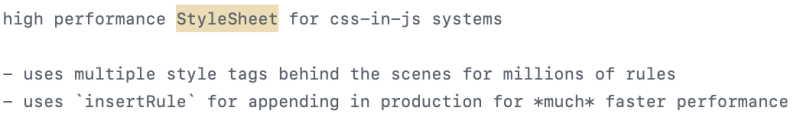

React를 사용하다보면 CSS-In-JS 라이브러리들을 자주 사용하곤 한다.
대표적으로 styled-components, emotion 등을 사용하곤 하는데, 이 라이브러리들을 사용하다 문득 CSS-In-JS 라이브러리는 어떻게 동작하는지 궁금해졌다.

평소 css in js 라이브러리 중 개인적으로 가장 선호하는 emotion의 오픈소스도 뜯어볼 겸 동작원리를 한번 알아보고자 하였다.

참고로 이 글은 오픈소스와 예제 코드를 왔다갔다하며 작성된지라 글이 조금 장황하다.
따라서 글 전체적인 내용 정리는 마지막에 간단하게 추려뒀다.

<hr/>

### 1. CSS-In-JS(Emotion)라이브러리는 어떻게 동작할까?

우선 css함수를 사용해 만든 컴포넌트를 콘솔로 찍어보았다.

​라이브러리 다운받기 피곤하니 deno를 이용하였다.

```js
import { css } from "https://esm.sh/@emotion/css"

const hello = css`
  color: red;
`

console.log(hello)
```

 
<br/><br/>

분명 우리는 hello라는 변수에 css`color:red`를 넣었고, 콘솔로 찍었다.
그랬더니 누가봐도 className같은 문자열이 나왔다.

여기서 특이한점은 **3번을 시도했는데 모두 멱등한 값이 출력되었다는 점이다.**

이건 우연일 수 없는 결과값이다.
번들링했을 때와 런타임 상에서 동일한 ClassName을 사용할 수 있는 환경을 만들고자했던 이유 때문인지, 무언가가 우리가 사용하는 값을 캐싱하여 그대로 반환하는게 분명했다.

그렇게 캐시관련된 소스코드가 있나 뒤져보니 아래 코드를 찾을 수 있었다.
https://github.com/emotion-js/emotion/blob/main/packages/cache/src/index.js

|  |  |
| --------------------------------- | --------------------------------- |

@emotion/cache의 index.js인데, createCache라는 함수를 default export하고 있었다.

바로 사용해봤다.
그냥 캐시만 만들고, 키에 css만 넣어줬다. (실제 오픈소스 내에서 이렇게 사용하더라)

```js
import createCache from "https://esm.sh/@emotion/cache"

const newCache = createCache({ key: "css" })
console.log(newCache)
```

 
<br/><br/>

그럼 우리가 위에서 css를 이용해 만들었던것에 대한 캐시도 있지 않을까?
역시나 이것도 오픈소스에서 찾을 수 있었다.

https://github.com/emotion-js/emotion/blob/main/packages/css/src/create-instance.js

아래와 같이 createEmotion함수를 만들 때 createCache라는 키워드가 등장해서 봤더니 우리가 위에서 사용했던 createCache를 사용하는 중이었다.

 
 
<br/>
<br/>

이번에도 바로 소스코드 콘솔에 찍어봤다.

```js
import { cache, css } from "https://esm.sh/@emotion/css"

const hello = css`
  color: red;
`

console.log(cache)
```

역시나 위에서 봤던 형태의 캐시 객체가 나왔다.

 
<br/><br/>

차이점이라고 하면 inserted와 registered에 우리가 만든 클래스명이 들어가있다는 점이다.

그럼 이 객체는 뭐하는 객체일까?
객체가 어디서 어떻게 생성되는지 궁금하여 찾아봤다.

이는 아래 코드에서 찾을 수 있었다.

https://github.com/emotion-js/emotion/blob/main/packages/sheet/src/index.js#L65

 
<br/><br/>

위와 같이 생겼는데, 여기서 우리가 관심있게 봐야 할 부분은 바로 "isSpeedy" 부분이다.

isSpeedy가 영향을 끼치는 코드는 아래 코드이다.

 
<br/><br/>

하나의 스타일 태그에 최대로 들어갈 수 있는 rule의 수이다.

위에있던 코드와 엮어보면 production모드일때 한 스타일태그에 들어갈 수 있는 rule의 수는 65000개까지, 그게 아니라면 1개가 되는 것이다.

이게 어떤 영향을 끼치냐?
dev와 prod에서 하나씩 보자.

아래는 dev환경일때의 상황이다.

 
<br/><br/>

isSpeedy flag가 false라서 한 스타일태그에 들어갈 수 있는 rule의 수가 1개라서 스타일태그가 엄청나게 생긴 상황이다.

그렇다면 production은 어떨까?

 
<br/><br/>

3개밖에 없는데, 안에 내용이 없다. 무슨 이유일까?

이 이유도 소스코드 주석에서 찾을 수 있었다.

 
<br/><br/>

dev환경에서는 수백만개의 rule들을 무난하게 관리하기 위해 style태그를 여러 개 두며 관리하고, 프로덕션 환경에서는 insertRule을 이용해 직접 CSSOM에 집어넣는 방식으로 동작한다고 한다.

참고로, 이 방식은 Emotion뿐만 아니라 Styled-Components도 동일하게 동작한다.

<hr/>

### \* CSSOM에 직접 집어넣는게 왜 성능상 더 좋다는 이야기일까?

생각해보면 dev에서도 insertRule으로 넣어버리면 동적으로 삽입된 스타일에 대한 디버깅부터 쉽지 않을 것이다.
그렇다면 CSSOM에 직접 집어넣는게 왜 성능상 더 좋다는 이야기일까?

내가 가진 브라우저에 대한 지식을 기반으로 유추해보자면 아래와 같은 이유가 아닐까 싶다.

"DOM"이란 브라우저의 렌더링 엔진 내에 존재하는 트리 형태로 이루어진 자료구조이다.
C++로 짜여져있는데, 브라우저는 html 텍스트를 읽어 `<style>`태그를 읽을 때는 스타일 과정으로 잠깐 넘어가 분석만 진행하게 된다.
아래는 실제로 크로미움팀에 물어봤던 내용이다.

 
<br/><br/>

head부분을 읽더라도 style태그를 만날 것이기에 style태그가 추가되거나 제거되면 html파싱 자체를 추가적으로 더 한다고 봐야한다.
style태그인지 뭔지 모르기에 일단 읽어야 하기 떄문이다.

그런데 CSSOM에 직접 주입하는 형태라면?

 
<br/><br/>

위와 같이, 기존에 존재하는 CSSOM에 주입만 해버리는 것이다.
애초에 DOM자체에 무언가 생길 일이 없는데 HTML을 다시 Parse할 이유가 있을까?
당연히 없다. 해야할 일 하나가 완전히 줄어드니 당연히 성능상 이점이 있다고 본다.

 
<br/><br/>

참고로 CSSRule이라는건 Blink엔진에서 처리되는 저 Rule을 뜻한다.

<hr/>

다시 소스코드 밖으로 나오자.
아까 위에서 작성했던 코드가 있을 것이다.

```js
import { css } from "https://esm.sh/@emotion/css"

const hello = css`
  color: red;
`
```

이 소스코드이다.
이 소스코드를 react없이 사용할 수 있을까?

 
<br/><br/>

실제로 @emotion/css의 의존성을 확인해보면 react는 없기 떄문에 무난히 사용 가능하다. (styled-components는 react 환경에서만 사용 가능하다.)

 
(styled-components는 react에 의존적임)
<br/><br/><br/>

emotion을 react없이 한번 사용해보자.
아래와 같이 html 하나 만들어서 확인해보자.

```html
<!doctype html>
<html lang="en">
  <head>
    <meta charset="UTF-8" />
    <meta name="viewport" content="width=device-width, initial-scale=1.0" />
    <title>Document</title>
  </head>
  <body>
    <script type="module" src="./cssCheck.js"></script>
    <div id="root"></div>
  </body>
</html>
```

```js
import { css } from "https://esm.sh/@emotion/css"

const hello = css`
  color: red;
`

const a = document.createElement("div")
a.innerText = "안녕하세요?"
a.classList.add(hello)
document.querySelector("body").appendChild(a)
```

live server로 돌려보면 아래와 같이 잘 사용할 수 있는것을 확인할 수 있다.

 
<br/><br/>

라이브서버로 켰더니 process.env에 대한 정의가 없어서 그런가, production환경처럼 돌이간다.
이 참에 cssRule에 들어갔는지 확인해보자.

개발자도구 콘솔에 한번 쳐보자.

> document.styleSheets

 
<br/><br/>

<hr/>

### 2. 정리

오픈소스와 예제 코드를 왔다갔다 하느라 내용이 장황해졌다.

내용은 이렇게 정리할 수 있을 것 같다.

`1`. CSS-In-JS 라이브러리(emotion, styled-components)는 dev환경에서는 원활한 디버깅 등의 이유를 위해 style태그를 한줄한줄 추가하는 방식으로 동작한다.

`2`. production환경에서는 성능 개선을 위해 InsertRule메서드를 이용하여 CSSOM에 직접 주입하는 방식을 사용한다.

`3`. emotion은 react없이 독립적으로 사용할 수 있는 라이브러리다.

`4`. 반면에 styled-components는 peerDependency에 react가 존재한다. 리액트가 없으면 사용할 수 없다.

<hr/>

<i style="font-size:0.7rem; text-align:right">

참고

https://github.com/emotion-js/emotion
https://ideveloper2.dev/blog/2022-01-25--emotion%EC%9C%BC%EB%A1%9C-%ED%8C%8C%EC%95%85%ED%95%B4%EB%B3%B4%EB%8A%94-css-in-js%EC%9D%98-%EC%9D%B4%EB%AA%A8%EC%A0%80%EB%AA%A8/
https://so-so.dev/web/css-in-js-whats-the-defference/

</i>

[](https://hits.seeyoufarm.com)
