최근 브라우저 렌더링 파이프라인을 주제로 테코톡 발표를 했다.
사실 예전에 썼던 글이 하나 있긴 한데, 발표를 위해 다시 공부를 하다 보니 예전에 썼던 글에 미흡한 부분이 많다는 점을 느꼈다.
무엇보다 과정 중 일부가 바뀌었는데, 공식 자료 중 일부가 레거시가 된 사실을 모르고 작년에 공부를 했던 것을 확인했다.
테코톡 발표에서 한정된 시간으로 인해 제대로 다루지 못한 내용들이 많았기도 해서, 이참에 새로 글을 작성해보려 한다.

### 1. Chromium의 멀티 프로세스 아키텍처

Chromium의 렌더링 파이프라인에 관한 내용을 이야기하기 전에, 먼저 Chromium의 멀티 프로세스 아키텍처에 대한 이야기를 해야한다.

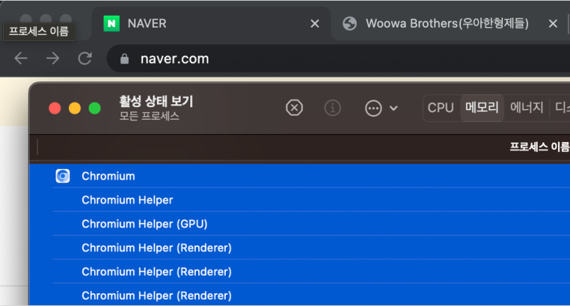 
 

위 사진에서 보이는 것처럼, 크로미움을 하나 켰다.
일반적인 하나의 프로그램을 실행한다면 하나의 프로세스가 생기는게 일반적이다. 그런데 작업관리자에서 보면 우리는 하나의 크로미움을 켰음에도 여러 개의 프로세스가 생긴 걸 확인할 수 있다.

브라우저는 기본적으로 정말 많은 동작을 한다.
화면을 띄우기도 하며, 네트워크 요청을 하기도 하고 스토리지에 데이터를 저장하기도 하는 등 많은 동작을 한다.
이러한 많은 동작을 특정 프로세스들로 묶어 관리하는게 바로 Chromium의 멀티 프로세스 아키텍처이다.

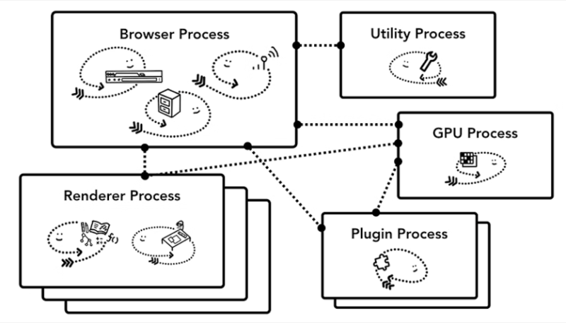 
 

Chromium의 프로세스는 크게 5가지로 나뉜다.

> 1.  브라우저 프로세스 : 주소 표시줄, 북마크 막대, 뒤로 가기 버튼 등 애플리케이션의 브라우저의 UI영역을 제어. 네트워크 요청이나 파일 접근과 같이 권한이 필요한 부분도 처리.
> 2.  GPU 프로세스 : 이미지와 픽셀 실제로 처리하는 프로세스. GPU프로세스와 컴퓨터의 그래픽카드가 실제로 화면에 픽셀을 그림.
> 3.  렌더러 프로세스 : 화면을 어떻게 칠할 것인지에 대한 명령어 생성
> 4.  플러그인 프로세스 : 사이트가 담당하는 모든 플러그인(flash 등) 담당.
> 5.  유틸리티 프로세스 : 유틸리티들 관련 프로세스

위 그림에서 보면 알 수 있겠지만, 렌더러 프로세스는 여러 개 생성되는 걸 확인할 수 있다.

렌더러 프로세스는 탭을 하나 열 때마다 여러 개 생성되는데, 만약 한 탭에 iframe이 포함되어 있다면, 이는 별도 렌더러 프로세스로 생성된다.
각 탭으로 인한 렌더러 프로세스들은 샌드박싱되는데, 이는 "Site Isolation" 이라는 크로미움 보안 정책 때문이다.
Site Isolation은 다양한 OS들에서 악성 웹 페이지가 다른 사이트의 데이터를 탈취하지 못하도록 하기 위해 만들어진 크롬 정책이다.
원래는 SOP(Same Origin Policy)에 따라 사이트별로 렌더러 프로세스가 샌드박싱됐었다.
그러나 악성 iframe의 경우 같은 프로세스가 부모 사이트를 향한 공격을 성공했을 때, Cross-Origin 관계여도 같은 프로세스인지라 쉽게 데이터 탈취가 가능했다.
이를 막기 위해 iframe의 경우도 다른 프로세스로 샌드박싱하는 방식으로 변화했는데, 이를 "Site Isolation" 이라고 한다.

<i style="text-align:right"> \* (샌드박싱 : VM생각하면 될 것 같다. 컴퓨터의 자원만 갖다 쓰고 아예 독립적인 것.) </i>

우선 각 탭별로 프로세스가 하나씩 할당되긴 하는데, 만약 RAM을 일정량 이상 사용하게 되면 렌더러 프로세스를 같은 Origin별로 묶게 된다.

아무튼 이런 이유로 인해 크로미움은 한 탭당 하나의 렌더러 프로세스가 생성된다.
이 글의 주제인 렌더링 파이프라인에서 우리가 중점적으로 봐야 할 프로세스는 **렌더러 프로세스와 GPU 프로세스, 그리고 브라우저 프로세스이다.**

위에서도 간략하게 설명했지만, 렌더러 프로세스의 경우 "화면을 어떻게 칠할 것인지에 대한(GPU 프로세스가 사용할) 명령어를 생성" 하는것이 주된 목적인 프로세스이다.
이 명령어들의 생성은 Blink라는 렌더링 엔진이 담당한다.
Blink 엔진의 경우 C++로 짜여져 있다.

### 2. 렌더링 파이프라인

우리가 HTML, CSS, JS로 웹 페이지를 만들었다고 해보자.
이 파일들을 브라우저로 열면 웹 페이지가 뜰 것이다.
우리 브라우저 입장에서 HTML, CSS, JS 등의 리소스를 모두 받았을 때, 브라우저 입장에서 이 파일들은 단순한 텍스트들에 불과하다.
이 텍스트에 불과한 파일들을 받아 우리 화면에 띄워주기까지의 과정을 "렌더링 파이프라인(Rendering Pipeline)" 이라고 한다.
이 렌더링 파이프라인은 여러 과정으로 쪼개져 있는데, 이는 아래와 같다.

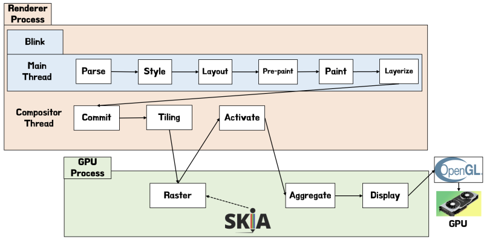 
 

> Parse -> Style -> Layout -> Pre-Paint -> Paint -> Layerize -> Commit -> Tiling -> Raster -> Activate -> Aggregate -> Display

의 총 12과정을 거쳐 화면에 표시되게 된다.

이 12과정을 하나씩 확인해보자.

### 2-1. Parse

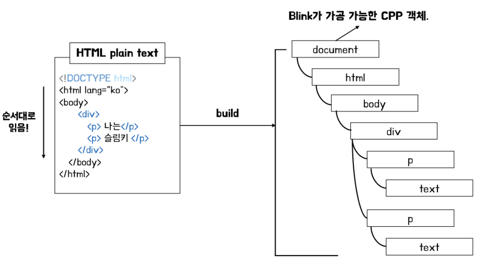 
 

첫 번째로 Parse 과정이다.
많이들 들어봤을 "DOM Tree"를 만들기 위해 HTML을 Parse 하는 과정이다.
브라우저가 HTML을 받았을 때, 브라우저 입장에서 HTML은 단순한 문자열일 뿐이다. 이 문자열에 불과한 HTML을 Blink가 다룰 수 있는 C++ 객체들의 트리 형태로 변환하는 과정이 Parse 과정이다.

위 사진에서 주의깊게 봐야 할 부분은 바로 위에서 아래로 "순서대로" 읽는다는 점이다.
그럼 여기서 의문점이 하나 생길 수 있다.
분명 Parse 과정은 HTML을 C++ 객체 트리(DOM Tree)화를 하는 과정이라 했는데, 만약 HTML 문서를 읽다가 `<script>` 태그의 JavaScript 코드를 만나면 어떻게 될까?

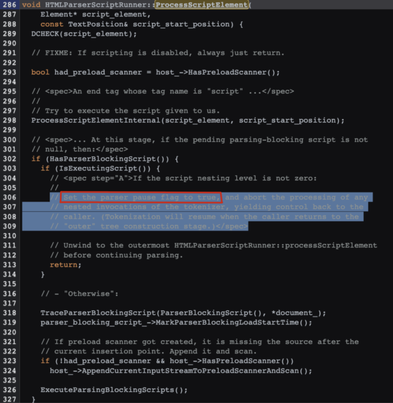 
 

위 사진이 실제 Chromium 코드 중 일부이다.
주석 부분을 보면 알 수 있지만, "Set the parser pause flag to true" 라는 말이 있다.
Parse 과정을 일시 중지한다는 말이다.
실제로 DOM을 파싱하는 과정에서 `<script>` 태그를 만나게 되면 blink 엔진의 DOM 파싱 과정은 일시 중단되고, `<script>` 내부의 JS 코드를 V8 엔진이 읽게 된다.
그럼 한 가지 의문점이 들 수 있다. `<script src="~~~">` 와 같이 외부 JS 코드를 읽어오는 경우에는 `<script>` 내부에 코드가 없는데 이는 어떻게 동작하게 될까? 이 경우는 브라우저 프로세스가 나서게 된다. 위에서 멀티 프로세스 아키텍처를 설명하며 브라우저 프로세스는 파일 접근과 같은 권한이 필요한 부분을 처리할 수 있다고 이야기했다.

여기서 한 가지 의문점이 더 들수 있다.

`<script defer>`나 `<script async>`같은 경우는 뭘까? 이 속성이 바로 parser flag를 true로 바꾸지 않고 false로 유지하는 속성이다.

### 2-2. Style

두 번째 과정은 자주 들어봤을법한 "CSSOM" 을 만드는 과정이다.

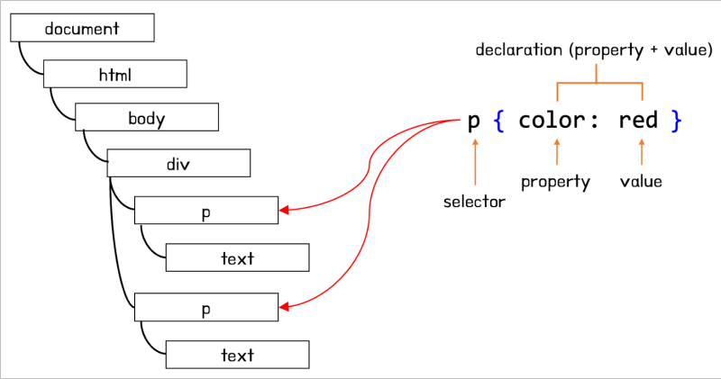 
 

Blink 엔진에서의 Style 과정은 크게 3단계로 나뉜다.

**1. 모든 스타일 시트에 존재하는 css Rule 파싱 및 인덱싱**
**2. 각 요소들 방문하여 적용되는 모든 rule들 찾기.**
**3. rule + 기타 정보들 결합해서 최종적으로 Style 계산.**

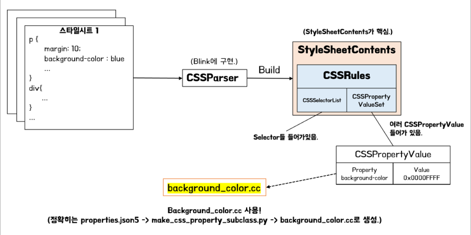 
 

Style 과정의 첫 과정은 모든 스타일 시트들에 존재하는 css Rule들을 파싱하고 인덱싱하는 과정이다.
이는 Blink에 구현되어있는 "CSSParser"에서 진행된다.
모든 스타일시트의 파싱 및 인덱싱이 Style 과정에서 우선시되어야 하는 이유가 있을까?

p라는 태그가 하나 있다고 해 보자.
여기에 color 속성을 추가할건데, 이에 대한 내용이 3가지나 있다고 해 보자.

| 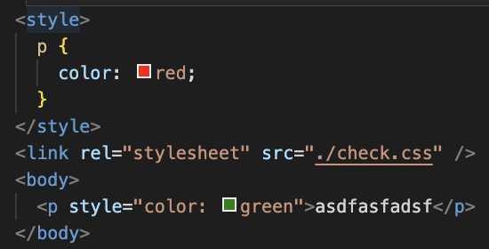 | 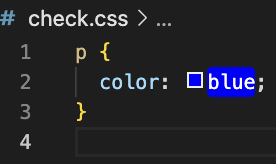 |
| -------------------------------------------------- | -------------------------------------------------- |

 

위와 같은 경우에서, p태그에는 어떤 속성이 적용되어야 할까?
인라인 스타일이 우선순위가 가장 높기 때문에, 자연스럽게 green이 될 것이다.
그럼 아래와 같은 경우는 어떨까?

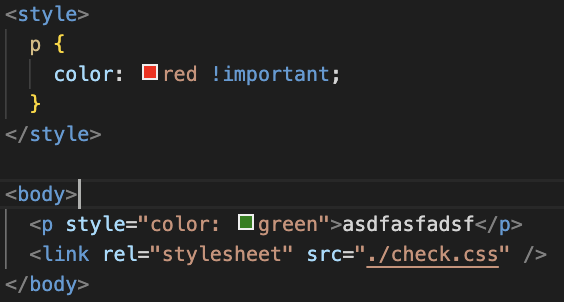 
 

important 속성을 넣어 주었다. 이 경우에는 red가 적용이 될 것이다.
이런 속성들을 정리해야 하기에 파싱과 인덱싱을 가장 먼저 하게 되는 것이다.
각각의 CSS Rule들은 빌드가 되며 StyleSheetsContents 안의 CSSRules 라는 곳에 하나씩 들어가게 된다. (이 StyleSheetsContents가 핵심이다.)
이 안에서도 Selector와 Property Value Set으로 나뉘게 된다.
특정 프로퍼티의 세부 동작은 `프로퍼티명.cc` 파일을 사용하게 되는데, 이 파일의 경우 빌드가 되며 생성되는 파일이다.

만약 background-color 라는 속성을 사용했다면, 빌드 시 properties.json5 라는 파일과 make_css_property_subclass.py 라는 파일을 통해 background_color.cc 라는 파일이 생성되고, 이를 사용하게 된다.

CSS를 Parse 하는 부분이 끝났다면, 실제 DOM에 어떤 rule이 적용될지 찾아둘 차례이다.
CSSRules에서 Selector 부분에 "어떤 엘리먼트에 적용될 것인가?" 에 대한 내용이 들어가게 된다.

이야기가 조금 길어졌는데, 결국 중요한 것은 파싱된 CSS Rule들이 들어있는 "StyleSheetsContents"이다.
이 StyleSheetsContents 를 이용하여 최종적인 결과물을 만들어내는데, 이를 ComputedStyle 이라고 부른다.
이 ComputedStyle이 바로 우리가 흔히 이야기하는 "CSSOM" 이다.

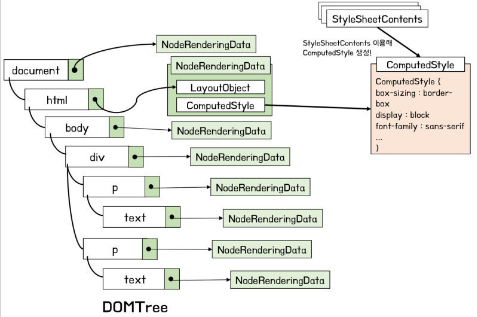 
 

이 ComputedStyle의 경우 DOMTree에 하나씩 연결되게 되는데, DOM Tree에 직접 연결되는 것이 아니다.
각 DOM Tree에는 NodeRenderindData라는 객체가 하나씩 이어붙게 된다.
이 NodeRenderingData 객체의 경우 ComputedStyle의 포인터, Layout 과정에서 다룰 LayoutObject의 포인터 등 DOM Tree의 각 Node와 관련된 데이터들을 담고 있다.
이렇게 연결된 ComputedStyle의 경우, Tree를 구성하는 것이 아닌 단순 Object 형태로 관리된다.
CSSOM Tree라는 이야기를 어디선가 많이 들어봐서 본인도 많이 헷갈렸던지라, Chromium의 blink팀에 메일을 보내 물어봤고, Tree 구조가 아니라는 답변을 받았다.

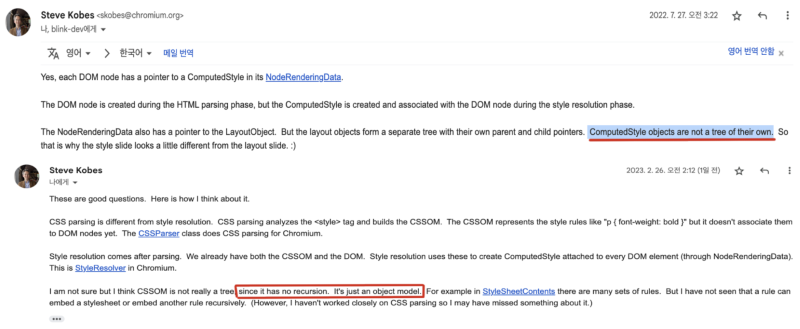 
 

아무튼 이렇게 만들어진 ComputedStyle에 접근할 수 있는 방법이 있다.
Blink에는 "V8 bindings" 라는 시스템이 있는데, 이 시스템 덕분에 Blink 객체의 일부를 JS로 접근이 가능하다.
ComputedStyle도 마찬가지이다.

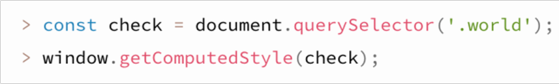 
 
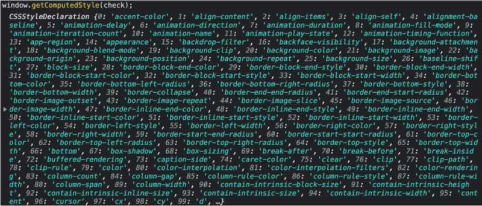 
 

위처럼 window.getComputedStyle() 메서드를 이용한다면 ComputedStyle에 접근할 수 있다.

### 2-3. Layout

ComputedStyle을 만들었다면 그 다음 과정은 Layout 과정이다.
Layout 과정은 우리가 이전 과정에서 만들었던 DOM Tree와 ComputedStyle을 이용하여 LayoutObject를 만드는 과정이다.
LayoutObject에는 특정 엘리먼트가 어떤 좌표에 어떻게 그려져야 하는지에 대한 기하학적 데이터들을 담고 있다.

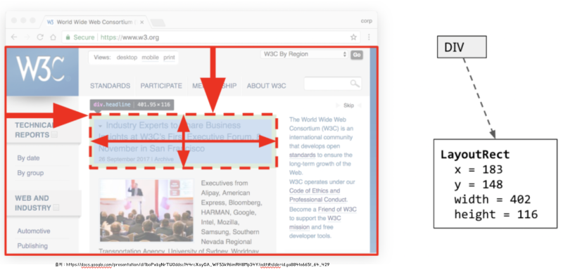 
 

Layout 과정은 고려해야 할 내용이 정말 많다.
대표적으로는 엘리먼트가 인라인으로 배치되어야 할지 박스로 배치되어야 할지를 고려해야 하고, 폰트도 고려해야 하며, 아랍어같은 경우는 RTL로 글자를 찍어내야 한다.
이런 경우들과 ComputedStyle을 모두 고려하여 LayoutObject를 만들게 된다.
그리고 이 LayoutObject들은 아래 그림과 같이 Tree 구조를 갖추게 된다.

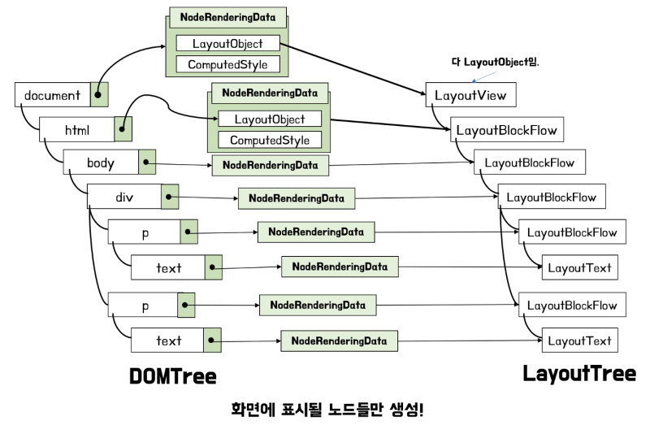 
 

ComputedStyle과 동일하게, LayoutObject의 경우도 DOM의 각 엘리먼트에 붙어있는 NodeRenderingData에 이어붙게 된다.

### 2-4. Pre-Paint

위의 Layout 과정에서 각 LayoutObject들은 만들어질 때 ComputedStyle이 각 LayoutObject에 반영이 된다고 했다.
그런데, 여기서 반영되지 않는 CSS가 몇 개 존재한다.
바로 transform, opacity, scroll, clip에 관한 속성들이다.

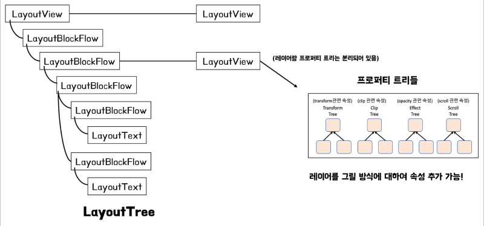 
 

이 속성들은 GPU에서 직접 처리하는 속성들이기에, GPU프로세스로 넘길 수 있도록 따로 관리해야 한다.
따라서 blink에서는 이러한 속성들을 프로퍼티 트리로 만들어 따로 관리하게 되는데, 이 프로퍼티 트리를 만드는 과정이 Pre-Paint라는 과정이다.

### 2-5. Paint

다음은 Paint 과정이다.
우리가 앞선 과정에서 만들었던 LayoutObject들을 이용하여 실제로 어떻게 화면을 칠할 것인지에 대한 명령어를 생성하는 단계이다.

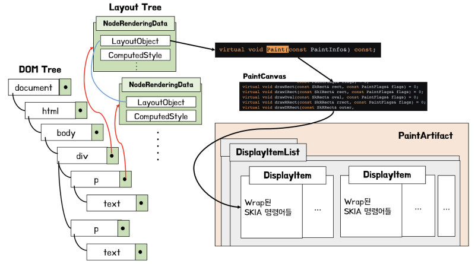 
 

각 LayoutObject에는 Paint()라는 메서드가 존재하는데, 이를 이용해 PaintCanvas의 drawRect() 같은 메서드들을 생성하게 된다.
이 메서드들은 2D 그래픽 라이브러리인 SKIA의 명령어를 wrap한 메서드이다.

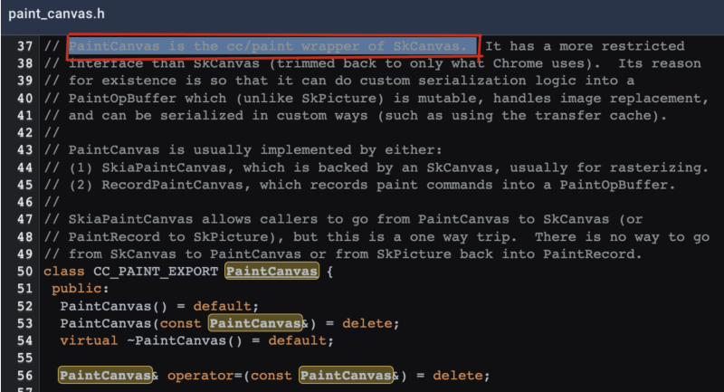 
 

실제 오픈소스 코드의 주석에서도 보면 알 수 있겠지만, "PaintCanvas is the cc/paint wrapper of SkCanvas" 라고 쓰여 있다.
PaintCanvas는 SkCanvas의 wrapper라는 말이다. (SkCanvas는 SKIA에 관련된 개체이다.)

이렇게 생성된 SKIA 명령어들은 위 그림과 같이 DisplayItemList의 DisplayItem에 들어가게 된다.
이 때, 마구잡이로 들어가는 것이 아닌 z-index 가 고려되어 들어가게 된다.

### 2-6. Layerize

다음 과정은 아래와 같이 화면의 레이어를 쪼개는 과정이다.

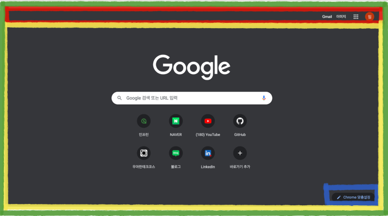 
 

위 사진처럼 화면이 쪼개지는 것인데, 쪼개진 레이어는 개발자 도구의 More-tools -> Layers에 들어가면 쪼개진 레이어들을 확인할 수 있다.

| 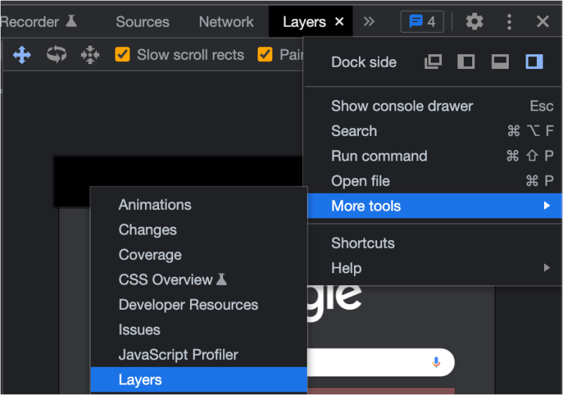 | 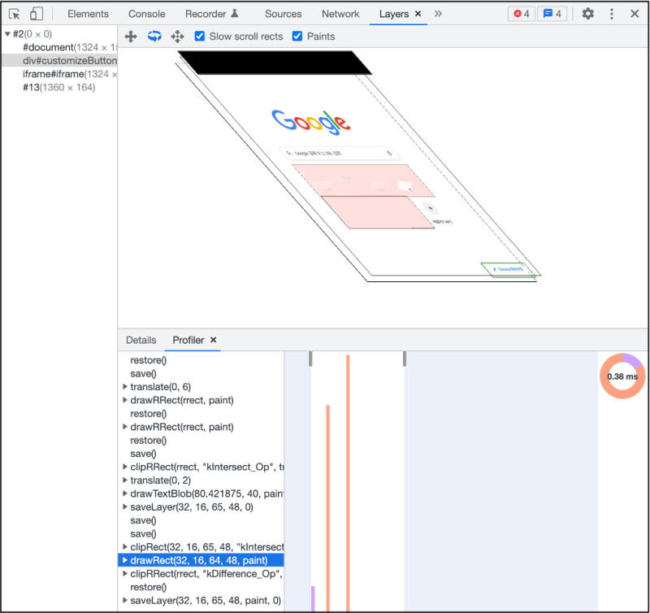 |
| ---------------------------------------------------- | ---------------------------------------------------- |

 

Google 메인 페이지의 경우 위와 같이 4개의 레이어로 쪼개진 것을 확인할 수 있다.

레이어가 쪼개지는 경우에 대해 몇 가지만 이야기해보자면

1. position: fixed를 쓴 경우
2. `<video>`, `<frame>`, `<iframe>`을 사용한 경우
3. transform 3D 관련 속성을 사용한 경우
4. will-change 속성 사용
5. 등등...

 이 각각의 레이어들은 독립적인 픽셀화가 이루어진다. 

너무 갑자기 독립적 픽셀화 이야기가 나와서 이해하기 힘들 수도 있는데, 아래 예시를 보면 이해하기 쉽지 않을까 싶다.

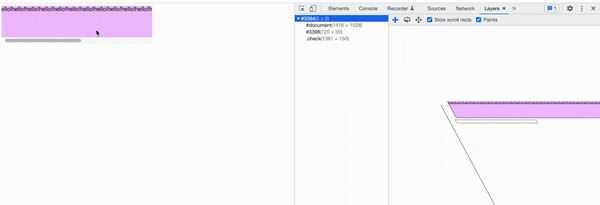 
 

위처럼 따로따로 그려놓는 것이다.

보여줄 수 있는 부분이 한정적인 상황에서는 미리 다 크게 그려놓고 일정 부분만 보여주는 방식인 것이다.
따라서 스크롤이 필요한 부분이 있다면 반드시 레이어가 생기게 된다고 보면 된다.

이렇게 레이어 단위로 각각 픽셀화 하고 GPU를 이용해 하나의 이미지로 합성해서 출력하는 기술을 "하드웨어 가속" 이라고 한다.
GPU를 렌더링에 활용하고 있기에 성능적인 이점을 얻을 수 있다. (아래에서 조금 더 다루겠다.)

이렇게 만들어진 레이어들은 모두 CompositedLayerList 라는 곳에 들어가게 된다.
당연히 각 레이어에는 이전 과정인 Paint 과정에서 만들었던 SKIA 명령어들이 들어가 있다.

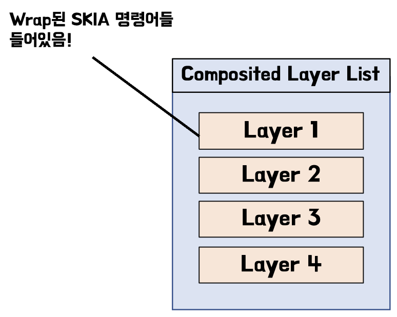 
 

이렇게 만들어진 CompositedLayerList가 Layerize 과정의 최종적인 결과물이자, Blink 엔진이 만드는 최종적인 결과물이다!
사실, 이 Layerize 과정은 원래 Pre-Paint과정 이전에 이루어지던 작업이었다. (공식 프레젠테이션 자료를 보면 compositing-assignment라고 해서 다루던 내용으로, Pre-Paint과정 이전에 있었다.) 이에 관한 이야기는 밑에서 다루겠다.

#### \* 하드웨어 가속을 이용하는건 언제나 좋을까?

그럼 무조건 하드웨어 가속을 이용하는게 좋은 렌더링 방식일까?
조금 극단적인 예시이긴 한데, 아래와 같은 화면을 만들 예정이라고 해보자.

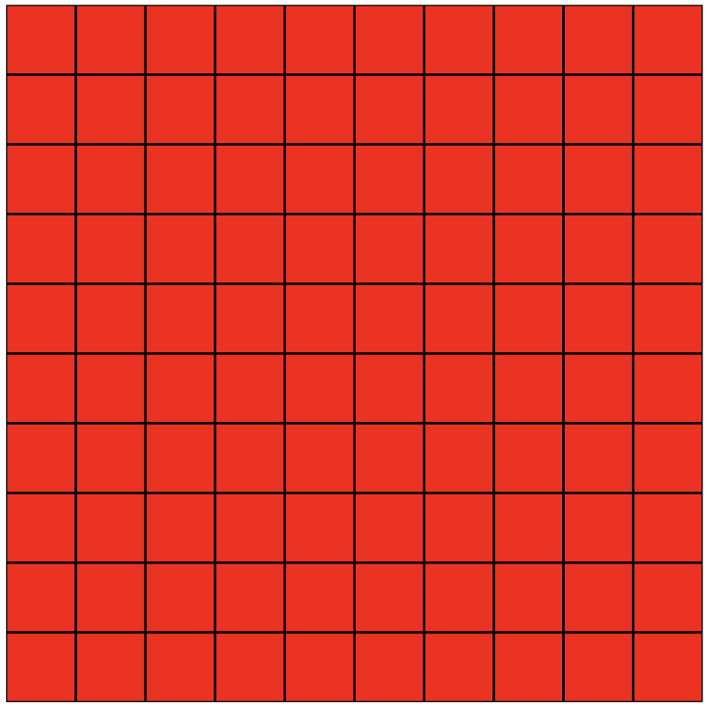 
 

하드웨어 가속을 남용한 케이스와 아닌 케이스를 Layer 탭에서 확인해보자.

| 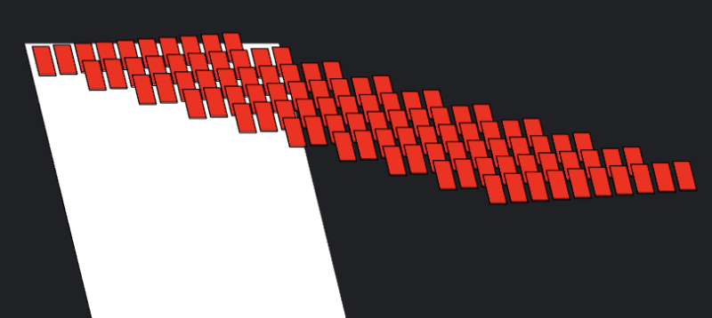 | 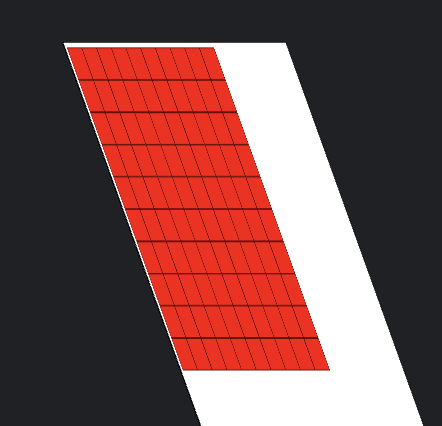 |
| ---------------------------------------------------- | ---------------------------------------------------- |
| 하드웨어 가속을 남용한 케이스                        | 불필요한 하드웨어 가속을 사용하지 않은 케이스        |

 

더이상 설명하지 않겠다.
과한 건 언제나 좋지 않다...ㅎ

#### \* CAP (Composite After Painting)?

사실 이 Layerize 과정은 과거 Compositing-assignment 라고 불리던 과정으로, Pre-Paint과정 이전(Layout 과정 직후) 시작되던 과정이다.

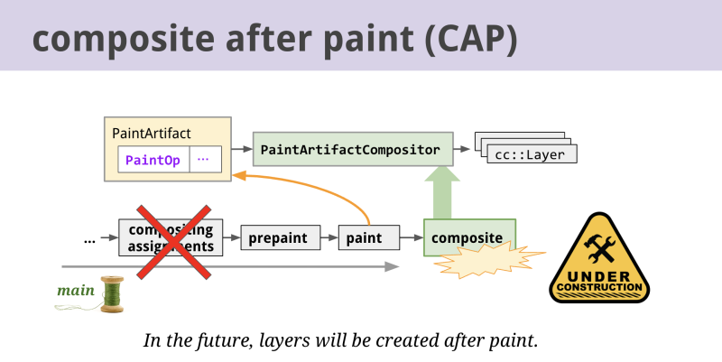 
 

예전 프레젠테이션 발표자료에서 보면 CAP 프로젝트가 이루어질 것이라 Layer가 Paint 과정 이후 생길 것이라고 예고했었는데, 이는 현재 반영된 상태이다. 아래 사진은 blink팀에 메일을 보내 얻은 답변이다.

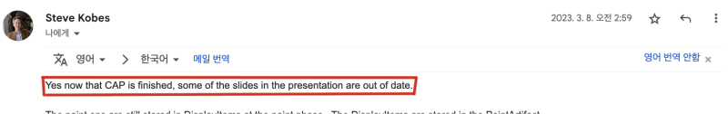 
 

이 CAP가 적용된 이유에 대해 간단히 예시를 들어보겠다.
먼저 한 페이지에 레이어가 없는 상황의 화면에서 어떠한 이유로 인해 레이어가 생성되는 상황이 발생했다고 해보자.
빨간 네모 박스에 마우스를 올리면 translate3D가 발생하며 박스가 오른쪽으로 옮겨가는데, translate3D를 썼기에 레이어가 생성 될 것이다.

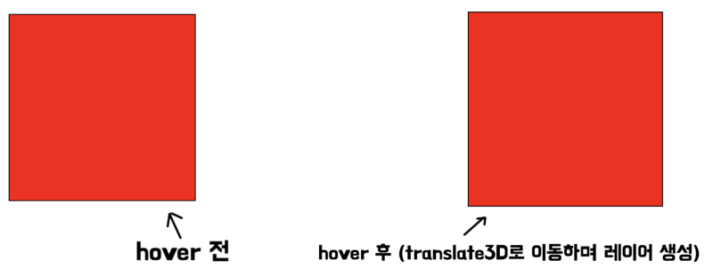 
 
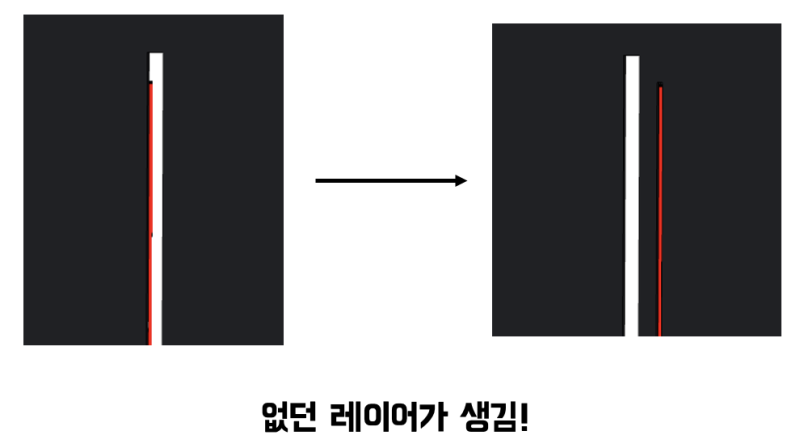 
 

CAP 이전에는 아래와 같은 과정으로 동작했다.

> LayoutObject들 레이어로 쪼개기 -> 그 레이어에 적용될 GPU 관련 CSS 저장해두기 -> Paint과정에서 레이어 단위로 Paint ops (SKIA 명령어들) 생성하기

CAP 이전이라면 레이어가 없는 상태에서 레이어를 쪼갰기 때문에, Pre-Paint 과정이 일어나고 이후 Paint 과정이 다시 일어나게 될 것이다.
이미 그려진 요소만 움직이기만 하는 것이기에, Paint 과정이 필요 없는데 레이어 생성 과정이 Paint 과정 이전이기에 불필요하게 Paint가 다시 발생하는 것이다.

이 문제를 해결하기 위해 레이어를 쪼개는 과정을 Paint 과정 뒤로 옮긴 것이다.
옮겼다고 생각하고 보면, 이미 Paint가 끝난 뒤 Paint ops(SKIA) 명령어들이 들어있는 DisplayItem들만 가지고 레이어별로 나누면 그만이기 때문이다.

###2-7. Commit

위 Layerize과정까지 해서 우리는 "CompositedLayerList" 라는 결과물과 Pre-Paint 과정에서 만들었던 프로퍼티 트리를 얻어냈다!
지금부터는 이 결과물들을 이용해 GPU프로세스와 상호작용하며 화면을 찍어줄 수 있도록 해야한다.

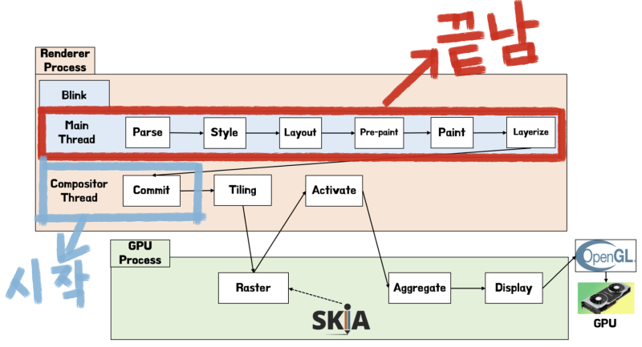 
 

그런데, 여기서 보면 렌더러 프로세스가 Main Thread와 Compositor Thread로 나뉘어진 것을 확인할 수 있다.

이렇게 두 개의 thread로 나누어 관리하는 이유는 병렬적으로 관리의 이점을 얻기 위함이다.
Main Thread의 모든 과정이 끝나면 이 결과는 Compositor Thread가 이어받아 진행하며, Main Thread는 JavaScript 코드를 실행하거나 렌더링 파이프라인을 다시 진행할 수 있다. 그 사이에, Compositor Thread는 GPU 프로세스와 상호작용하며 화면을 찍어내는 작업을 하게 되는 것이다.

이제부터의 과정은 Main Thread가 아닌 Compositor Thread가 진행하게 되기에, 우리의 작업물이었던 "CompositedLayerList"와 프로퍼티 트리를 Main Thread로부터 받아오는 작업이 진행된다. 이 과정이 Commit 과정이다.
이 과정에서 Compositor Thread는 이전 과정의 결과물에 대한 복사본을 트리 형태로 두 개 갖고 있게 된다.
각각의 이름은 "Pending Tree", "Active Tree" 이다.
이렇게 두 개의 복사본 트리로 관리하는 이유는 이후의 과정인 Active 과정에서 다루도록 하겠다.

### 2-8. Tiling

화면을 찍으려다 보면 화면이 너무나도 클 수 있다.
불필요하게 이 화면을 모두 그려내는게 과연 맞을까? 당연히 비효율적일 것이다.
그렇기에 아래와 같이 레이어들을 타일로 쪼개게 된다. 이 과정이 Tiling 과정이다.
각 타일에는 역시나 Paint 과정에서 만들었던 SKIA 명령어들이 들어가있고, 이 명령어들을 다음 과정에서 사용하게 된다.

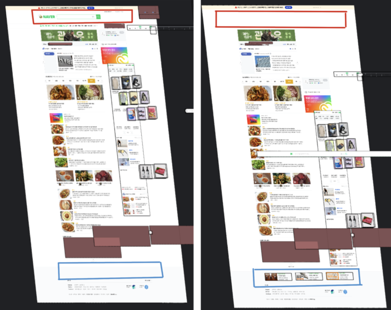 
 

네이버를 기준으로 보자.
스크롤이 위에 있을 때는 하단 부분이 보이지 않는 상황이고, 스크롤을 내리면 검색창부분이 보이지 않게 된다.
이렇게 되는 이유가 Tile 단위로 레스터하여 화면을 찍어내기 때문이다.

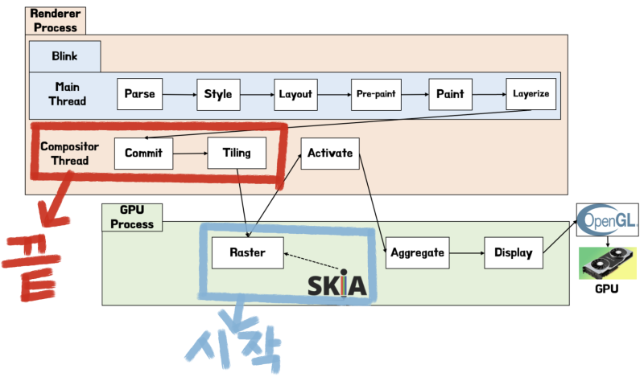 
 

이렇게 만들어진 결과물(tile)은 이제 GPU 프로세스로 보내진다.

### 2-9. Raster

다음 과정은 Raster 과정이다.
우리가 Paint과정에서 만들었던 DrawRect() 같은 SKIA 명령어들을 실행하는 단계이다.
먼저 Wrap된 SKIA 명령어들과 Pre-Paint 과정에서 만들었던 프로퍼티 트리를 이용하여 비트맵을 생성하고, 이렇게 만들어진 비트맵은 GPU 메모리에 저장하게 된다.

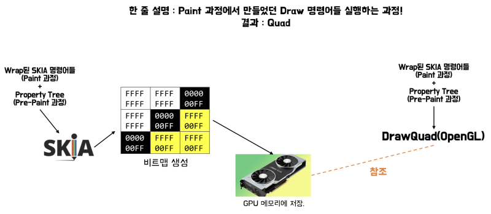 
 

그리고 이 결과물들은 모두 "Quad" 라는 단위로 묶이게 되며, DrawQuad라는 명령어가 생성된다.
이는 OpenGL의 wrap 된 SKIA메서드이다.

### 2-10. Activate

이제 다시 Compositor Thread로 돌아왔다.

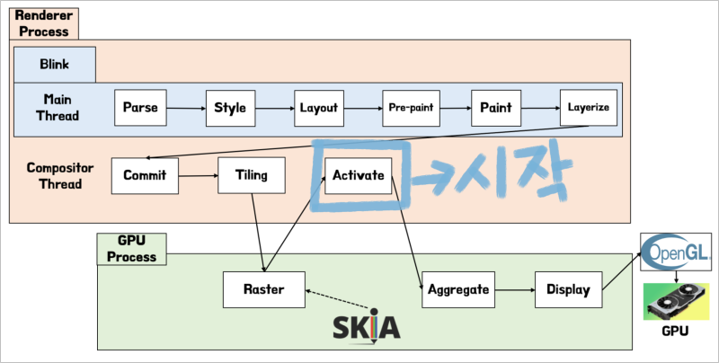 
 

다음 과정은 Activate 과정인데, 이 내용은 테코톡 발표에서 시간 제약상 제대로 다루지 못한 내용이다.🥲

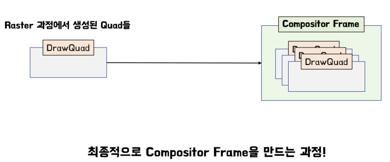 
 

발표에서는 정말 간략하게 Raster과정에서 생성된 Quad들을 "Compositor Frame" 이라는 단위로 묶는 과정이라고만 설명했다.
뭔가 조금 더 설명을 덧붙일 필요가 있어보인다.
위에서 이야기했지만, 우리는 Commit 과정에서 이전 과정의 결과물에 대한 복사본을 트리 형태로 두 개 갖고 있는다고 했다.
각각의 이름은 "Pending Tree", "Active Tree" 인데, Chromium은 이 두 트리를 swap 하는 방식의 멀티 버퍼링 패턴을 이용한다.

#### \* 멀티 버퍼링 패턴?

연극을 생각하면 좋을 것 같다.
우리가 관객 입장이라 생각해보자. 1막이 끝나고 2막이 시작되기 전에, 무대를 꾸미는 등의 준비 작업이 필요할 것이다.
이러면 관객 입장에서는 흐름이 끊기는 느낌을 받게 될 것이다.
이런 방식 대신 무대를 두 개 만들어 버리는 것이다.
첫 번째 무대가 1막을 진행하는 동안, 두 번째 무대에서는 2막 무대를 꾸미고 있는 것이다. 이후 2막이 시작되면 두 번째 무대가 바로 이어서 시작하고, 첫 번째 무대는 3막을 준비하는 것이다. 이런 방식이라고 생각하면 좋을 듯 하다.

Raster 작업이 다른 프로세스에서 진행되다보니 비동기적으로 진행되게 된다.
Raster과정이 진행되는 중이거나, 다른 GPU 프로세스 작업을 하는 중이라면 Compositor Thread에서는 새로운 변경사항이 있을 수 있다.
이를 Pending Tree와 Active Tree로 나누는 것이다.
렌더링에 필요한 작업이 모두 완료되면 그 때 Active Tree로 보내게 된다!
여기서 Active상태의 결과만 "Compositor Frame" 이라는 단위로 묶게 되는 것이다..

### 2-10. Aggregate

지금부터의 과정은 GPU 프로세스가 담당한다.

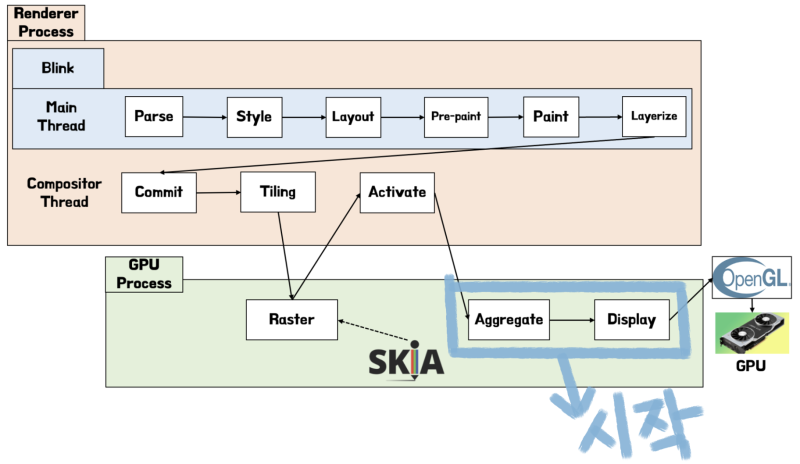 
 

Activate 과정에서 만들어졌던 Compositor Frame은 사실 브라우저 프로세스에서도 만들 수 있다.
뒤로가기 버튼이나 북마크 버튼 등도 화면에 찍어야 하기 때문이다!
이 외로, Iframe도 별도의 렌더러 프로세스가 생기기에 이 화면도 동시에 찍어야 할 것이다. (Site Isolation 때문)
그렇기에 iframe에 의한 렌더러 프로세스의 Compositor Frame이 있을 것이다.

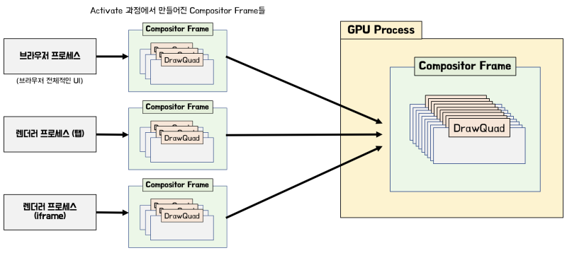 
 

이 Compositor Frame을 하나로 묶는 과정이 바로 Aggregate 과정이다.

### 2-11. Display

이렇게 묶인 Quad 명령어들(Compositor Frame)이 최종적으로 실행되는 과정이다!
SKIA의 Quad 명령어를 통해 OpenGL을 거쳐 GPU 작업이 일어나고, 결과적으로 화면에 출력되게 된다.

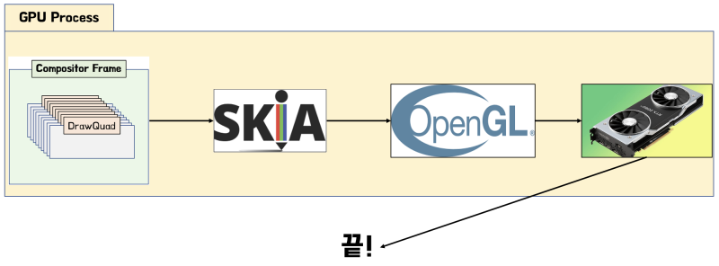 
 

이렇게 모든 렌더링 파이프라인 과정이 끝나게 된다.

### 3. 프론트엔드 개발자로서 고려해볼 수 있는 점...?

어떻게 브라우저가 동작하는지에 대해 공부해본다면 어떤 CSS 속성을 쓰는지에 따라 Reflow가 발생할지, RePaint가 발생할지 등에 대한 점들을 고려해볼 수 있을 것이다.
Reflow가 발생한다면 RePaint나 그마저도 안나도록 고려한다거나, 불필요한 RePaint가 발생한다면 이를 막기 위한 리팩토링을 해볼 수 있지 않을까 싶다.
그리고 하드웨어 가속을 이용했을 때 얻을 수 있는 이점이 있다고 판단된다면, 레이어를 쪼개 하드웨어 가속을 고려해 볼 수도 있을 것이다! (스타일 재계산을 줄이기 위해)

