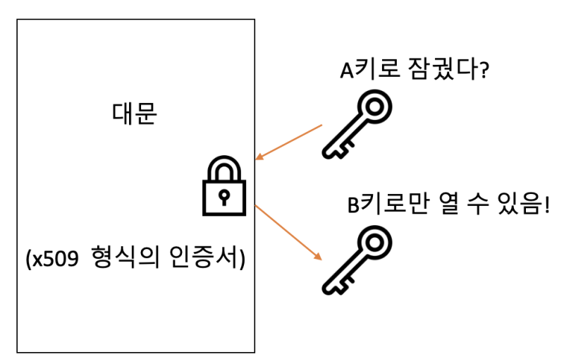

우테코 프로젝트에서 Nginx를 Docker 컨테이너에 올려 사용하려고 개인 ec2에서 공부하던 도중 https 접속은 불가능한 것을 확인했다.

https 접속을 위해서는 독립된 인증 기관(CA)에서 SSL/TLS 인증서를 획득해야 한다. 웹 사이트가 신뢰를 구축하기 위해 데이터를 교환하기 전에 브라우저와 인증서를 공유하기 때문이다.

우리가 사용하고자 하는 도커 컨테이너 내 nginx에 SSL/TLS 인증서를 적용하는 방법은 크게 두 가지로 나뉜다.

1. 자체 서명된 인증서를 사용하는 방법
2. 신뢰할 수 있는 인증 기관에서 발급된 인증서 사용

이 두 가지 방법 중 **"신뢰할 수 있는 인증 기관에서 발급된 인증서 사용"** 으로 https 접속을 가능하게 만들어보자.

우선 신뢰할 수 있는 SSL 인증서를 생성은 "Let's Encrypt"를 사용하여 생성할 수 있다.

"Let's Encrypt"가 바로 CA(Certificate Authority)이다!
우리는 Let's Encrypt에서 인증서를 받아올 것이지만, Certbot라는 친구를 사용할 것이다.
이 Certbot은 Let's Encrypt를 사용해 인증서 생성도 도와주고, 우리가 받는 인증서들의 만료일도 갱신해준다!

그래서 Certbot을 먼저 설치해야 하는데, 그 전에 Snapd 패키지를 설치하면 Certbot 설치가 좀 더 편해진다.
따라서 Snapd를 설치해주자.

```bash
sudo apt update
sudo apt install snapd
```

이후 snapd 서비스를 활성화하여야 한다. 아래와 같이 쳐주자.

```bash
sudo systemctl enable --now snapd.socket
```

snapd가 활성화되었다면, snapd를 이용해 certbot을 설치해주자.

```bash
sudo snap install core
sudo snap refresh core
sudo snap install --classic certbot
```

이제 우리는 certbot을 이용하여 ssl 인증서를 받아야 한다!
원래는 설치 후 certbot을 사용하기 전에 먼저 nginx부터 꺼야 한다.
따라서 nginx가 올라가있는 도커 컨테이너부터 내리자.

```bash
sudo docker rm -f {컨테이너ID}
```

이후 docker-compose에 추가 설정을 해 주어야 한다.
certbot을 docker에 매핑해주는 것이다!

```docker
# docker-compose.yml

services:
  web:
    image: nginx
    restart: always
    ports:
      - 80:80
      - 443:443
    volumes:
      - /home/ubuntu/frontend:/usr/share/nginx/html
  certbot:
    image: certbot/certbot
    command: certonly --webroot -w /usr/share/nginx/html -d {도메인명}
    volumes:
      - /home/ubuntu/frontend:/usr/share/nginx/html
    depends_on:
      - web
```

먼저 Docker에서 certbot/certbot 이미지를 기반으로 Let's Encrypt를 사용하여 SSL/TLS 인증서를 발급하고, 발급받은 인증서를 웹 서버의 /usr/share/nginx/html 디렉토리와 연결해 주어야 한다.
위에서 정의해준 web 서비스가 먼저 시작되고 정상적으로 실행된 후에 certbot 서비스가 실행되도록 보장해야 한다.
따라서 depends_on 부분에 web도 넣어주어야 한다.

이제 아래와 같은 명령어를 작성하여 도커 컨테이너를 켜며 SSL 인증서를 받아보자.

```bash
sudo docker compose run certbot certonly --webroot -w /usr/share/nginx/html -d {도메인명}
```

위에서 Certbot이 인증서를 자동으로 갱신시켜주기도 한다 했는데, certonly가 인증서를 자동으로 갱신해주는 명령어 중 하나라고 보면 된다.

 
<br/>

그러면 이런 화면을 볼 수 있다. (무지성으로 막 인증서 받다보면 7일간 재발급 안해준다...)

여기까지 하고 나면 docker 컨테이너 내부에 /etc/letsencrypt/live/{도메인명} 경로에 인증서가 생기게 된다.
따라서 도커 컨테이너가 종료되면 이 인증서도 함께 날아가게 된다.
그렇기에 SSL 인증서를 발급받은 후에는 도커 컨테이너 내부의 인증서 파일을 다시 EC2로 복사 해 와야한다.
docker cp 명령어를 쓰기 위해 컨테이너 아이디부터 알아오자.

```bash
docker ps -a
```

이후 도커 컨테이너에 있는 키들을 ec2 로컬로 가져오자.

```bash
sudo docker cp {CONTAINER_ID}:/etc/letsencrypt/live/{도메인명} /etc/letsencrypt/live
```

어떻게든 옮겨만 와서 /etc/letsencrypt/live/{도메인명}로 넣어주기만 하면 된다.
들고 와서 Nginx가 읽을 수 있도록 꼭 권한 설정을 확인해주자. (이것때문에 삽질 좀 많이했다🥲)

```bash
sudo chmod 644 privkey.pem # 경로 찾아가서
```

이후에는 docker-compose.yml 파일에서 아래와 같이 SSL 인증서와 개인 키 파일을 매핑하도록 수정해야 한다.

```bash
version: "3"
services:
  web:
    image: nginx
    restart: always
    ports:
      - 80:80
      - 443:443
    volumes:
      - ./nginx.conf:/etc/nginx/conf.d/default.conf
      - /home/ubuntu/frontend:/usr/share/nginx/html
      - /home/ubuntu/images:/usr/share/nginx/html/img
      - /etc/letsencrypt/live/{도메인명}/fullchain.pem:/etc/nginx/cert/fullchain.pem  # 이 부분 추가
      - /etc/letsencrypt/live/{도메인명}/privkey.pem:/etc/nginx/cert/privkey.pem  # 이 부분 추가
  certbot:
    image: certbot/certbot
    command: certonly --webroot -w /usr/share/nginx/html -d {도메인명}
    volumes:
      - /home/ubuntu/frontend:/usr/share/nginx/html
      - /etc/letsencrypt:/etc/letsencrypt
    depends_on:
      - web
```

마지막으로 Nginx 설정을 업데이트 해 주자.

```nginx
# ... 80번 포트 설정
server{
  listen 443 ssl;

  ssl_certificate /etc/nginx/cert/fullchain.pem;  # SSL 인증서 경로
  ssl_certificate_key /etc/nginx/cert/privkey.pem;  # SSL 인증서 키 경로
  # ... 추가 설정들
}
```

이후 Nginx 컨테이너를 재시작하면 끝이다.
Nginx는 이제 HTTPS로 인증서를 사용하여 애플리케이션을 서빙할 수 있게 되었다!

 
<br/>

### \* RSA 키와 x509 규칙의 인증서​

https를 쓰려면 클라이언트(브라우저)는 서버로부터 인증서를 받아 인증서의 유효성을 확인해야 한다.

그럼 기본적으로 RSA 키 쌍이 필요하고, 이를 이용해 x509 규칙을 따르는 인증서를 만들게 된다. (x509는 공개키 인증서의 표준 형식으로, 대부분의 SSL/TLS 인증서가 x509 형식을 따른다.)

우리가 위에서 받았던 fullchain.pem이 바로 x509형식의 인증서이다!

그리고 우리가 받은 privkey.pem은 RSA키 쌍인 것이다.
이를 이용해 우리가 https 통신을 할 수 있게 된 것이다.

<i>RSA 키와 x509 규칙의 인증서 : 대충 설명하면 아래 그림과 같을 것이다.</i>

|  |  |
| ----------------------------------------- | ----------------------------------------- |

[](https://hits.seeyoufarm.com)
