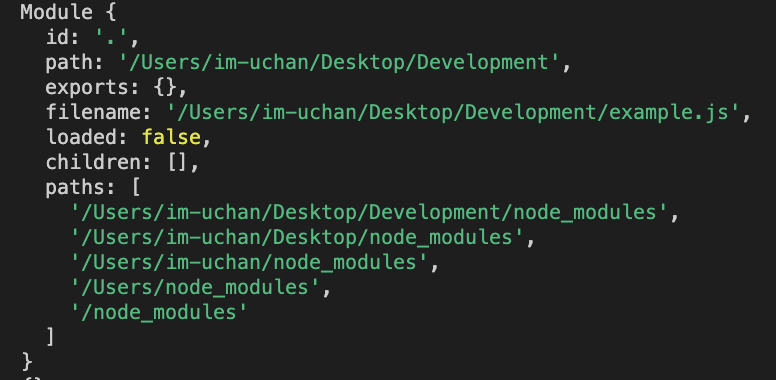
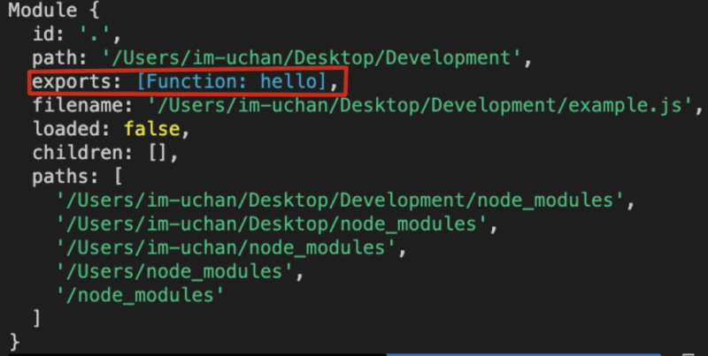
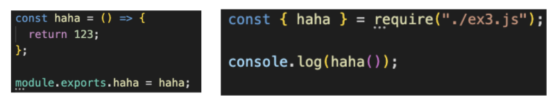
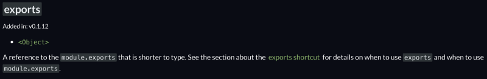
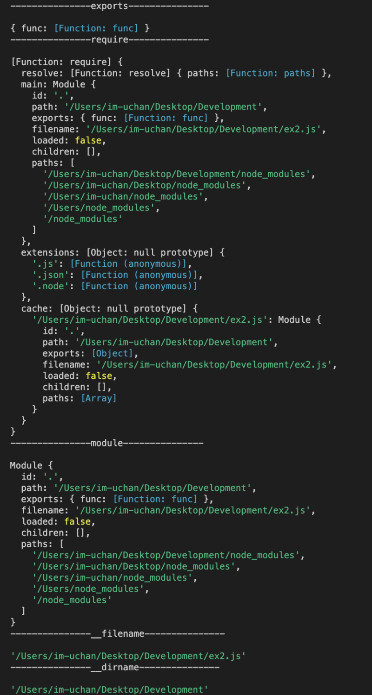
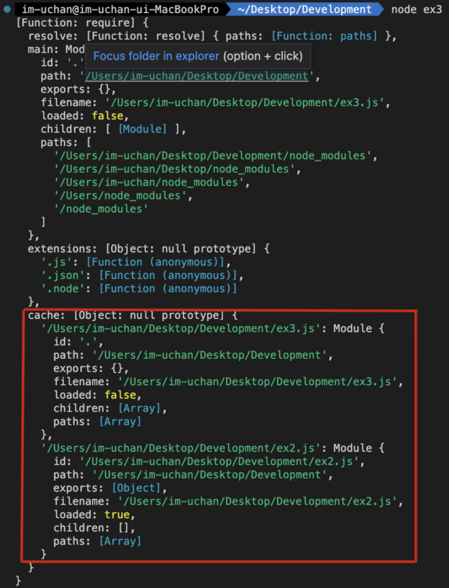
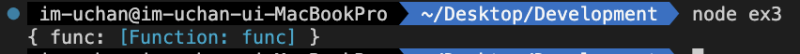
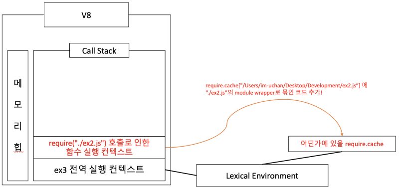
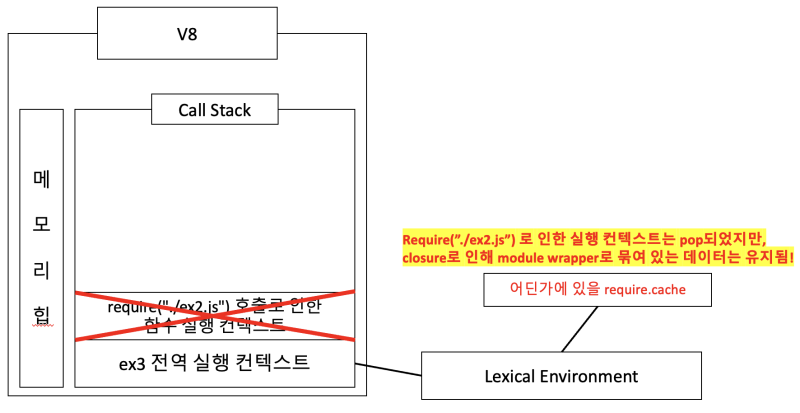

[](https://hits.seeyoufarm.com)

CommonJS 방식 (require)과 ESModule 방식(import)의 차이는 뭘까?
왜 기존의 CommonJS 를 두고 ESModule 방식을 채택하고자 하는걸까?

"CommonJS 방식은 트리쉐이킹이 일어나지 않는다" 라는 이야기를 어쩌면 들어봤을 수도 있다.
왜 트리쉐이킹이 일어나지 않는다는걸까? 아니면 좀 더 근본적으로, 트리쉐이킹이 일어나지 않았을 때 뭐가 문제가 된다는 걸까?
cjs 방식이 무엇인지에 대해 먼저 다룬 뒤, 아래 목차대로 글을 써 보려 한다.

1.CJS(Common JS) 방식이란?

2.module.exports 와 exports

3.모듈 require : 동기와 캐싱

4.그래서 왜 tree shaking이 일어날 수 없는건데?

5.그렇다면 왜 Node.js는 tree shaking이 불가능한 형태로 cjs를 만들었을까?

6.결론

<hr/>

### 1. CJS 방식이란?

CJS(CommonJS) 방식에 대해 이야기하기 전에, 먼저 "모듈"이란 뭘까? Node.js에서의 모듈은 그냥 각각의 자바스크립트 파일을 이야기 한다.
아무튼! CJS(CommonJS) 방식은 원래 Node.js에서 자바스크립트 패키지를 불러올 때 사용하던 방식이다. 애초에는 이 방식밖에 없었기에, 근본은 있는 방법이라고 할 수 있다.
코드로 예시를 들자면 아래같이 require나 module.exports 같은 코드를 쓰는 경우를 이야기한다.

```js
const ex2 = require("./ex2.js")

const haha = () => {
  return 123
}

module.exports = haha
```

<hr/>

### 2. module.exports와 exports

CJS방식을 확실하게 이해하기 위해서는 "exports" 와 "module.exports"에 대한 이해가 필요하다.
우선 console.log에 module을 한번 찍어보자.

```js
console.log(module)
```

그럼 아래와 같은 결과가 나오는 것을 확인할 수 있다.

 
<br/>

보면 알 수 있겠지만, module은 일반 객체이다.
우리가 아무 생각 없이 쓰던 module.exports = 함수명; 같은 코드들은 위 Module의 exports에 들어간다는 의미의 코드였던 것이다.
따라서 아래와 같이 코드를 작성하고 콘솔에서 확인해보면

```js
module.exports = function hello() {}
console.log(module)
```

아래와 같이 Module객체의 exports 프로퍼티에 hello 함수가 할당된 것을 확인할 수 있다.

 
<br/>

이를 통해 알 수 있겠지만, **"module.exports = 함수"** 와 같이 직접 할당하는 경우와 **"module.exports.hello = 함수"** 와 같은 경우는 당연히 다를 것이다.
exports 객체 내부에 특정 프로퍼티를 생성하고 함수를 할당하느냐, exports객체를 통채로 대체하느냐의 차이이기 때문이다.
따라서 module.exports.프로퍼티명 = 함수 와 같이 exports를 한 경우, 아래와 같이 구조분해할당으로 함수를 가져오는걸 확인할 수 있다.

 
<br/>

그럼 그냥 exports랑 module.exports는 대체 무슨 차이가 있는걸까?

```js
console.log(module.exports === exports) // true
```

이 코드를 직접 찍어보면 알 수 있겠지만, true가 나온다. 레퍼런스가 동일하다는 의미이다.

 
<br/>

https://nodejs.org/api/modules.html#exports

위 링크를 보면 알 수 있겠지만, 레퍼런스가 같은 이유는 exports가 module.exports에 대한 참조라는 이야기가 있다.

```js
// ex3.js
const haha = () => 123

const haha2 = () => 0

exports = haha2
module.exports = haha

// ex2.js
const haha = require("./ex3.js")

console.log(haha()) // 123
```

본체는 module.exports이기에 exports를 수정해도 결국 module.exports 의 무언가가 export된다. exports대신 module.exports를 사용하자.

<hr/>

### 3. 모듈 require : 동기와 캐싱

모듈을 require()해올 때 꼭 알아야 할 두 가지 특징이 하나 있다.
바로 "반드시" 동기로 로딩해온다는점과 한 번 불러온 파일은 캐싱했다 재사용한다는 점이다.

먼저 아래와 같은 코드가 있다.

```js
// ex2.js
require("./ex3.js")

new Promise(() => {
  setTimeout(async () => {
    await console.log("나는 ex2!")
  }, 2000)
})

// ex3.js
module.exports = new Promise(() => {
  setTimeout(async () => {
    await console.log("나는 ex3!")
  }, 1000)
})
```

코드가 과연 어떻게 동작할까?

 
<br/>

정말 동기적으로 동작한다는 것을 확인할 수 있다.
또한, 모듈을 가져오며 반드시 한 번 읽는다는 것도 확인할 수 있을 것이다.

그렇다면 캐싱에 대한 이야기는 무슨 말일까?
아래 예제를 보자.

```js
// ex1.js
require("./ex2.js")
require("./ex3.js")

// ex2.js
require("./ex3.js")

new Promise(() => {
  setTimeout(async () => {
    await console.log("나는 ex2!")
  }, 2000)
})

// ex3.js
require("./ex2.js")

module.exports = new Promise(() => {
  setTimeout(async () => {
    await console.log("나는 ex3!")
  }, 1000)
})
```

node ex1 을 했다 하고 생각해보자.

ex1이 실행되며 ex2를 동기적으로 require했다.
ex2가 실행되며 ex3를 동기적으로 require했다.
ex3가 실행되며 ex2를 동기적으로 require 할...까...?
정말 그렇다면 무한루프에 빠지는게 맞지만, 그렇지 않다.

 
<br/>

이는 require시 모듈을 가져올 때 캐싱된 값이 있는지를 확인하고 있다면 캐싱되어있던 값을 반환하기 때문이다.

<hr/>

### 4. 그래서 왜 tree shaking이 일어날 수 없는건데?

드디어 이 글의 주제이다!
방금 위에서 require시 모듈을 가져왔을 때 캐싱된 값이 있는지를 확인한다고 했다.
"도대체 어떻게 캐싱된 값을 유지할 수 있을까?" 라는 고민을 하며 읽어보면 좋을 것 같다.

먼저, Node.js에서 Module을 로드해올 때 꼭 일어나는 한 가지 작업이 있다.
바로 "Module Wrapper Function" 이라는 것으로 모듈 내의 전체 코드를 감싸주는 작업을 한다.
Module Wrapper Function이라는 건 대체 뭘까?
그냥 이렇게 생긴 함수이다.

```js
;(function (exports, require, module, __filename, __dirname) {
  // 여기에 우리가 exports 했던 코드 들어감
})
```

저 함수에 들어가게 되는 것이다.
예시를 들자면 아래와 같이 되는 것이다.

```js
function func() {
  const a = 123
  return a + 1
}

module.exports.func = func

// ---------------아래처럼 들어감-----------------
;(function (exports, require, module, __filename, __dirname) {
  function func() {
    const a = 123
    return a + 1
  }
  module.exports.func = func
})
```

정말 그런걸까?
이는 module.exports를 한 뒤 아래와 같은 코드를 찍어 확인해볼 수 있다.

```js
function func() {
  const a = 123
  return a + 1
}

module.exports.func = func
console.log("---------------exports---------------\n")
console.dir(exports)
console.log("---------------require---------------\n")
console.dir(require)
console.log("---------------module---------------\n")
console.dir(module)
console.log("---------------__filename---------------\n")
console.dir(__filename)
console.log("---------------__dirname---------------\n")
console.dir(__dirname)
```

 
<br/>

이렇게 잘 찍히는 것을 확인할 수 있다.

그럼 이제, 이렇게 module wrapper function으로 묶인 함수를 require()해올 때를 한번 보자.

```js
// ex2.js
function func() {
  const a = 123
  return a + 1
}

module.exports.func = func

// ex3.js
const ex2 = require("./ex2.js")
console.dir(require)
```

require를 찍으면 뭐가 나올까?

 
<br/>

굉장히 많은 무언가가 찍히는데, 우리는 cache 부분을 봐야 한다.
cache부분에 우리가 불러왔던 ex2.js에 대한 데이터가 담겨있는 것을 확인할 수 있다.
우리가 ex2.js에서 exports했던 func() 함수가 여기에 담겨 있는 것이다!
정말인지 확인해보자.

```js
const ex2 = require("./ex2.js")
console.dir(require.cache["/Users/im-uchan/Desktop/Development/ex2.js"].exports)
```

 
<br/>

정말 여기에 담겨있는 것을 확인할 수 있다.
그렇다면 어떻게 require된 데이터들을 갖고 있을 수 있는걸까?

정답은 "클로저(Closure)"에 있다.
천천히 실행 컨텍스트를 그려보며 확인해보자.

 
<br/>
 
<br/>

위 두 개의 사진이면 충분히 가능하지 않을까 싶다.
require.cache는 전역 실행 컨텍스트에 존재하는 데이터인데, require()가 호출되며 생성된 실행 컨텍스트에서 ex2의 정보에 대한 데이터를 return함으로써 그 데이터들이 그대로 유지되는 것이다. 메모리를 계속 먹고있는다고 볼 수 있다.
결론적으로, closure때문에 Tree Shaking이 일어날 수 없는 것이다.

<hr/>

### 5. 그렇다면 왜 Node.js는 tree shaking이 불가능한 형태로 cjs를 만들었을까?

closure로 한 이유에는 그럴만한 사연이 있다.
애초에 common JS는 Node환경에서만 쓰기 위해 만들어진 것이다😅
위에서 이야기했지만, cjs 방식은 모듈이 여러 번 로드되어도 한 번만 초기화되고 이후에는 이전에 초기화된 모듈을 반환한다. 이는 메모리 사용을 줄여주게 된다. 클로저를 사용하여 exports 객체와 require 함수를 모듈의 로컬 스코프에 한정시킴으로, 모듈 간의 정보 공유와 재사용하고자 했던 것이다. 한마디로 모듈의 성능을 위해 하나의 거대한 클로저로 합쳐버린 것이다.

무엇보다 cjs가 생겼던 시기는 브라우저에서의 복잡한 모듈 시스템이 필요 없던 시기이며, 애초에 서버 기준으로는 어느정도 컴퓨터의 성능이 보장되어 있기에 성능에 큰 문제가 되지 않는다.
브라우저에서 모듈 시스템이 필요했기에 문제가 되었던 것이다.
**"브라우저 환경에서"** 각 모듈을 불러올 때 마다 클로저가 생성되어 참조되다보니, 당연히 성능이 떨어질 수 밖에 없었다.

<hr/>

### 6. 결론

이렇게 CommonJS방식 동작원리를 분석해보았다.
의존성 문제를 해결하다보면 종종 cjs가 필요할 때가 있어보이긴 하지만, 그 외로 브라우저 단에서는 굳이 쓸 이유가 있을까 싶긴 하다 ㅎㅎ...
