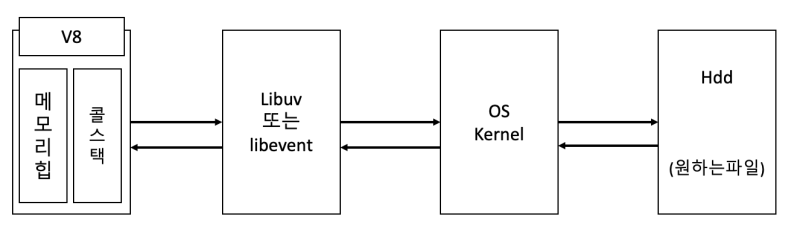
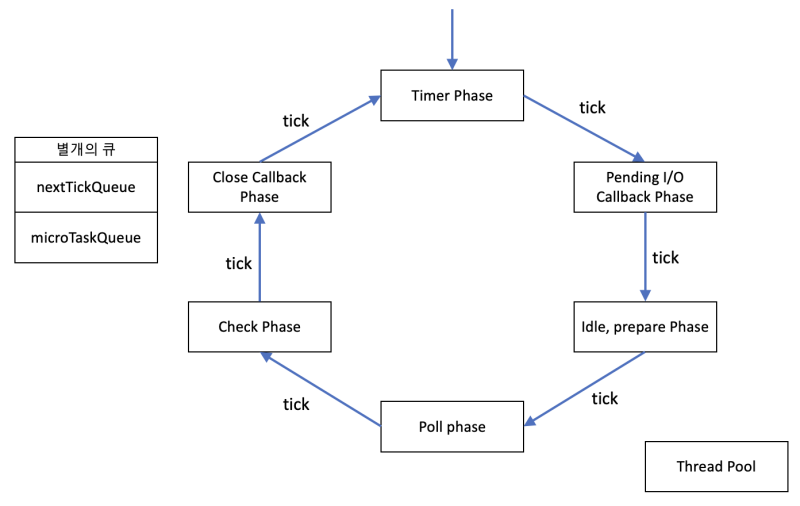
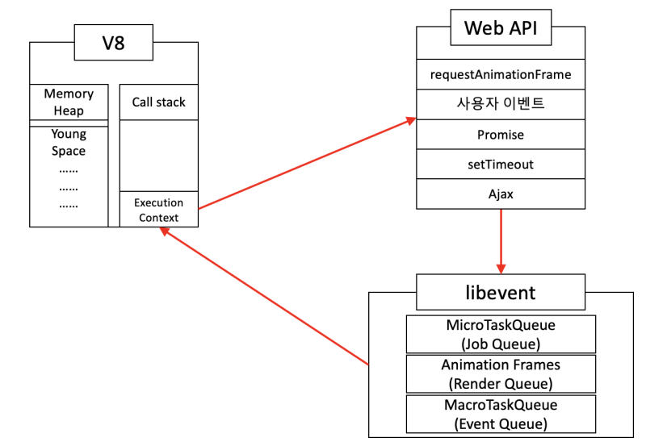

[](https://hits.seeyoufarm.com)

JavaScript와 관련된 공부를 하다보면 이벤트 루프라는 말을 종종 마주하곤 한다.
Chrome같은 브라우저나 JavaScript 런타임인 Node.js에는 이벤트 루프라는 개념이 존재한다.
이 개념을 위하여 Node.js의 경우 libuv라는 라이브러리를 사용하고, Chrome의 경우 libevent라는 라이브러리를 사용한다.
이 글에서는 각 이벤트 루프들에 대한 내용과 Node.js, Chrome 에서의 이벤트루프의 차이에 대해 공부한 내용을 정리해보려 한다.

<hr/>

### 1.이벤트 루프(Event Loop)의 개념

이벤트 루프는 굉장히 추상적인 개념이다.
이벤트 처리를 위한 일련의 방법을 "이벤트 루프(Event Loop)" 라고 부른다.
따라서 "이벤트 루프"라는 개념을 코드로서 구현 할 수는 있지만, "이벤트 루프" 그 자체는 코드가 아니다.
예시로, V8엔진은 자바스크립트 코드를 읽기 위해서 존재하는 엔진이다. 파일 읽어오기 등과 같은 비동기로 동작해야할 특정한 이벤트를 만난다면, V8 엔진은 이 작업을 처리할 수 없다.
결국 파일 읽기와 같은 작업은 운영체제의 커널에 요청을 해야하는데, 자바스크립트 코드가 이러한 이벤트를 만났을 때 "어떠한 방식으로 어떻게 처리할 것인가" 라는 것이 이벤트 루프라는 개념이다.
그리고 이는 각각 Node.js의 libuv와 chrome의 libevent에서 각기 다른 방법으로 구현되어있다.

<hr/>

### 2. libuv와 libevent?

libuv와 libevent에 대해 한 마디로 줄여 설명하자면, 이 라이브러리들은 OS의 커널을 추상화한 라이브러리들이다.
OS의 커널은 하드웨어와 소프트웨어 사이에서 인터페이스를 제공하는 역할을 한다.
libuv와 libevent도 비슷하다.
위에서 설명했던 예시를 다시 한번 사용하겠다.
V8엔진이 자바스크립트 코드를 읽다가 파일 읽기 관련 코드를 만났다.
V8엔진은 자바스크립트 코드를 읽기 위해 존재하는 엔진이기에, OS의 커널에 파일 요청과 같은 작업은 처리할 수 없다. 여기서 이 요청을 대신 해주는 것이 libuv, libevent같은 라이브러리이다.
libuv, libevent 같은 라이브러리는 V8엔진과 OS의 커널 사이에서 인터페이스를 제공하는 역할을 하는 것이다.
따라서 이 라이브러리들은 소프트웨어와 하드웨어 사이에서 인터페이스를 제공하는 역할을 하는 커널을 추상화한 라이브러리라고 볼 수 있다.

그림으로 보면 아래와 같이 볼 수 있을 것이다.

 
<br/>

그림과 같이 libuv, libevent같은 라이브러리는 V8엔진과 OS의 커널 사이에서 인터페이스를 제공하는 역할을 한다.

<hr/>

### 3. Node.js에서의 Event Loop

그렇다면 먼저 Node.js에서의 이벤트 처리 방법에 대해 알아보자.

2번에서 언급했던 것처럼 V8엔진은 자바스크립트 코드를 읽다가 비동기로 처리해야할 작업이 있다면 libuv로 넘겨버린다. 작업을 넘겨받은 libuv는 그 작업을 libuv 자신이 처리할 수 있는 일인지를 판단한다.
만약 처리하고자 하는 일이 타이머같은 동작이라면 libuv 내에서 충분히 처리할 수 있는 일이다. 따라서 이런 작업들은 libuv 내에서 비동기적으로 함수를 호출하여 처리한다.

만약 파일 읽어오기와 같이 libuv가 혼자 처리할 수 없는 일이라면 libuv는 libuv 내의 쓰레드풀(Thread Pool)을 이용하여 커널에 요청을 한다. 이 때, 쓰레드 풀을 이용해 커널에 요청해야하는 경우는 비동기로 동작하지 않고 그 작업이 끝날 때 까지 기다린 뒤 결과를 가져오는 동기적인 방식으로 동작한다.
이러한 모든 과정은 싱글 쓰레드로 동작한다.

이렇게 하고자 하는 비동기 또는 동기 작업이 끝났다면, 작업의 종류에 따라 libuv에 있는 8개의 큐 중 하나에 콜백 형태로 들어간다.
아래는 libuv에 있는 큐들의 이름이다.

> 1. nextTickQueue
> 2. microTaskQueue
> 3. Timer
> 4. pending I/O Callbacks
> 5. Idle, prepare
> 6. Pole
> 7. Check
> 8. Close Callbacks

이 때 1번과 2번(nextTickQueue, microTaskQueue)을 제외한 각각의 큐 들을(3 ~ 8번) 페이즈(phase)라고 부른다.

 
<br/>

비동기 요청이 들어오면 libuv는 그 요청이 스스로 처리할 수 있는 작업인지, 커널에게 요청해야하는 작업인지 판별한다. 이후 그 작업이 완료되면 결과를 콜백 형식으로 각 페이즈나 nextTickQueue 또는 microTaskQueue에 넣어둔다. libuv는 Node.js 프로세스가 종료되기 전까지 [라운드 로빈(RR)](https://blog.naver.com/dlaxodud2388/222166315601) 방식으로 6개의 페이즈들을 순회하며 들어온 콜백이 있는지 확인한다. 여기서 한 페이즈 한 페이즈 넘어가는 것을 "Tick"이라고 한다.
여기서 각 페이즈들은 선입선출방식으로 콜백들을 처리한다.

각 페이즈들의 역할은 아래와 같다.

**1. Timer phase**
이 페이즈는 setTimeout(), setInterval()같은 작업들을 하는 페이즈이다.
또한 이벤트 루프의 시작이 되는 기준점인 페이즈이기도 하다.
지정된 시간에 맞게 기다리다가 그 시간이 되면 타이머의 콜백을 Timer phase의 큐에 넣는다.

**2. Pending I/O callbacks phase**
이 페이즈의 큐에 들어가있는 콜백의 경우 다음 루프 반복으로 인해 연기된 I/O의 콜백이다.
각 페이즈가 모든 작업을 다 하고 다음 페이즈로 넘어가는 것이 아니다 보니 조금 작업을 하다 남은 작업을 이 페이즈에서 하게 된다. 그 후 작업이 끝나면 이 Pending I/O callback phase의 큐에 넣는다.

**3. Idle, Prepare phase**
이 페이즈의 경우 Node.js의 내부 관리를 위해 사용되는 페이즈이다.
매 tick마다 실행이 된다.

**4. Poll phase**
이 페이즈는 I/O와 관련된 콜백들을 처리하는 페이즈이다.
타이머가 걸려있는 콜백들을 제외한 대부분이 이 페이즈에서 처리된다.

**5. Check phase**
이 페이즈의 경우 setImmediate()의 콜백을 위한 페이즈이다.
setImmediate()의 경우 setTimeout(), setInterval()과 다르게 이 Check phase에서 관리된다.

**6. Close phase**
close 타입의 이벤트들이 처리되는 페이즈이다.
ex) .on('close', ()=>{ ... });

```js
const fs = require("fs")

fs.readFile("./hello.txt", (err, data) => {
  // hello.txt 파일의 내용은 "안녕하세요!"
  console.log(data.toString())
})
console.log("hi!")
function hello() {
  console.log("배고프다")
}
hello()
```

위와 같은 코드를 v8이 실행했다고 해보자.
readFile()를 읽는순간 v8은 이 작업을 libuv로 보낼 것이다. 작업을 받은 libuv는 이 작업을 libuv 스스로 할 수 없는 작업임을 확인하고 OS의 커널에 파일을 읽어달라는 요청을 보낼 것이다. 이후 파일 읽기가 완료되면 libuv는 결과를 받아 Poll Phase에 넣는다. 이러는 와중에 v8은 코드들을 마저 실행한다.
코드가 다 끝났다면 libuv는 등록된 콜백이 있는지 확인한다. 없다면 그대로 코드를 종료했겠지만, 있다면 앞서 말한 6개의 페이즈를 순회하며 콜백들을 처리한다.
순회하던 중 Poll Phase에서 readFile()결과값을 가져올 수 있을 것이다.
따라서 코드의 결과는 아래와 같다.

> hi!
> 배고프다
> 안녕하세요!  
> // 파일 내용 (Poll Phase에서 가져옴.)

그리고 설명하지 않은 nextTickQueue와 microTaskQueue는 libuv에서 별도로 관리되는 큐이다.
process.nextTick()으로 작성된 코드들이 nextTickQueue에 들어가고, Promise()로 작성된 코드들이 microTaskQueue에 들어간다.
nextTickQueue가 microTaskQueue보다 우선순위가 높으며, 이 두 큐는 앞서 말한 6개의 페이즈(Timer, Pending I/O, Idle, Pole, Check, Close Callback)을 tick이 발생하고 다음 페이즈로 넘어가기 전에 우선적으로 콜백을 처리하게 되는 그런 큐이다.

아래 코드를 통해 한번 알아보자.

```js
setTimeout(() => {
  console.log("settimeout0")
}, 0)
setImmediate(() => {
  console.log("setimmediate")
})
function hi() {
  return new Promise(resolve => {
    resolve()
  })
}
hi().then(() => {
  console.log("나는promise")
})
process.nextTick(() => {
  console.log("나는process.nexttick")
})
console.log("콘솔찍었다")
```

먼저 코드는 setTimeout() -> setImmediate()-> Promise -> nextTick() -> console.log() 순으로 만나게 될 것이다.
console.log()를 제외하고는 모두 비동기로 처리되어야 하는 코드이기에 모두 libuv가 처리를 한다.
코드가 마무리 된 뒤 이벤트를 처리할 큐들을 확인하기에 console.log("콘솔찍었다"); 가 먼저 찍힌다.
이후 nextTickQueue, microTaskQueue를 먼저 확인하기에 각각 나는process.nexttick, 나는promise 순으로 찍히게 된다. 그 뒤 Timer Phase의 setTimeout이 Check Phase의 setImmediate보다 페이즈가 먼저 있기 때문에 settimeout0 -> setimmediate 순서대로 찍힌다.

결론적으로 아래와 같은 결과가 찍히게 된다.

> 콘솔찍었다
> 나는process.nexttick
> 나는promise
> settimeout0
> setimmediate

### 3. 브라우저(Chrome)에서의 Event Loop

그림으로 먼저 보자면 아래와 같다.

 
<br/>

V8 엔진이 코드를 읽다 비동기 관련한 코드가 나오면 바로 libuv로 넘겨버리는 Node.js와는 다르게, 브라우저의 경우 WebAPI를 사용하거나 사용자 이벤트가 발생하면 libevent로 넘겨 처리하는 구조이다.
Chrome의 libevent를 통한 이벤트 처리는 3가지 큐를 통해 이루어진다.

**1. MicroTaskQueue**

**2. RenderQueue(Animation Frames)**

**3. MacroTaskQueue**

### 3-1) MicroTaskQueue (Job Queue)

MicroTaskQueue는 Node.js의 libuv에서의 역할과 비슷한 역할을 한다.
가장 우선순위가 높은 큐이며, Promise 타입이 이 큐에 들어간다.
MicroTaskQueue는 큐가 빌 때 까지 계속해서 작업을 수행한다. 이 큐가 비워지지 않으면 다른 큐들이 동작하지 않게 된다. 또한, MicroTaskQueue는 렌더링 전에 수행이 시작되기에 비워지지 않으면 DOM이 렌더링되지 않을 수 도 있다. 이는 아래 코드를 브라우저 개발자 도구에 작성해보면 알 수 있다.
그 탭이 먹통이 될 것이다.

```js
function loop() {
  console.log("microtaskqueue")
  queueMicrotask(loop)
}
loop()
```

### 3-2) Animation Frames (Render Queue)

이 큐는 requestAnimationFrame()라는 API를 통해 생성된 콜백이 들어가는 큐이다.
requestAnimationFrame()은 브라우저에게 수행하기를 원하는 애니메이션을 알리고 다음 RePaint가 진행되기 전에 해당 애니메이션을 업데이트하는 함수를 호출하는 메서드이다.

브라우저의 렌더링 과정은 아래의 과정을 거친다.

1. Parse(DOM Tree 구축)
2. Style(CSSOM 생성)
3. Layout(Layout Tree 구축, Reflow)
4. Pre-Paint(GPU 종속css 트리 생성)
5. Paint (GPU가 사용할 명령어 구축, Repaint)
6. Layerize (레이어 분리)

이 때 3번 Layout(Reflow) 과정은 Layout Tree를 통해 어떤 노드가 어느 위치에 존재하게되는지 기하학적 데이터를 결정하는 과정으로, 이 과정이 발생하는 상황은 정해져 있다.

> 노드 추가 제거
> 노드 크기, 위치 변경
> 폰트 변경, 이미지 크기 변경, 텍스트 내용 변경
> 페이지 초기 렌더링시
> 브라우저 리사이즈

따라서 requestAnimationFrame() 가 호출되면

1. Layout (Reflow)과정이 다시 호출되고,
2. Layout Tree에 존재하는 요소들을 픽셀로 전환하는 "Paint(Repaint)" 과정을 거친 뒤
3. Layer로 쪼갠 뒤 GPU에게 넘겨 화면을 변경.

이런 방식으로 렌더링되는 과정을 "렌더링 파이프라인"이라고 부르는데, 이런 과정들의 일부가 requestAnimationFrame() 호출을 하게 된다면 Animation Frames(Render Queue)에 들어가는 것이다.

**<i>
(몇년 전에 쓴 글이라, 글을 옮기면서 보니 글을 썼던 흐름이 조금 가물가물하긴 한데, 브라우저는 일반적으로 초당60프레임을 사용자에게 보여준다. 1000/60을 하면 대략 16ms정도 나오는데, Frame Drop이 좀 많이 난다 싶으면 이 메서드를 이용하여 Frame을 좀 맞추는 방식으로 사용하기도 한다.)
</i>**

### 3-3) MacroTaskQueue (Event Queue)

이벤트 큐라고도 불리는 MacroTaskQueue에는 사용자가 발생시킨 이벤트나 setTimeout(), Ajax와 같은 작업을 관리한다.
한 가지 재미있는 사실은 MacroTaskQueue는 이름은 큐이지만 사실은 Set으로 구현되어있다.
큐에 들어간 이벤트들을 선입선출로 관리하는 것은 맞으나 단순히 아무 task나 가져오는 것이 아닌 실행 가능한 task를 가져와야 하기 때문에 Set으로 구현되어 있다.

<hr/>

### 4. Chrome에서의 Event Loop와 Node.js에서의 Event Loop의 차이

Chrome의 libevent 라이브러리를 통해 구현한 이벤트 루프는 2번에서 설명한 Node.js libuv를 통해 구현된 이벤트 루프와 조금 다르게 구현되어 있었다.
그럴 법도 한게 Node.js라면 js 코드를 한 번 읽고 거기서 발생하는 이벤트들을 처리하면 되겠지만, 브라우저는 그렇지 않다. 브라우저는 마우스, 키보드 인터럽트로부터 발생하는 이벤트부터 시작해서 디스플레이 출력까지 굉장히 많은 io 작업들을 처리해야 한다. 따라서 libevent의 경우 비동기적으로 끊임없이 돌아가야 한다. 돌아가는 환경이 아예 다르다.
이러한 이유 때문에 Chrome의 libevent와 Node.js의 libuv는 매우 다를 수밖에 없고, 구현한 이벤트 루프 또한 다를 수밖에 없다.

<hr/>

<i style="font-size:0.7rem; text-align:right">

참고
https://jsqna.com/js-event-loop-browser-vs-node/
https://jaehyeon48.github.io/javascript/browser-event-loop/
https://developer.mozilla.org/ko/docs/Web/API/Window/requestAnimationFrame
https://ibocon.tistory.com/239
https://yceffort.kr/2021/08/browser-nodejs-event-loop
https://blog.naver.com/pjt3591oo/222782354235

</i>
