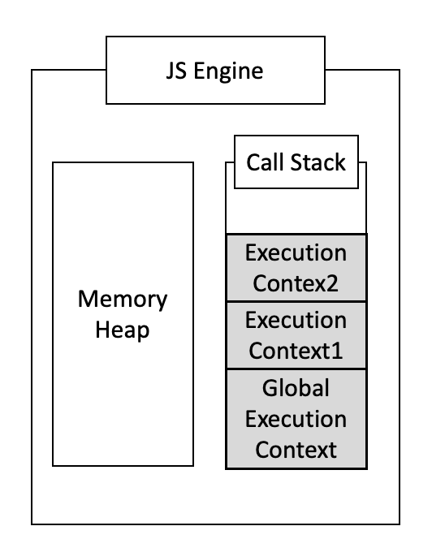
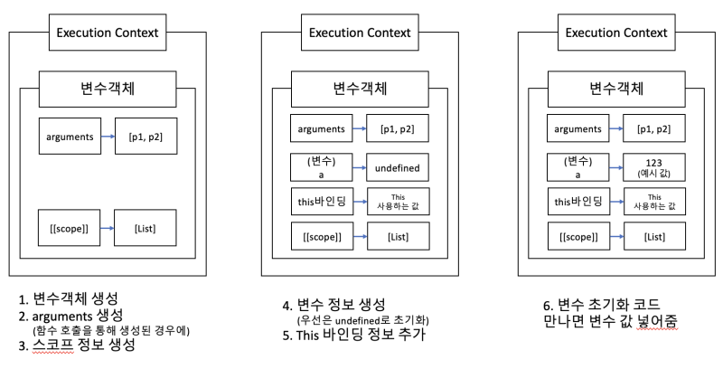
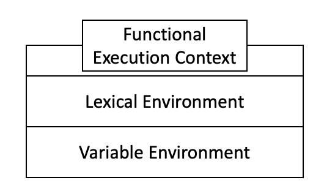
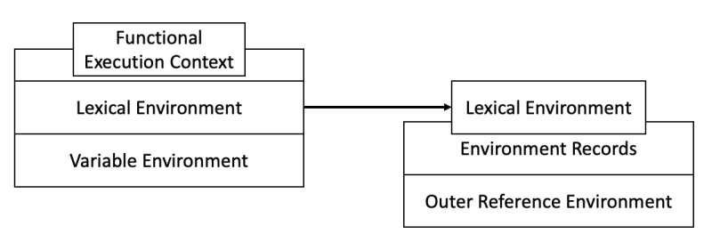
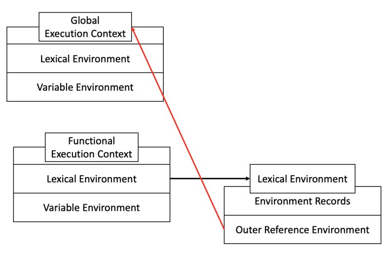
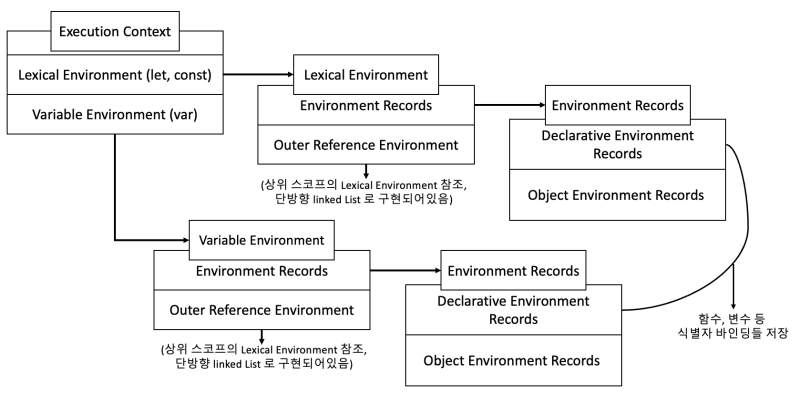
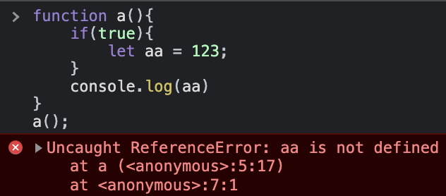
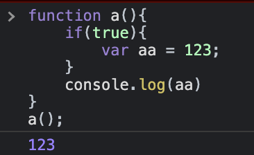
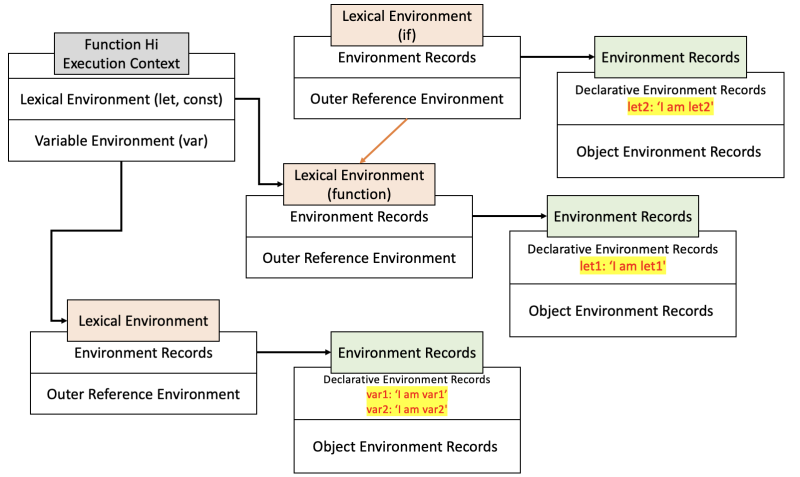

ES5를 기점으로 Execution Context의 동작하는 방식과 구조가 많이 달라졌다.
이 블로그의 예전 포스팅에서는 대부분 그 이전의 Execution Context를 기준으로 포스팅을 작성했었다.
ES6의 Execution Context에 대해 ES3의 Execution Context와 비교하며 한번 정리해 보려 한다.

ES5를 기점으로 Execution Context가 조금 달라졌다 하더라도, 바뀌지 않은 Execution Context의 개념적인 내용에 대해 먼저 이야기하고 가겠다.

<hr/>

### 1. Execution Context(실행 컨텍스트) 란 무엇인가?

자바스크립트가 코드를 실행하기 위해서는 특정한 코드들에 대한 정보가 필요할 것이다.
그 특정한 코드를 실행하기 위해 코드를 일종의 블록으로 나누는데, 그 코드 블록에 들어가 있는 변수, 함수, this, arguments 등에 대한 정보를 담고 있는 하나의 환경을 "Execution Context"라고 부른다.
한마디로 정리하자면 "실행 가능한 자바스크립트의 코드 블록"이다.
이 Execution Context라는 코드 블록은 딱 3가지 경우에만 생성된다.

- 맨 처음 코드가 실행되었을 때 (Global Execution Context).
-  함수가 호출되었을 때.
-  eval()이 사용되었을 때.

이렇게 생성된 Execution Context는 자바스크립트 엔진의 Call Stack이라는 곳에 차곡차곡 쌓이게 된다.

 
<br/>

Execution Context가 생성되는 경우 중 eval() 사용의 경우는 eval() 자체를 XSS(Cross Site Script) 공격에 사용되는 등 악의적인 공격에 사용될 수 있다 보니 보안상 문제 때문에 사실상 안 쓰는 케이스이기에 이 경우는 이 글에서 다루지 않겠다
[(eval()을 사용하지 않는 이유)](https://blog.naver.com/dlaxodud2388/222164268980)

Execution Context가 위의 3가지 상황이 발생 시 콜 스택에 쌓인다는 내용은 ES5 이후에 Execution Context가 바뀌고도 동일하게 가져가는 개념이다.

이제 ES3을 기준으로 실행 컨텍스트가 어땠는지부터 다시 한번 보자.

<hr/>

### 2. ES3 기준 Execution Context와 Scope Chain

 
<br/>

우선 생긴 Execution Context 가 함수 호출로 인해 생긴 Execution Context라면, 먼저 변수 객체가 생긴 뒤 arguments 정보를 생성한다. 이후 이 arguments는 param 등의 정보를 담는다.

이후에는 scope 정보가 생긴다. 이 스코프 정보를 통해 하위 Execution Context에서 전역 Execution Context에 있는 변수가 참조를 할 수 있다. 이렇게 변수 객체의 scope 정보를 타고 상위 실행 컨텍스트의 데이터에 접근하곤 하는 것을 "Scope Chain(스코프 체인)"이라고 한다.
이 scope 정보는 단방향 링크드 리스트와 같은 형태로 이루어져 있기 때문에 특정한 함수 Execution Context에서 전역 Execution Context 방향으로만 참조가 가능하게 된다. 따라서 아래와 같은 예시처럼 코드가 동작하게 되는 것이다.

```js
var a = 1;
function hi(){
    console.log(a);
}
hi(); // 함수에서 변수 a 접근가능

function hi(){
    var aa = 123;
}
console.log(aa) // 전역에서 aa변수 접근 불가능
```

스코프 정보에 대한 정보가 생긴 뒤에는 변수에 대한 정보가 생성된다.
이런 변수가 있다고만 먼저 등록해두고 값은 undefined로 초기화해둔다.
이후에 변수 초기화 코드를 만나면 그제서야 undefined를 초기화하고자 하는 값으로 초기화된다.

변수 정보 생성 이후에는 this 바인딩에 대한 정보를 추가해 준다. 만약 this가 참조하는 객체가 없다면 전역으로 바인딩 된다.

여기까지 하면 ES3 기준의 Execution Context가 생성된다. 

<hr/>

### 3. ES6의 Execution Context

그렇다면 ES6 이의 Execution Context는 ES3 기준 Execution Context 와 뭐가 다른 걸까?
우선 Execution Context의 구성 요소가 달라진다.
가장 큰 차이점으로 ES6의 Execution Context는 Lexical Environment라는 것이 두 개가 들어간다.
이렇게 들어간 두 개의 Lexical Environment는 각각 다른 이름으로 구별되어 불린다. 
(물론 서로 조금 다른 동작을 한다.)
1. Lexical Environment
2. Variable Environment

 
<br/>

### 3-1) Lexical Environment의 구조

Lexical Environment는 2가지로 이루어져 있다.

1. Environment Records 
2. Outer Reference Environment (scope)

 
<br/>

Environment Records는 또 여러 가지로 나뉘기에, 먼저 Outer Reference Environment 부터 이야기하겠다.

### 3-2) Outer Reference Environment 와 Lexical Nesting Structure

Outer Reference Environment 는 상위 스코프의 Lexical Environment를 가리킨다.
이는 자바스크립트에서 흔히 말하는 Scope Chain에 관련된 내용이다.
이  Outer Reference Environment 를 통해 상위 스코프의 데이터들을 참조할 수 있다고 생각하면 된다.
단, 이  Outer Reference Environment는 단방향 링크드 리스트로 이루어져 있기에 하위 스코프에서 상위 스코프를 참조하는 것만 가능하다.

전역 Lexical Environment의 경우 당연히 Outer Reference Environment는 null 값이다.
전역에서 함수 하나만 호출된 상태의 상황을 그림으로 나타내면 아래와 같을 것이다.

 
<br/>

이렇게 Lexical Environment의 Outer Reference Environment 가 상위 Lexical Environment와 연결되어 있는 것을 ES5버전 이후의 Execution Context에서는 "Lexical Nesting Structure"라고 한다.

### 3-3) Lexical Environment의 Environment Records 


Environment Records는 기본적으로 변수, 함수 이름과 관련된 값들을 추적한다.
이 Environment Records의 경우 다시 2가지로 나뉜다.


1. Declarative Environment Records (선언적 환경 레코드)
2. Object Environment Records (개체 환경 레코드)


함수, 변수, this 등 식별자 바인딩이 Declarative Environment Records에 저장되는데, 대부분의 경우 
Object Environment Records보단 Declarative Environment Records에 저장된다고 보면 된다.


Object Environment Records는 with 문 같은 코드를 쓰는 것이 아니라면 대부분 그쪽으로 저장될 일이 없다고 보면 된다.

이제 Lexical Envorinment의 전체적인 그림을 한번 그려보면 아래와 같은 구조일 것이다.

 
<br/>

### 3-4)  Lexical Environment와 Variable Environment

그럼 이제 한번 생각해 보자.
왜 함수의 Execution Context를 Lexical Environment와 Variable Environment로 구별지어 나눈 걸까?
여기서 내오는 내용이 바로 변수 선언 방식 let, const와 var의 차이이다.


**첫 번째 차이점이다.**
아래 사진을 보면 알 수 있겠지만, let, const로 선언한 변수들의 경우 스코프 자체가 block scope이다. 
그에 비해 var로 선언한 변수의 경우는 스코프가 functional scope이다.

 |
--- | --- |
(블록 스코프)|(함수 스코프)

이 차이점으로 인해 한 함수안에 여러 블록이 생긴다면 그 함수의 Execution Context에는 여러 Lexical Environment를 여러 개 만들어야 하는 상황이 만들어지기에 Lexical Environment와 Variable Environment를 구분 짓는 것이다.

예시로 아래와 같은 코드가 있다고 해보자.

```js
function Hi(){
    let let1 = 'I am let1';
    var var1 = 'I am var1';
    if(true){
         let let2 = 'I am let2';
         var var2 = 'I am var2';
    }
}
```

이 경우 아래 그림과 같이 Lexical Environment가 블록 기준으로 여러 개 생기게 될 것이다.
(함수 블록, if 블록)

 
<br/>

**두 번째 차이점은 변수가 생성되는 과정이다.(TDZ 영향 여부)**
자바스크립트에서는 변수가 생성되는 과정이 3가지로 나누어진다.

>1. Declaration phase(선언 단계) : 변수를 Execution Context의 Lexical Environment에 등록.
>2. Initialization phase(초기화 단계) : Lexical Environment에 등록되어 있는 변수를 위하여 메모리를 할당하는 단계. 여기서 변수는 undefined로 초기화된다.
>3. Assignment phase(할당 단계) : 변수에 실제로 값이 할당되는 단계이다. (undefined → 특정한 값)

let, const와 var은 이 3가지 과정을 거치는 부분에서 또다시 차이가 발생하는데,
var의 경우 1번과 2번이 동시에 진행되는데 let, const는 1번만 먼저 진행된다.

1번 Declaration phase(선언 단계) 와 2번 Initialization phase(초기화 단계) 사이를 [TDZ(Temporal Dead Zone)이라고](https://blog.naver.com/dlaxodud2388/222284235839) 부르는데, 변수 생성 과정 차이로 인한 TDZ의 영향을 받느냐가 두 번째 차이점이다.
이 때문에 동작을 아예 다르게 해야 하는 것이고 그렇기에 Lexical Environment와 Variable Environment를 구분 짓는다.


* 참고로 흔히들 말하는 "변수 선언 부가 스코프의 최상단으로 끌어올려진다"라는 특성인 "호이스팅(Hoisting)" 현상은 1번 Declaration phase(선언 단계) 때문에 발생하게 된다. let과 const 또한 Declaration phase(선언 단계)는 거치기에 호이스팅은 일어난다.
오류가 발생하는 이유는 TDZ에 영향을 받아 초깃값을 할당받지 못한 변수에 접근하려 하였기 때문일 뿐이지, 
호이스팅이 일어나지 않는 것이 아니다.

실제로 Execution Context의 생성 과정은 크게 두 페이즈로 나누어진다.

> 1. Creation Phase(Execution Context에 대한 정의 과정)​
> 2. Execution Phase(코드를 실행하는 과정)

첫 번째 페이즈인 Creation Phase에서 Lexical Environment와 Variable Environment에 대한 정의가 이루어지게 된다.

Variable Environment에서는 var로 선언된 변수를 변수 선언 1, 2단계(Declaration phase, Initialization phase) 모두 진행하기에 메모리에 매핑되고 undefined로 초기화까지 마치게 된다.
반면에 Lexical Environment의 경우는 let, const로 선언된 변수를 1단계(Declaration phase)만 진행하기에 Variable Environment와는 동작 방식에 차이가 있다.


결론적으로 위 두 가지 차이 때문에 Lexical Environment와 Variable Environment로 차이를 두는 것이다.

<hr/>

<i style="text-align:right; font-size:0.7rem">

[참고링크1](https://es5.github.io/#x10)
[참고링크2](https://stackoverflow.com/questions/20139050/what-really-is-a-declarative-environment-record-and-how-does-it-differ-from-an-a)

</i>