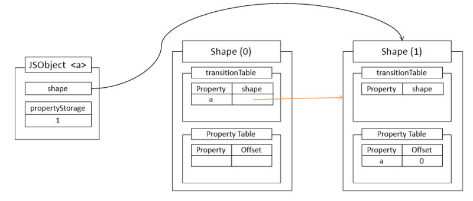

[](https://hits.seeyoufarm.com)

이 글의 주제인 히든 클래스와 인라인 캐싱에 대해 설명하기 전에, 
먼저 자바스크립트의 객체의 프로퍼티와 프로퍼티 값은 어떻게 저장이 될지 한번 생각해보자.

아래 코드를 예시로 들어 한번 생각해보자.

```js
function A(x,y){
   this.x = x;
   this.y = y;
}
let a = new A(1,2);
```

보이는 것처럼 a 라는 객체에 x와 y라는 프로퍼티가 존재하고 그 안에1, 2라는 값이 들어가게 될 것이다.

그런데 이 객체의 프로퍼티와 값이 한 곳에 묶여 저장이 된다고 생각해보자.(실제로는 그렇지 않다.)

 
<br/>

대충 위 그림같은 느낌으로 말이다.
그런데 이런 구조로 이루어져 있다면 문제가 하나 발생한다.

```js
let a = new A(1,2);
let b = new A(2,3);
let c = new A(3,4);
// ...
```

위 코드와 같이 같은 모양의 객체들을 막 생성해낸다면 각각의 객체들은 똑같은 프로퍼티 이름들을 다 가지고 있어야 하고, 그에 따른 값도 다 가지고 있어야 할 것이다.

 
<br/>

위 그림처럼 프로퍼티 이름과 값을 다 가지고있는 것은 정말 비효율적인 일일 것이다.
그렇다면 자바스크립트는 어떻게 객체의 프로퍼티와 프로퍼티 값을 갖고 있을까?

 
<br/>

대충 그림으로 그려보자면 위 그림과 같이 저장하게 된다.
프로퍼티의 값을 저장하는곳과, 그 외 프로퍼티 명이나 그 외 정보들(프로퍼티 값 저장소의 오프셋정보 등)을 저장하는곳을 나눠 가지고 있게 된다.

그런데, 생각해보면 자바스크립트는 동적 언어인지라 프로퍼티가 언제 어떻게 바뀌어 버릴 지 모른다.
여기서 자바스크립트와 다른 클래스 언어의 차이가 발생하게 된다.

 
<br/>

클래스 언어같은 경우는 위 그림과 같이 사용하기에 컴파일 시에 메모리의 오프셋 값 지정이 가능하다.
그러나 자바스크립트의 경우 아까 위에서 썼던 코드에서


```js
a.q = 123;
```

이런 코드를 추가해버리면 a 객체에는 q라는 프로퍼티가 갑자기 생기게 되는 것이다.
이런 자바스크립트의 특성 때문에, 자바스크립트는 클래스 언어와는 다르게 오프셋 값을 미리 결정하는 것이 불가능하다. 프로퍼티가 언제 어떻게 바뀔지 모르기 때문이다.

이 문제를 자바스크립트 엔진들은 아래와 같이 해결하였다.

 
<br/>

위에서 프로퍼티의 "값"을 저장하는곳과, 그 외 프로퍼티 명이나 그 외 정보들(프로퍼티 값 저장소의 오프셋 정보 등)을 저장하는곳을 나눠 가지게 된다고 설명하였는데,
프로퍼티의 값을 저장하는곳을 위 그림에선 "JSObject" 그리고 값 외의 정보들을 저장하는 곳을 "Shape"라고 보면 된다. 여기서 "Shape"라고 한 이것을 학술 논문에서는 "히든 클래스(Hidden class)"라고 부른다.


이제 위 그림을 보며 각각 무엇을 의미하는지 알아보자.

### JSObject
- shape : 자신이 현재 참조하고 있는 Shape(히든클래스)를 가리킨다.
- propertyStorage : 이 부분이 프로퍼티의 값들이 저장되어있는 부분이다.


### Shape

- transitionTable : 객체의 구조가 중간에 바뀌는 경우(프로퍼티 추가 등)에 사용된다.
- propertyStorage : 프로퍼티의 이름과 JSObject의 propertyStorage 안에 있는 프로퍼티 값의 오프셋 정보가 저장되어있다.
- propertyStorageCapacity : 프로퍼티의 총 개수
- prototype : 해당 객체의 프로토타입


여기서 유의깊게 봐야 할 것이 바로 transitionTable이다. 이 transitionTable은 객체의 구조가 중간에 바뀌는 경우에 사용된다고 했는데, 어떻게 사용되는지 아래 예시 코드를 통해 알아보자.

```js
function Hello(x){
    this.a = x;
}

let a = new Hello(1);

a.b = 123;
```

 
<br/>

그러다가 a라는 프로퍼티가 생성이 된다면, 아래 그림과 같이 shape (1) 을 만들고 그 안의 Property Table에 프로퍼티 이름 a와 프로퍼티 a의 값이 들어있는 오프셋 값을 넣어준다. (JSObject `<a>`의 propertyStorage 안의 오프셋 값) 
이후 Shape(0)의 transitionTable 안에 a 라는 프로퍼티 명이 추가된다.
이렇게 되면 앞으로 특정한 빈 객체에 a라는 프로퍼티가 추가되면 이 transition Table을 참조하여 Shape(1)로 가게 되는 것이다.

 
<br/>

이후 a.b = 123; 을 만나게 되는데, 이 경우도 위와 같다.
a라는 프로퍼티를 이미 가지고 있는 상황에서 b라는 프로퍼티가 생성되는 것이기에, Shape(2)를 만들고 그 안의 Property Table에 a와 b를 추가한 뒤 오프셋 값을 넣어준다.
이후 Shape(1)의 transition Table에 b라는 프로퍼티를 넣어주게 된다. 
그리고 객체가 Shape(2)로 넘어가게 된다.
앞선 내용과 같이, a라는 이름의 프로퍼티를 가지고 있는 객체가 b라는 프로퍼티를 추가하게 될 경우, 굳이 Shape를 만들지 않고 Shape(1)의 transition Table를 참조하여 Shape(2)로 갈 수 있게 된다.

 
<br/>

그러다 아까 위 코드에서 아래와 같은 코드가 추가되었다고 해보자.

```js
let b = new Hello(23);
```

그렇다면 아래 그림과 같이 될 것이다.

 
<br/>


이렇게 Shape에 대해서 설명을 했는데, 아까 위에서 말했던 것처럼 "Shape" 라는 것을 학술 논문에서는 
히든 클래스(Hidden Class) 라고 부른다고 했다. (이제 그냥 히든클래스라고 부르겠다.)
학술논문에서 다르게 부른 것처럼, 여러 자바스크립트 엔진마다 이 Shape를 부르는 이름이 다른데,
V8의 경우는 "Map"이라고 부르고 Chakra의 경우 "Types", JavaScriptCore 엔진의 경우 "Structure",
SpiderMonken의 경우 "Shapes"라고 부른다.

그렇다면 위에서 설명한 히든클래스에 관한 내용들이 정말인지 한번 확인해보자.

```js
function Hello(x){
    this.a = x;
}

let a = new Hello('1');
let b = new Hello('23');
```

우선 개발자도구를 들어가 위 코드를 먼저 콘솔창에 치고 메모리탭에 들어가 스냅샷을 찍어보자. (chrome을 사용하였다.)
이후 각 Hello를 쳐서 확인해보자.

 
<br/>

위에서 말했던 것처럼 V8엔진의 경우 히든클래스를"Map"이라고 부른다.
위 그림처럼 두 객체의 Map이 같다는 것을 확인할 수 있다.
그렇다면 여기서 아래 코드를 추가해보자.

```js
b.x = '가나다';
```

 
<br/>


그렇게 되면 위 그림과 같이 나오는 것을 확인할 수 있다.
a객체가 참조하고있는 히든 클래스의 transition Table을 참조하여 b객체가 프로퍼티x 가 생긴 뒤 만들어진 히든 클래스를 참조하도록 하는 것을 확인할 수 있다.


이렇게 직접 스냅샷을 찍어보아 히든클래스를 확인해보았는데, 여기서 우리가 실제로 접근해서 필드값을 가져오는  과정을 생각해보자.
객체에 접근해서 히든클래스로 간 뒤 Property Table로 가 프로퍼티를 비교한 뒤 오프셋의 위치로 가서 값을 가져오게 될 것이다.
이렇게까지 해야 겨우 실제 필드값을 가져올 수 있는 것이다.
그런데 생각해보면 굳이 히든클래스라는것을 써서 접근하게 해야할까? 생각이 들 수 있다.
오버헤드만 생기는 것이 아닌가 생각이 들 수 있다.


사실 이 히든클래스를 사용하는 이유는 인라인 캐싱(Inline Caching)을 위해서이다.
결론적으로 보자면 우리는 프로퍼티 값을 가져오기 위해 그 객체 프로퍼티의 오프셋을 통해 값으로 접근하게 된다.
이 인라인 캐싱이라는 것은 우리가 특정한 프로퍼티에 맨 처음 접근을 했을때, 그 객체의 히든 클래스를 그대로 캐싱해버리는 것이다.
히든클래스를 캐싱했으니 프로퍼티의 오프셋 값도 그대로 가져오게 될 것이다.
캐싱 이후 접근할 때는 오프셋 값을 그대로 쓰면 되니 효율적일 것이다.

그러다보니 이 인라인 캐싱의 가장 큰 혜택을 받을 수 있는 경우중 하나는 프로퍼티가 생성 또는 추가되지 않는다는 가정 하의 반복문의 경우이다.
맨 처음 접근한 뒤로는 히든클래스를 그대로 캐싱하기에 오프셋 값을 마음대로 다 쓸 수 있게 된다.