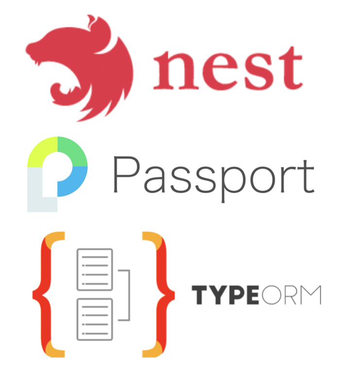
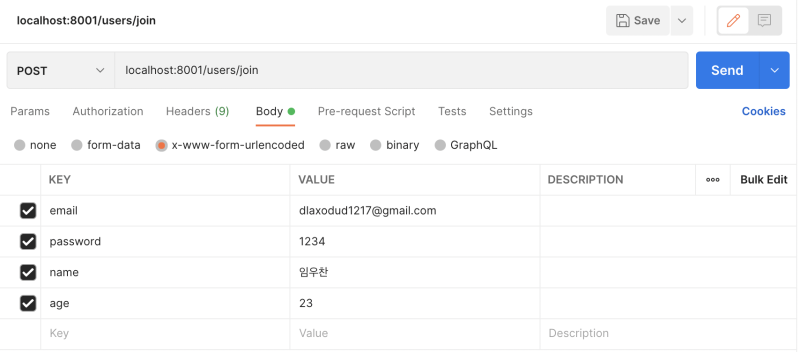
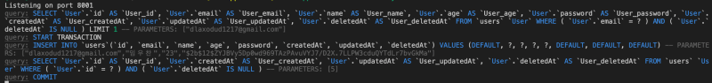
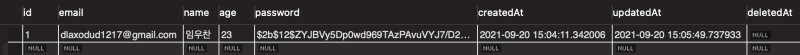
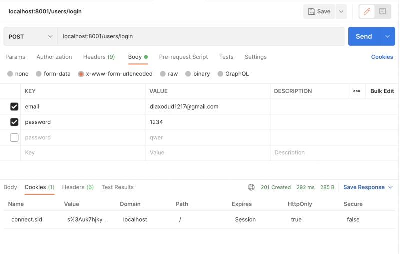
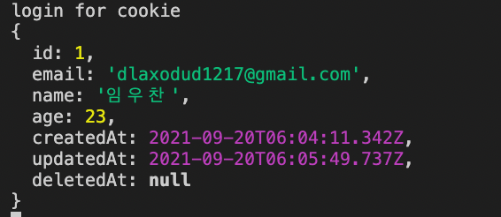
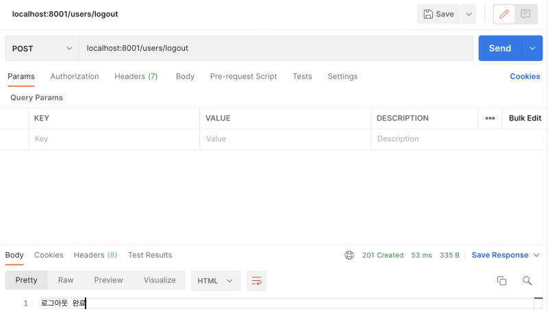

 
<br/>

이번 포스팅에서는 NestJS+Passport와 TypeORM을 이용해 로그인/ 회원가입 API를 구현해보겠다.
Nest 프로젝트 생성과 TypeORM 사용법에 관해서는 아래 글에서 다뤘었다.

https://blog.naver.com/dlaxodud2388/222505555514
https://blog.naver.com/dlaxodud2388/222494827734

<hr/>

### 1. 프로젝트 구조

프로젝트 구조는 아래와 같다.

```bash
├── httpException.filter.ts
├── nest-cli.json
├── ormconfig.ts
├── package-lock.json
├── package.json
├── src
│   ├── app.controller.spec.ts
│   ├── app.controller.ts
│   ├── app.module.ts
│   ├── app.service.ts
│   ├── auth
│   │   ├── auth.module.ts
│   │   ├── auth.service.ts
│   │   ├── local-auth.gaurd.ts
│   │   ├── local.serializer.ts
│   │   ├── local.strategy.ts
│   │   ├── logged-in.guard.ts
│   │   └── not-logged-in.guard.ts
│   ├── common
│   │   ├── decorator
│   │   │   └── users.decorator.ts
│   │   └── dto
│   │       └── users.dto.ts
│   ├── entities
│   │   └── User.ts
│   ├── main.ts
│   └── users
│       ├── users.controller.spec.ts
│       ├── users.controller.ts
│       ├── users.module.ts
│       ├── users.service.spec.ts
│       └── users.service.ts
├── tsconfig.build.json
└── tsconfig.json
```

<hr/>

### 2. 엔티티 생성

프로젝트 생성 후 아래와 같이 User 엔티티만 생성해 주겠다.

```ts
// ./src/entities/User.ts
import {
  Column,
  CreateDateColumn,
  DeleteDateColumn,
  Entity,
  PrimaryGeneratedColumn,
  UpdateDateColumn,
} from "typeorm"

@Entity({ schema: "example3", name: "users" })
export class User {
  @PrimaryGeneratedColumn({ type: "int", name: "id" })
  id: number

  @Column("varchar", { name: "email", unique: true, length: 30 })
  email: string

  @Column("varchar", { name: "name", length: 20 })
  name: string

  @Column("int", { name: "age" })
  age: number

  @Column("varchar", { name: "password", length: 70 })
  password: string

  @CreateDateColumn()
  createdAt: Date

  @UpdateDateColumn()
  updatedAt: Date

  @DeleteDateColumn()
  deletedAt: Date | null
}
```

ormconfig.ts도 아래와 같이 작성해준 뒤 app.module.ts에 import해주자.

```ts
// ./ormconfig.ts
import { TypeOrmModuleOptions } from "@nestjs/typeorm"
import { User } from "./src/entities/User"
import * as dotenv from "dotenv"

dotenv.config()
const config: TypeOrmModuleOptions = {
  type: "mysql",
  host: "localhost",
  port: 3306,
  username: process.env.DB_USERNAME,
  password: process.env.DB_PASSWORD,
  database: process.env.DB_DATABASE,
  entities: [User],
  synchronize: true, // 한번 만들고 false로 바꾸자.
  autoLoadEntities: true,
  charset: "utf8mb4",
  logging: true,
  keepConnectionAlive: true,
}

export = config
```

```ts
// ./src/app.module.ts
import { Module } from "@nestjs/common"
import { ConfigModule } from "@nestjs/config"
import { TypeOrmModule } from "@nestjs/typeorm"
import { AppController } from "./app.controller"
import { AppService } from "./app.service"
import { User } from "./entities/User"
import { UsersModule } from "./users/users.module"
import * as ormconfig from "../ormconfig"
import { UsersController } from "./users/users.controller"
import { UsersService } from "./users/users.service"
import { AuthModule } from "./auth/auth.module"

@Module({
  imports: [
    ConfigModule.forRoot({
      isGlobal: true,
    }),
    UsersModule,
    User,
    AuthModule,
    TypeOrmModule.forRoot(ormconfig),
    TypeOrmModule.forFeature([User]),
  ],
  controllers: [AppController, UsersController],
  providers: [AppService, UsersService],
})
export class AppModule {}
```

 
<br/>

테이블 구조는 위와 같다.

<hr/>

### 3. 회원가입 구현

user service코드와 user controller코드를 작성해주자.
typeorm repository의 save()와 bcrypt 모듈을 이용하여 구현해주면 된다.

```ts
// ./src/users/users.controller.ts

import { Body, Controller, Get, Post } from "@nestjs/common"
import { UsersService } from "./users.service"

@Controller("users")
export class UsersController {
  constructor(private UsersService: UsersService) {}

  @Post("join")
  async Join(@Body() body) {
    await this.UsersService.Join(body.email, body.name, body.age, body.password)
  }
}
// ./src/users/users.service.ts

import { Injectable, UnauthorizedException } from "@nestjs/common"
import { InjectRepository } from "@nestjs/typeorm"
import { User } from "src/entities/User"
import { Repository } from "typeorm"
import bcrypt from "bcrypt"

@Injectable()
export class UsersService {
  constructor(
    @InjectRepository(User)
    private usersRepository: Repository<User>,
  ) {}

  async Join(email: string, name: string, age: number, password: string) {
    const newuser = await this.usersRepository.findOne({ where: { email } })
    if (newuser) {
      throw new UnauthorizedException("이미 존재하는 사용자입니다.")
      return
    } else {
      const hashedpassword = await bcrypt.hash(password, 12)
      await this.usersRepository.save({
        email,
        name,
        age,
        password: hashedpassword,
      })
    }
  }
}
```

 
<br/>

이후 위와 같이 request를 보내게 되면 아래와 같이 회원가입 구현이 끝난 것을 확인할 수 있다.

 
<br/>
 
<br/>

<hr/>

### 4. 로그인/ 로그아웃 구현

우선 user controller에 코드를 추가해주겠다.

```ts
// ./src/users/user.controller.ts

import { Body, Controller, Get, Post, Req, Res, UseGuards } from '@nestjs/common';
import { UsersService } from './users.service';
import { Users } from 'src/common/decorator/users.decorator';
import { localAuthGuard } from 'src/auth/local-auth.gaurd';
import { LoggedInGuard } from 'src/auth/logged-in.guard';
...
    @UseGuards(localAuthGuard)
    @Post('login')
    logIn(@Users() user){
        return user
    }

    @UseGuards(LoggedInGuard)
    @Post('logout')
    logOut(@Req() req, @Res() res){
        req.logOut();
        res.clearCookie('connect.sid', {httpOnly:true});
        res.send('OK');
    }
// ...
```

로그인 성공 시 response해줄 user정보를 위해 중간에 들어간 users.decorator.ts 코드는 아래와 같다.

```ts
// ./src/common/decorators/users.decorator.ts

import { createParamDecorator, ExecutionContext } from "@nestjs/common"

export const Users = createParamDecorator(
  (data: unknown, ctx: ExecutionContext) => {
    const request = ctx.switchToHttp().getRequest()
    return request.users
  },
)
```

users.controller.ts의 추가한 코드를 보면 알 수 있겠지만, @UseGuards(localAuthGuard)라는 코드가 들어간다.
NestJS에는 Guards라는 개념이 있는데, NestJS request의 lifeCycle에서 controller, interceptors, pipe보다 먼저 실행되는 부분이라고 생각하면 될 것 같다.
이에 관한 내용은 아래 링크를 참고하면 좋을 것 같다.

https://slides.com/yariv-gilad/nest-js-request-lifecycle/#/1

이제 이 localAuthGuard를 만들어 줄 것이다.

```ts
// ./src/auth/local-auth.guard.ts

import { ExecutionContext, Injectable } from "@nestjs/common"
import { AuthGuard } from "@nestjs/passport"

@Injectable()
export class localAuthGuard extends AuthGuard("local") {
  async canActivate(context: ExecutionContext): Promise<boolean> {
    const can = await super.canActivate(context)
    if (can) {
      const request = context.switchToHttp().getRequest()
      // 요청 정보 바탕으로 로그인.
      console.log("login for cookie")
      await super.logIn(request)
    }
    return true
  }
}
```

AuthGuard('local') 부분 자체가 express에서 사용할 때 passport.authenticate('local')부분이라고 생각하면 된다.
const request = context.switchToHttp().getRequest(); 를 통해 ExecutionContext로부터 요청을 가져온 뒤 이 요청 정보를 바탕으로 로그인을 실행할 수 있도록 하는 것이다.
이 localAuthGuard가 실행되고 나면 local.strategy.ts가 실행된다.
아래는 local.strategy.ts의 내용이다.

```ts
// ./src/auth/local.strategy.ts

import { Injectable, UnauthorizedException, Logger } from "@nestjs/common"
import { Strategy } from "passport-local"
import { PassportStrategy } from "@nestjs/passport"
import { AuthService } from "./auth.service"

@Injectable()
export class LocalStrategy extends PassportStrategy(Strategy) {
  constructor(private authService: AuthService) {
    super({ usernameField: "email", passwordField: "password" })
  }
  async validate(email: string, password: string, done: CallableFunction) {
    const user = await this.authService.validateUser(email, password)
    if (!user) {
      throw new UnauthorizedException()
    }
    return done(null, user)
  }
}
```

보이는것처럼 위 코드는 AuthService코드와 연결되어있다.
AuthService코드는 아래와 같다.

```ts
// ./src/auth/auth.service.ts

import { Injectable } from "@nestjs/common"
import { User } from "src/entities/User"
import { Repository } from "typeorm"
import bcrypt from "bcrypt"
import { InjectRepository } from "@nestjs/typeorm"

@Injectable()
export class AuthService {
  constructor(
    @InjectRepository(User) private usersRepository: Repository<User>,
  ) {}

  async validateUser(email: string, password: string) {
    const user = await this.usersRepository.findOne({
      where: { email },
    })
    if (!user) {
      return null
    }
    const result = await bcrypt.compare(password, user.password)
    if (result) {
      const { password, ...userWithoutPassword } = user
      return userWithoutPassword
    }
    return null
  }
}
```

단순히 이메일과 패스워드를 받아 유저가 있는지 확인하고 있다면 리턴해주는 그런 동작을 한다.

const { password, ...userWithoutPassword } = user; 이런 방식으로 리턴하여 패스워드는 제외하고 리턴할 수 있도록 해주었다.
이렇게 나온 userWithoutPassword는 local.strategy.ts의 return done(null, user); 에 포함되어 들어간다.
return된 done(null, user)는 local-auth.guard의 req.logIn(request)로 가게 되고 이는 local.serializer.ts의
serializerUser로 가게 된다.
local.serializer.ts의 코드는 아래와 같다.

```ts
// ./src/auth/local.serializer.ts

import { Injectable } from "@nestjs/common"
import { PassportSerializer } from "@nestjs/passport"
import { InjectRepository } from "@nestjs/typeorm"
import { User } from "src/entities/User"
import { Repository } from "typeorm"
import { AuthService } from "./auth.service"

@Injectable()
export class LocalSerializer extends PassportSerializer {
  constructor(
    private readonly authService: AuthService,
    @InjectRepository(User) private userRepository: Repository<User>,
  ) {
    super()
  }

  serializeUser(user: User, done: CallableFunction) {
    console.log(user)
    done(null, user.id)
  }

  async deserializeUser(userId: string, done: CallableFunction) {
    return await this.userRepository
      .findOneOrFail(
        {
          id: +userId,
        },
        {
          select: ["id", "email", "name", "age"],
        },
      )
      .then(user => {
        console.log("user: ", user)
        done(null, user)
      })
      .catch(error => done(error))
  }
}
```

세션에서 사용자의 모든 정보를 가지고 있으면 이는 부담이 되기에 serializeUser는 id만 세션에 저장해두도록 동작하고, deserializeUser는 저장해둔 id값으로 사용자의 정보를 가져와주도록 동작한다.

이렇게 Auth관련 파일들을 모두 만들었다. 이제 이 파일들을 auth.module.ts에 묶어주고 이를 app.module.ts에 연결하자.

```ts
// ./src/auth/auth.module.ts

import { Module } from "@nestjs/common"
import { PassportModule } from "@nestjs/passport"
import { TypeOrmModule } from "@nestjs/typeorm"
import { User } from "src/entities/User"
import { AuthService } from "./auth.service"
import { LocalSerializer } from "./local.serializer"
import { LocalStrategy } from "./local.strategy"

@Module({
  imports: [
    PassportModule.register({ session: true }),
    TypeOrmModule.forFeature([User]),
  ],
  providers: [AuthService, LocalStrategy, LocalSerializer],
})
export class AuthModule {}
```

PassportModule.register({session:true})에서 session이 필요한 경우면 true해주면 된다.
<i>(jwt를 사용하는 경우면 false)</i>

```ts
// ./src/app.module.ts

import { Module } from "@nestjs/common"
import { ConfigModule } from "@nestjs/config"
import { TypeOrmModule } from "@nestjs/typeorm"
import { AppController } from "./app.controller"
import { AppService } from "./app.service"
import { User } from "./entities/User"
import { UsersModule } from "./users/users.module"
import * as ormconfig from "../ormconfig"
import { UsersController } from "./users/users.controller"
import { UsersService } from "./users/users.service"
import { AuthModule } from "./auth/auth.module"

@Module({
  imports: [
    ConfigModule.forRoot({
      isGlobal: true,
    }),
    UsersModule,
    User,
    AuthModule,
    TypeOrmModule.forRoot(ormconfig),
    TypeOrmModule.forFeature([User]),
  ],
  controllers: [AppController, UsersController],
  providers: [AppService, UsersService],
})
export class AppModule {}
```

이제 마지막으로 main.ts에 passport를 연결하고 서버를 켜 로그인해보자.

```ts
// ./src/main.ts

import passport from 'passport';

async function bootstrap() {

  app.use(
    session({
      resave:false,
      saveUninitialized:false,
      secret:process.env.COOKIE_SECRET,
      cookie:{
        httpOnly:true,
      }
    }),
  );
  app.use(passport.initialize())
  app.use(passport.session());

   ......
}
bootstrap();
```

아래와 같이 잘 동작하는 것을 확인할 수 있다.

 
<br/>
 
<br/>
 
<br/>

<hr/>

### 5. Express.js + passport와의 비교

사실상 NestJS에서 Passport를 쓸 때와 express에서 쓸 때의 로직이 거의 비슷하다.

https://blog.naver.com/dlaxodud2388/221801204568

아래는 순서대로 expressjs의 로그인 라우터 코드, localStrategy, Serializer 코드이다.

```js
// router코드
router.post("/login", isNotLoggedIn, (req, res, next) => {
  passport.authenticate("local", (authError, user, info) => {
    if (authError) {
      console.error(authError)
      return next(authError)
    }
    if (!user) {
      return res.status(401).json("아이디 또는 비밀번호가 틀립니다.")
    }
    return req.login(user, loginError => {
      if (loginError) {
        console.error(loginError)
        return next(loginError)
      }
      return res.status(200).json(user)
    })
  })(req, res, next)
})
```

```js
// localStrategy 코드
const LocalStrategy = require("passport-local").Strategy
const { User } = require("../models")
const bcrypt = require("bcrypt")

module.exports = passport => {
  passport.use(
    new LocalStrategy(
      {
        usernameField: "email",
        passwordField: "password",
      },
      async (email, password, done) => {
        try {
          const exUser = await User.findOne({ where: { email } })
          if (exUser) {
            const result = await bcrypt.compare(password, exUser.password)
            if (result) {
              done(null, exUser)
            } else {
              done(null, false, console.log("비밀번호가 일치하지 않습니다."))
            }
          } else {
            done(null, false, console.log("가입되지 않은 회원입니다."))
          }
        } catch (err) {
          console.error(err)
          done(err)
        }
      },
    ),
  )
}
```

```js
// serializer 코드
const local = require("./localStrategy")
const { User } = require("../models")

module.exports = passport => {
  passport.serializeUser((user, done) => {
    done(null, user.id)
  })

  passport.deserializeUser((id, done) => {
    User.findOne({ where: { id } })
      .then(user => done(null, user))
      .catch(err => done(err))
  })
  local(passport)
}
```

라우터 코드의 passport.authenticate('local', (authError,user,info)=>{ 부분이 local-auth.guard.ts의 localAuthGuard extends AuthGuard('local'){ 부분이라고 보면 될 것 같다.

```ts
// local-auth.guard.ts
import { ExecutionContext, Injectable } from "@nestjs/common"
import { AuthGuard } from "@nestjs/passport"

@Injectable()
export class localAuthGuard extends AuthGuard("local") {
  async canActivate(context: ExecutionContext): Promise<boolean> {
    const can = await super.canActivate(context)
    if (can) {
      const request = context.switchToHttp().getRequest()
      // 요청 정보 바탕으로 로그인.
      console.log("login for cookie")
      await super.logIn(request)
    }
    return true
  }
}
```

Nest에서는 저 부분이 실행된 뒤
local.strategy.ts와 authService가 차례로 실행됐었는데 코드 내용을 보면 이 내용이 곧 express의 localStrategy.js와 동일하다. (사용자 정보 가져와 아이디 비밀번호 비교 후 done()리턴)

```ts
// local.strategy.ts
import { Injectable, UnauthorizedException, Logger } from "@nestjs/common"
import { Strategy } from "passport-local"
import { PassportStrategy } from "@nestjs/passport"
import { AuthService } from "./auth.service"

@Injectable()
export class LocalStrategy extends PassportStrategy(Strategy) {
  constructor(private authService: AuthService) {
    super({ usernameField: "email", passwordField: "password" })
  }
  async validate(email: string, password: string, done: CallableFunction) {
    const user = await this.authService.validateUser(email, password)
    if (!user) {
      throw new UnauthorizedException()
    }
    return done(null, user)
  }
}
```

```ts
// auth.service.ts
import { Injectable } from "@nestjs/common"
import { User } from "src/entities/User"
import { Repository } from "typeorm"
import bcrypt from "bcrypt"
import { InjectRepository } from "@nestjs/typeorm"

@Injectable()
export class AuthService {
  constructor(
    @InjectRepository(User) private usersRepository: Repository<User>,
  ) {}

  async validateUser(email: string, password: string) {
    const user = await this.usersRepository.findOne({
      where: { email },
    })
    if (!user) {
      return null
    }
    const result = await bcrypt.compare(password, user.password)
    if (result) {
      const { password, ...userWithoutPassword } = user
      return userWithoutPassword
    }
    return null
  }
}
```

이후 local.serializer.ts를 보면 알 수 있겠지만, serializerUser를 통해 세션에 아이디값만 저장해두고 deserializeUser로 아이디값으로 다른 정보들을 가져오는 동작 전체가 express의 serializer와 같다는 것을 알 수 있다.

```ts
import { Injectable } from "@nestjs/common"
import { PassportSerializer } from "@nestjs/passport"
import { InjectRepository } from "@nestjs/typeorm"
import { User } from "src/entities/User"
import { Repository } from "typeorm"
import { AuthService } from "./auth.service"

@Injectable()
export class LocalSerializer extends PassportSerializer {
  constructor(
    private readonly authService: AuthService,
    @InjectRepository(User) private userRepository: Repository<User>,
  ) {
    super()
  }

  serializeUser(user: User, done: CallableFunction) {
    console.log(user)
    done(null, user.id)
  }

  async deserializeUser(userId: string, done: CallableFunction) {
    return await this.userRepository
      .findOneOrFail(
        {
          id: +userId,
        },
        {
          select: ["id", "email", "name", "age"],
        },
      )
      .then(user => {
        console.log("user: ", user)
        done(null, user)
      })
      .catch(error => done(error))
  }
}
```

결론적으로 봤을 때, 동작하는 과정에 있어 Express에서 passport를 사용했을 때와 구조가 크게 다를 것이 없다.

[](https://hits.seeyoufarm.com)
