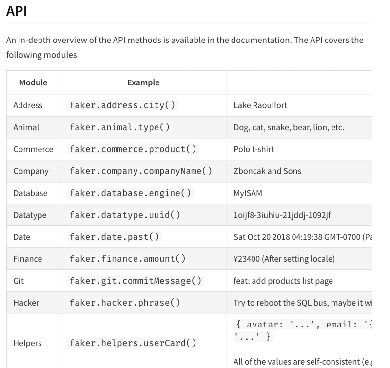
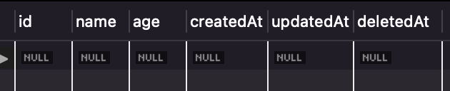
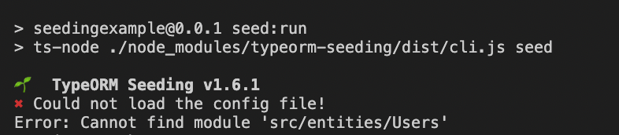
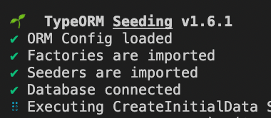
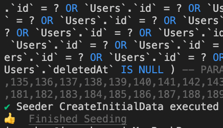
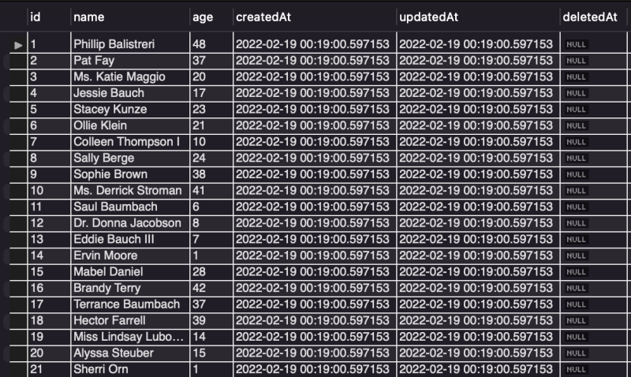

데이터베이스 마이그레이션을 하고나면 초기 데이터들을 임의로 넣어주고 싶을 때가 있다.
그럴 때 사용하는 기술이 seeding이란 기술이다.
@faker-js/faker 모듈은 이름, 이메일 등의 데이터들을 무작위로 만들어주는 모듈이다.

<hr/>

### 1. @faker-js/faker 사용법

https://www.npmjs.com/package/@faker-js/faker

사용방법은 꽤나 간단하다.

```ts
import faker from "@faker-js/faker"
const randomName = faker.name.findName() // Charlene Schuster 등..
```

위와 같은 방식으로 사용 가능하고
api는 위 공식문서를 보면 알 수 있겠지만 정말 많다.

 
<br/>

<hr/>

### 2. NestJS에서 typeorm 사용 시 seeding 예제

#### 2-1) seeding전 typeorm Schema코드 작성

```ts
// ./src/entities/Users.ts
import {
  Column,
  CreateDateColumn,
  DeleteDateColumn,
  Entity,
  Index,
  PrimaryGeneratedColumn,
  UpdateDateColumn,
} from "typeorm"

@Entity({ schema: "seedingEx", name: "seedingex" })
export class Users {
  @PrimaryGeneratedColumn({ type: "int", name: "id" })
  id: number

  @Column("varchar", { name: "name", length: 20 })
  name: string

  @Column("int", { name: "age" })
  age: number

  @CreateDateColumn()
  createdAt: Date

  @UpdateDateColumn()
  updatedAt: Date

  @DeleteDateColumn()
  deletedAt: Date | null
}
```

```ts
// ./src/app.module.ts
import { Module } from "@nestjs/common"
import { ConfigModule } from "@nestjs/config"
import { AppController } from "./app.controller"
import { AppService } from "./app.service"
import { UsersService } from "./users/users.service"
import { UsersController } from "./users/users.controller"
import { UsersModule } from "./users/users.module"
import * as ormconfig from "../ormconfig"
import { TypeOrmModule } from "@nestjs/typeorm"
import { Users } from "./entities/Users"

@Module({
  imports: [
    UsersModule,
    ConfigModule.forRoot({
      isGlobal: true,
    }),
    TypeOrmModule.forRoot(ormconfig),
    TypeOrmModule.forFeature([Users]), // 추가
  ],
  controllers: [AppController, UsersController],
  providers: [AppService, UsersService],
})
export class AppModule {}
```

 
<br/>

이제 위와같은 테이블이 생성된 것을 확인할 수 있다.
이 테이블에 시딩을 해보자.

<hr/>

#### 2-2) Seeder 코드 작성

이제 seeding을 할 코드를 만들어 주어야 한다.

우선 npm에서 아래 모듈을 다운받아주자.

```bash
npm i nestjs-seeding @faker-js/faker
```

https://www.npmjs.com/package/typeorm-seeding

이후 seeding을 위해 nestjs-seeding의 Seeder인터페이스를 구현해줘야 한다.

```ts
import { Connection } from "typeorm"
import { Seeder, Factory } from "typeorm-seeding"

export class CreateInitialData implements Seeder {
  public async run(factory: Factory, connection: Connection): Promise<any> {
    //
  }
}
```

위의 run메서드를 typeorm의 쿼리빌더를 이용해 채워주자.

```ts
// ./src/database/seeds/create-initial-data.ts
import { Connection } from "typeorm"
import { Seeder, Factory } from "typeorm-seeding"
import { Users } from "../../entities/Users"

export class CreateInitialData implements Seeder {
  public async run(factory: Factory, connection: Connection): Promise<any> {
    await connection
      .createQueryBuilder()
      .insert()
      .into(Users)
      .values([{ id: 1, name: "임우찬", age: 24 }])
      .execute()
  }
}
```

values에 들어가는 배열에 데이터들이 db의 데이터로 들어간다.
저기에 들어갈 배열의 데이터를 @faker-js/faker로 데이터들을 생성해준다면 임의로 많은 데이터들을 db에 넣어줄 수 있는 것이다.

저 배열부분만 가공하도록 아래와 같이 코드를 조금만 수정해주자.

```ts
// ./src/database/seeds/create-initial-data.ts

import faker from "@faker-js/faker"
import { Connection } from "typeorm"
import { Seeder, Factory } from "typeorm-seeding"
import { Users } from "../../entities/Users"

export class CreateInitialData implements Seeder {
  public async run(factory: Factory, connection: Connection): Promise<any> {
    const data = []
    for (let i = 1; i <= 100; i++) {
      data.push({
        id: i,
        name: faker.name.findName(),
        age: Math.floor(Math.random() * 50),
      })
    }
    await connection
      .createQueryBuilder()
      .insert()
      .into(Users)
      .values(data)
      .execute()
  }
}
```

<hr/>

#### 2-3) ormconfig파일, package.json파일 수정

이제 ormconfig파일을 조금 수정해주자.
ormconfig에 들어가는 데이터 중 엔티티부분은 꼭 아래와 같이 상대경로로 가져와주자.

```ts
// ./ormconfig.ts

import { TypeOrmModuleOptions } from "@nestjs/typeorm"

import * as dotenv from "dotenv"
import { Users } from "./src/entities/Users" // 무조건 상대경로로 가져와야 시딩됨

dotenv.config()
const config: TypeOrmModuleOptions = {
  type: "mysql",
  host: "localhost",
  port: 3306,
  username: process.env.DB_USERNAME,
  password: process.env.DB_PASSWORD,
  database: process.env.DB_DATABASE,
  entities: [Users],
  synchronize: false,
  migrations: [__dirname + "/src/migrations/*ts"],
  cli: { migrationsDir: "src/migrations" },
  autoLoadEntities: true,
  charset: "utf8mb4",
  logging: true,
  keepConnectionAlive: true,
}

export = config
```

상대경로로 가져오지 않는다면 아래와 같이 Could not load the config file! Error: Cannot find module 'src/entities/Users' 가 나오는 것을 확인할 수 있다.

 
<br/>

이제 package.json에 아래 내용을 추가해주자.

```ts
  "scripts": {
    "seed:config": "ts-node ./node_modules/typeorm-seeding/dist/cli.js config",
    "seed:run": "ts-node ./node_modules/typeorm-seeding/dist/cli.js seed"
  },
```

이후 터미널에 아래와 같이 npm run seed:run을 해보자.

```bash
npm run seed:run
```

임의로 100개의 데이터를 넣었다.

|  |  |
| -------------------------------------- | -------------------------------------- |

잘 됐다면 위 사진같이 👍 Finished Seeding 이라는게 뜨는걸 확인할 수 있다.

 
<br/>

DB에 데이터들이 잘 들어간 것을 확인할 수 있다.

[](https://hits.seeyoufarm.com)
