[](https://hits.seeyoufarm.com)

무려 3년 4개월만에 다시 작성하는 Prototype에 관한 글이다.
최근에 다른 사람과 Prototype에 관한 이야기를 잠깐 할 일이 생겨 예전에 내가 썼던 글을 어쩌다 볼 일이 있었다.

그런데 지금 보니 글의 흐름도 너무 마구잡이처럼 느껴지기도 하고, 공개해두기 부끄럽기도 했던지라 이 참에 다시 한 번 작성해 보려고 한다.

<hr/>

## 1. 선행 지식

먼저 JS의 prototype에 대해 이해하기 위해, 선행되어야 하는 지식이 몇 가지 있다.
왜 이런지에 대해 이해해야 하는 내용이라기보단, 그냥 '그렇구나~' 하고 넘어가면 되는 내용들이다.

1. 자바스크립트에 존재하는 모든 Reference Type은 모두 "객체"이다.
2. 자바스크립트의 함수 또한 객체이며, JS의 함수는 "일급 객체"이다.
3. 자바스크립트의 모든 객체는 "반드시" 함수를 통해 생성된다.

위 딱 세 가지만 짚고 넘어가자.

먼저 자바스크립트는 크게 2가지 타입으로 분류된다. 
number, string과 같은 Primitive Type과 객체, 배열, 함수 등과 같은 Reference Type으로 말이다.
위에서 방금 언급한 내용이지만, 자바스크립트에서 Reference Type은 모두 "객체"로 분류된다.
배열도 객체, 함수도 객체라는 말이다. 그렇게 분류되는 이유는 밑에서 더 깊게 다뤄볼 계획이다.


두 번째로는 "일급 객체"에 관한 내용이다.
일급 객체에 대한 정의는 아래와 같다.

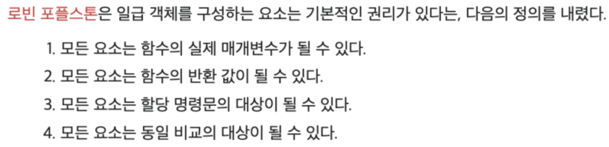 

우리가 흔히 쓰는 것처럼 js에서의 함수는 매개변수가 될 수 있으며, 반환 값도 될 수 있고, 동일 비교의 대상도 될 수 있다.

세 번째가 굉장히 중요하다.
자바스크립트의 모든 객체는 무조건 함수를 통해서 생성된다.
아래 코드와 같이 생성된다는 이야기다.

```js
function Obj1(){}

const obj = new Obj1();
```

그러면 여기서 한 가지 의문이 들 수 있다. '아니 const obj = {} 이렇게 생성할수도 있잖아?'
맞다.

{}로 생성할 수 있지만, {}로 생성하는건 사실 new Object()로 생성하는 것과 동일하다.

```js
const obj = new Object();
const obj2 = {};

// 두 생성방식이 동일함.
```

배열 또한 마찬가지이다. []로 생성하는 방식은 사실 new Array()로 생성한다고 보면 된다.

마지막으로 생성자 함수도 일반 함수와 동일하다는걸 잊지 말자. 생성자 함수도 일반 함수이기에 Reference Type이고 이는 곧 "객체"이다.

여기까지 3가지에 대해서 간단하게 정리 해 보았으니 이제 prototype이 무엇인지에 대해 알아보자.

<hr/>

## 2. Prototype이란?

평소에 prototype에 대해 설명하다 보면 설명하는 과정에서 자연스럽게 "그냥 원래 그렇다" 라고 말하며 설명하는 경우가 많다.
이 글에서도 동일하게 "원래 그렇다" 라는 방식으로 설명할 예정이다. 어떻게 보면 그냥 암기가 될 수도 있다고 생각한다.

그럼에도 꼭 "왜 이렇게 설계된건가?" 에 대해 알고 싶다면, 이 글을 모두 읽은 뒤 ["자바스크립트는 왜 프로토타입을 선택했을까"](https://medium.com/@limsungmook/%EC%9E%90%EB%B0%94%EC%8A%A4%ED%81%AC%EB%A6%BD%ED%8A%B8%EB%8A%94-%EC%99%9C-%ED%94%84%EB%A1%9C%ED%86%A0%ED%83%80%EC%9E%85%EC%9D%84-%EC%84%A0%ED%83%9D%ED%96%88%EC%9D%84%EA%B9%8C-997f985adb42) 라는 글을 읽어보기를 추천한다. (본인은 처음 읽을 때 감탄하며 읽었다)
프로토타입이라는 개념이 아리스토텔레스의 "분류학"을 완전히 반박하며 나온 개념이라 프로토타입이라는 개념 자체의 이해도를 높이는데는 큰 도움이 될 것이라고 생각한다.


### 2-1) prototype 객체와 constructor 프로퍼티

가장 먼저 이야기 할 내용은 바로 prototype 객체이다.
위에서 이야기 한 선행 지식 내용 중, 모든 객체는 함수가 생성한다는 이야기를 했었다.
이러한 일반 함수가 생성될 때 자동으로 생성되는 객체가 하나 있다.
바로 prototype객체이다.

갑자기 prototype객체가 생성된다 해서 갸우뚱 할 수 있는데, 예시를 하나 들어보겠다. 아래와 같이 함수가 하나 생성되었다고 해보자.

```js
function Hello(){};
```

위처럼 Hello 라는 함수가 생성되면 Hello.prototype이라는 객체가 동시에 생성되는 것이다.
이 Hello 함수와 Hello.prototype객체는 양방향으로 연결되어있다. 
Hello 함수는 내부의 'prototype'이라는 프로퍼티가 Hello.prototype을 가리키고, Hello.prototype 내부의 constructor라는 프로퍼티는 Hello를 가리키는 구조가 된다.

아래 그림과 같이 말이다.

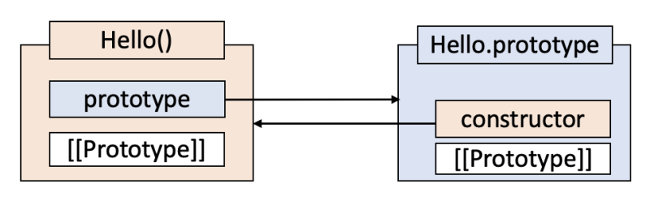 


### 2-2) `[[Prototype]]` 이란? 


이제 위 그림에서 잠깐 나온 `[[Prototype]]`에 대해 알아보자. 
사실 이 `[[Prototype]]` 라는 건 인터널 슬롯(internal slot)으로 JS의 모든 객체에 생성된다.
함수 또한 객체라고 했으니 `[[Prototype]]`이 당연히 함수 내부에도 생성된다.


여기서 `[[Prototype]]`가 어디를 가리키는지가 매우 중요하다.
`[[Prototype]]`은 자신을 생성한 생성자 함수의 prototype객체를 가리킨다.

이번에도 코드와 그림으로 간단하게 알아보자.

<i style="color:red; text-align:right">

*원칙적으로는 `[[Prototype]]` 은 접근 불가능하다.
하지만 __proto__라는 접근자 프로퍼티를 이용하여 접근이 가능하다.
__proto__로 접근하면 내부에서 Object.getPrototypeOf()가 호출되며, 호출한 객체의 프로토타입인 객체를 반환한다.

</i>

```js
function Hello(){};
const obj = new Hello();
```

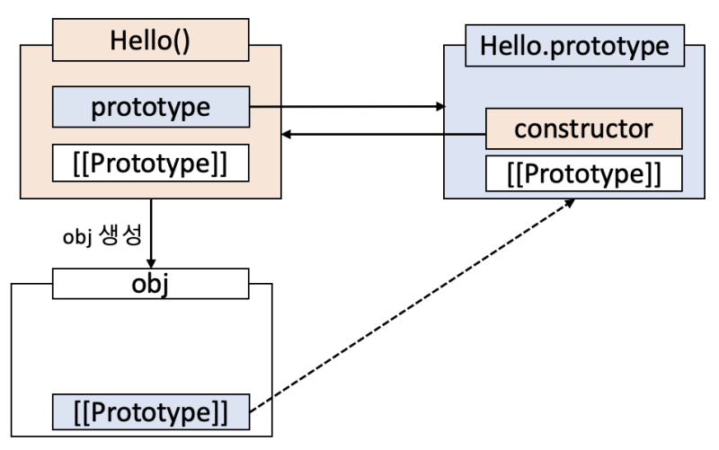 

위와 같은 구조를 이루게 된다.
코드를 찍어봐도 아래와 같은 구조인 것을 확인할 수 있다!

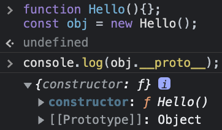 

<hr/>

## 3. Prototype Chain이란?

Prototype Chain에 대해 알아보기 전에 아래 코드를 한 번 보자.

```js
function Hello(){};
const obj = new Hello();
obj.a = 123;
obj.hasOwnProperty('b');
```


2번에서 썼던 예시처럼 Hello 함수를 이용해 obj라는 객체를 생성했다.
이후 obj객체에 a라는 프로퍼티를 만들고 123이라는 값을 넣었다.
이후 obj 안에서 hasOwnProperty() 메서드를 이용해 'b'라는 프로터티가 존재하는지를 찾았다.

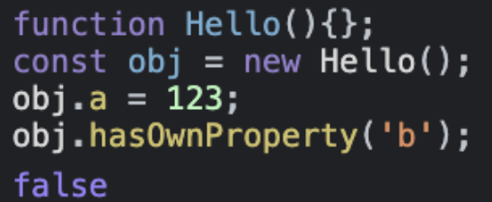 

결과는 당연히도 false가 나왔다!

그리고 위 로직처럼 그림으로 그려보면 아래와 같은 상태로 나올 것이다.

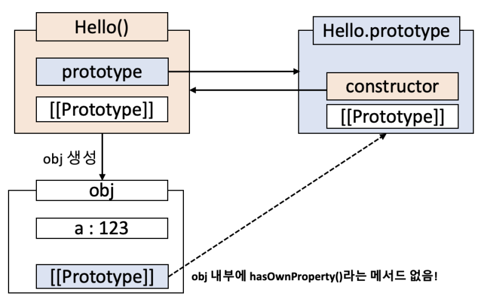 


근데 뭔가 이상함을 느낄 수 있다.
생각해보면 obj 내부에는 "hasOwnProperty()" 라는 메서드가 존재하지 않는다.
그렇다면 이 코드가 대체 어떻게 정상적으로 동작하는걸까?

이는 Prototype Chain이라는 동작 때문이다.
정말 간략하게 설명하자면 JS의 각 객체들은 `[[Prototype]]`을 타고 자신의 생성자함수의 프로토타입 객체들의 메서드를 사용할 수 있는 특성이 있는데, 이러한 동작을 "Prototype Chain" 이라고 한다.
그럼 이제 Hello.prototype을 다시 보자.

선행 지식 부분에서 이야기 했던 내용을 다시 떠올려보자. 모든 객체는 반드시 생성자 함수가 생성한다 했다.
Hello.prototype은 누가 생성했을까?
바로 Object() 를 통해 생성된 객체이다.

따라서 Hello.prototype.__proto__는 Object.prototype을 가리키게 된다.
이렇게 되면 아래와 같은 구조가 된다.

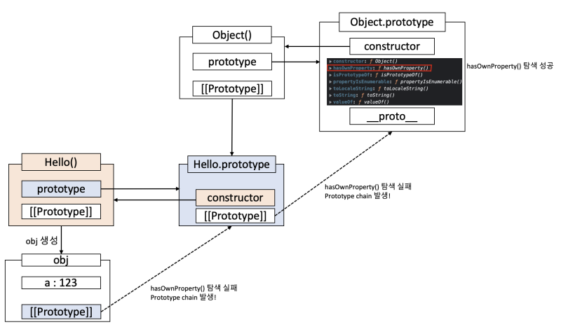 

obj 내에서 hasOwnProperty()메서드를 찾아 호출하려 했으나 없는 걸 확인했을 것이다.
이렇게 되면 obj.`[[Prototype]]`을 통해 Hello.prototype 내에서 hasOwnProperty()를 찾는 것이다.

그럼에도 없는 걸 확인한 경우 Hello.prototype의 `[[Prototype]]`를 통해 Object.prototype을 찾게 된다.
여기서 hasOwnProperty() 메서드를 찾아내 사용하는 것이다!
물론 여기서도 찾지 못한다면 오류를 내게 될 것이다.

이게 Prototype Chain이다.

최종적인 그림은 아래와 같을 것이다.

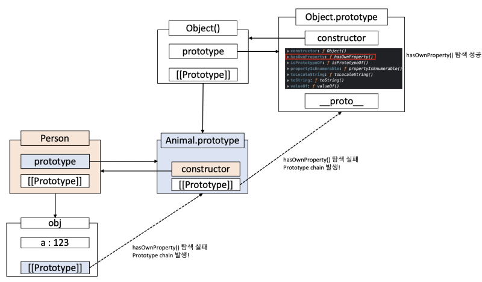 

자바스크립트의 모든 Reference Type은 위와 같은 방식으로 동작한다.
배열이나 Set 등도 동일하다는 말이다.

또한 자바스크립트의 Class 키워드도 이 방식으로 동작하는데, 이는 밑에서 한번 알아보겠다.

<hr/>

## 4. Class 키워드와 prototype

먼저 JS의 Class문법이 언제, 왜 생겼는지부터 알아보자.
Class 문법은 ES6에 들어오면서 새롭게 생긴 문법이다.
사실, ES6 이전까지는 function 키워드가 하는 역할이 확실하게 떨어지지 않았었다.
일반 함수로도 쓰일 수 있으며, 객체를 생성하기 위한 생성자 함수가 될 수도 있었다.
이러한 특성 때문에 여러 사람이 코드를 짜다보면, 자연스럽게 function이라는 키워드때문에 읽기가 힘들었다.
그래서 개발자들 사이에서 "생성자 함수로 사용할 때는 반드시 대문자로 사용하자" 라는 암묵적인 룰이 있었다.
그럼에도 function이라는 키워드 자체가 객체 생성과 맞는 키워드는 아니었기에, 굉장히 보기 불편하던 와중 ES6이 되어서야 비로소 "class" 라는 문법이 나오게 된 것이다.


그렇게 탄생한 문법이기에, 사실상 객체를 생성하는 방식은 위처럼 prototype을 이용해 생성하게 되고, 동작 방식 또한 prototype과 동일하다.
사실상 class라는 문법이 문법적 설탕에 불과한 것은 사실이다.


정말인지 한번 알아보자. Hello 클래스를 function Hello()라고 생각하고 읽으면 편할 것 같다.

```js
class Hello{}
const obj = new Hello();
console.log(obj.__proto__);
```

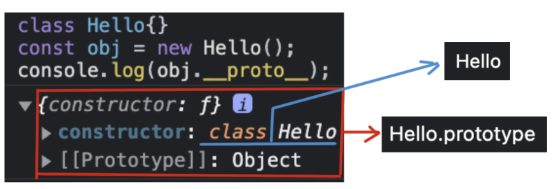 

위 코드 결과를 보면 알 수 있겠지만, prototype을 설명했을 때 구조와 다른 점이 정말 하나도 없다.

그렇다면 class 내부에 메서드를 한 번 써보자.

```js
class Hello{
    sayHi(){
        console.log('안녕!');
    }
}
const obj = new Hello();
console.log(obj.__proto__);
```

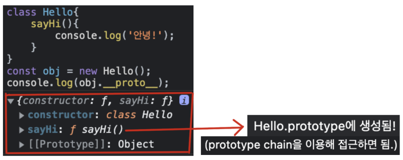 

sayHi() 메서드가 Hello.prototype에 생성되는 것을 확인할 수 있다.
Hello 클래스를 통해 생성되는 각 객체마다 sayHi()함수를 만들지 않아도 되는 것이다.


그렇다면 class 내의 private 함수는 어디에 생성될까?

```js
class Hello{
    #sayHi(){
        console.log('안녕!');
    }
}
const obj = new Hello();
console.log(obj.__proto__);
console.log(obj);
```

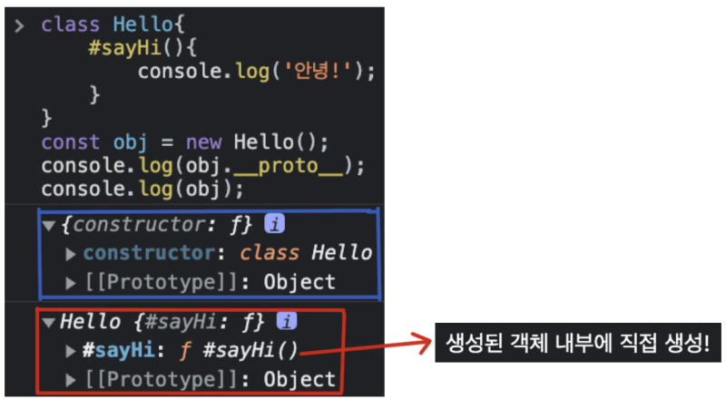 

이 쯤 되면 예상했을 수도 있지만, private변수는 각각 새롭게 만들어지는 객체들 내부에 하나하나 생성된다.

여기까지 봤으면 한 가지 의문이 생길 수 있다.
class문법이 생기며 extends라는 문법도 생겼는데, 이 문법은 prototype으로 대체 어떻게 동작한다는 걸까?

<hr/>

## 5. Prototype으로 Class 키워드의 상속 구현하기

```js
class Animal{
    move(name){ return `${name} 움직인다!`; }
}
class Person extends Animal{
    talk(name){ return `${name} 말한다!`; }   
}
const woochan = new Person();
console.dir(woochan);
```
먼저 class 키워드 기준으로 extends를 넣어 상속받게 해보자.
콘솔로 찍어보면 아래와 같은 걸 알 수 있다.

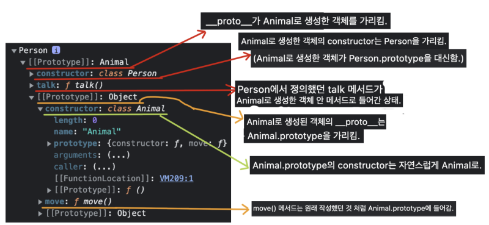 

이 형태를 prototype으로 구현한다면 충분히 class와 extends 없이 상속을 구현할 수 있다.

```js
function Create(parent){
    function Child(){}
    Child.prototype = parent;
    return new Child();
 }
 
 function Animal(){ }
 Animal.prototype.move = function(name){
     return `${name} 움직인다!`;
 }
 let animal = new Animal();
 
 let person = Create(animal);
 person.__proto__.talk = function(name){
     return `${name} 말한다!`;
 }

console.log(person.talk('임우찬'));
console.log(person.move('임우찬'));
```

위와 같이 코드를 작성하면 class로 상속을 사용했을 때와 동일한 코드가 만들어진다!


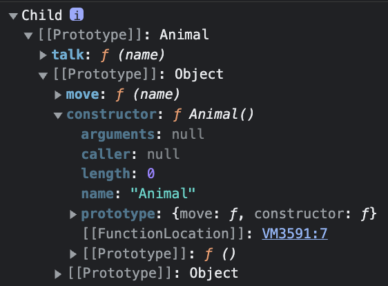 |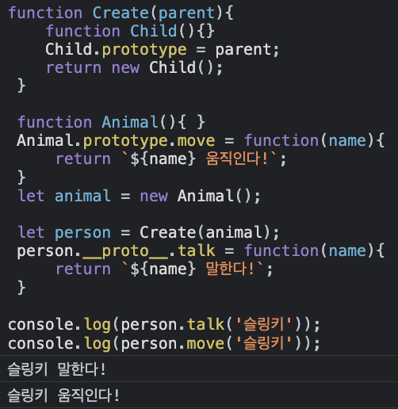
--- | --- |


그림으로 나타내면 아래와 같다.

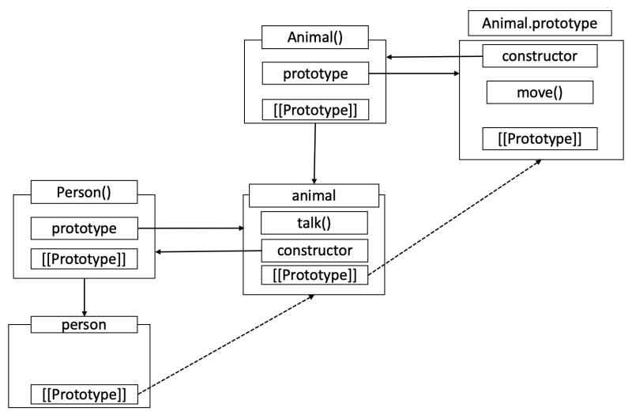 

<i style="text-align:right">

* __proto__를 이용해 직접 접근하여 `[[Prototype]]`을 바꾸는 방법은 성능상 좋지 않기에, 실제로 추천하는 방법은 아니다.

</i>

<hr/>

## 6. Arrow Function과 Prototype

ArrowFunction의 경우 Class와 함께 나온 문법이다.
Arrow Function은 일반 함수와는 다르게 prototype 프로퍼티가 없다. 따라서 prototype 객체도 생성되지 않는다.
메모리적으로도 크게 나쁠 게 없기 때문에, 객체를 생성하지 않는 경우라면 Arrow Function을 사용하는 게 좋다.