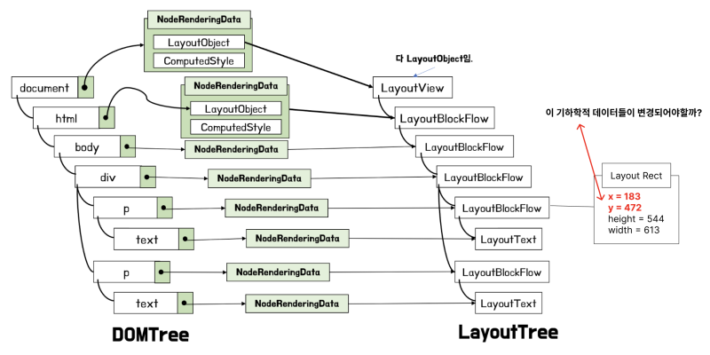
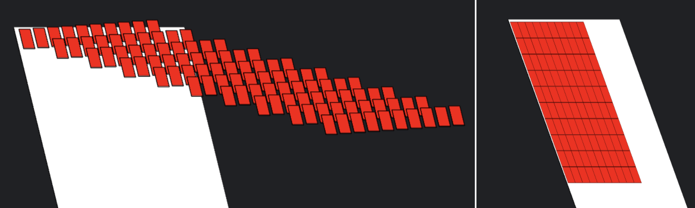

React 코드로 작성된 서비스를 사용자가 쓴다고 해보자.

사용자가 느꼈을 때 어떤 부분들이 불편하다고 느낄 수 있을까? 이를 최적화하기 위해 어떤 개선점들을 찾을 수 있을까?
우아한테크코스 레벨4 미션에서 다루는 내용들을 기반으로 학습한 내용과 해결한 방법에 대해 작성해보고자 한다.

<hr/>

### 0. 최적화 작업을 하기 전 고려해야 할 점

내용들을 본격적으로 다루기 전에, 미션을 통해 가장 크게 얻은 내용부터 써보고자 한다.
당장 최적화를 하는것에 내 노력과 시간을 쏟기 전에 "꼭 최적화가 필요한가?"를 고민해보는게 좋을 것 같다는 생각이 들었다.
결국 우리가 최적화를 하고자 하는 이유는 "사용자 입장에서 불편함"을 개선하기 위함이기 때문이다.
**프론트엔드 개발자** 로서, 어쩌면 이론상 너무 비효율적으로 동작한다고 하더라도 사용자가 전혀 불편함을 느끼지 못한다면, 최적화에 내 노력과 시간을 쏟는 것이 언제나 정답이 아닐 수도 있다는걸 항상 염두에 둬야한다는 생각이 들었다.

#### \* 최적화를 하며 고려할 수 있는 내용들?

이 글의 제목은 성능최적화 10가지 방법이지만, 10개 방법들을 좀 더 분류해봤다.
내가 만든 서비스에서 성능상 문제가 없는지 고려할 수 있는 내용을 크게 4가지로 나누어 보았다.

[1]. 필요한것만 필요한 때 요청하고 있는가?

[2]. 요청 크기가 큰 것은 없는가?

[3]. 최소한의 변경만 일어나며 렌더되고 있는가?

[4]. 같은 리소스를 매번 새로 요청하고 있는가?

이 4가지(총 10가지)를 하나하나 다뤄보자.

<hr/>

### 1. 필요한것만 필요한 때 요청하고 있는가?

왜 필요한것만 필요한 때 요청하는게 최적화라는걸까?
이것부터 알아보기 전에 부연설명을 잠깐 하겠다 ㅎㅎ...

사용자가 우리의 웹 페이지를 요청했을 때의 그 흐름을 보자.
웹 서버와 사용자가 통신할때는 http프로토콜을 기반으로 통신할테니 자연스레 3-way-handshake가 이루어질 것이다.

 
<br/>

3way handshake가 끝난 뒤에는 사용자측에서 요청을 할 것이고, 그에 따른 정적 파일들을 web server는 클라이언트측으로 전송을 해줄 것이다.
근데 이 정적 파일들의 크기가 굉장히 크다면 어떻게 될까?
다운로드가 완료될때까지 사용자는 계속해서 비어있는 흰 화면을 보게 될 것이다.
그럼 이 정적 파일들의 크기를 줄이는 방법을 생각할 수 있겠지만, 이는 2번 **요청 크기가 큰 것은 없는가?** 에서 다룰 내용이다.
**"요청 크기가 크니, 일단 파일들을 쪼개자!"** 라는 내용의 코드 스플리팅을 먼저 알아보자.

<hr/>

#### 1-1) 필요할 때만 리소스 요청하기 : 코드 스플리팅

"코드 스플리팅"에 대해 알아보자.

특정 페이지를 불러오는데 있어 필요가 없는 코드를 처음부터 받아올 필요가 있을까? 당연하게도 없을 것이다.

모든 상황에서 하나의 번들파일을 불러오는 상황을 막기 위해 그냥 코드를 쪼개는게 코드 스플리팅이다.
좀 더 정확히 이야기하자면, 필요한 코드만 제때 불러올 수 있도록 build시에 만들어지는 bundle.js파일을 쪼개는 방법이 바로 "코드 스플리팅" 방식이다.
코드 스플리팅은 suspense와 lazy loading을 이용하여 할 수 있다.

```ts
const Home = lazy(() => import('./pages/Home/Home'));
const Search = lazy(() => import('./pages/Search/Search'));

import NavBar from './components/NavBar/NavBar';
import Footer from './components/Footer/Footer';

  <Router>
    <NavBar />
    <Suspense fallback={<div className="loading">loading</div>}>
      <Routes>
        <Route path="/" element={<Home />} />
        <Route path="/search" element={<Search />} />
      </Routes>
    </Suspense>
    <Footer />
  </Router>
```

이런 방식으로 Suspense내에 있는 컴포넌트를 lazy loading하도록 import할 수 있는데, 이렇게 하면 build했을 때 번들 파일이 분리되게 된다.

<hr/>

#### 1-2) 필요할 때만 리소스 요청하기 : 용량이 큰 리소스 Lazy Loading 적용하기

용량이 큰 리소스 하면 대표적으로 떠오르는게 gif, 동영상 등이 있을 것이다.

이는 intersecrion observer를 이용하여 적용할 수 있다.

```ts
// intersection observer들어가는 부분 코드
const videoSrcList: string[] = [trendingGif, findGif, freeGif]
const [loadedVideos, setLoadedVideos] = useState<number[]>([])

const initialOption = {
  root: null,
  rootMargin: "0px 0px -50px 0px",
  threshold: 0,
}

useEffect(() => {
  const observer = new IntersectionObserver(entries => {
    entries.forEach((entry, index) => {
      if (entry.isIntersecting && !loadedVideos.includes(index)) {
        const videoElement = entry.target as HTMLVideoElement
        const videoSrcIndex = Number(videoElement.getAttribute("data-index"))

        const sourceElement = videoElement?.querySelector(
          "source",
        ) as HTMLSourceElement

        if (!sourceElement.src) {
          sourceElement.src = videoSrcList[videoSrcIndex]

          videoElement.load()

          setLoadedVideos([...loadedVideos, videoSrcIndex])
        }
      }
    })
  }, initialOption)

  const targets = document.querySelectorAll(".show-on-scroll")

  targets.forEach(target => {
    observer.observe(target)
  })

  return () => observer.disconnect()
}, [])
```

```ts
// video태그 들어가는 코드
import styles from './FeatureItem.module.css';

type FeatureItemProps = {
  itemInformation: {
    title: string;
    index: number;
  };
};

const FeatureItem = ({ itemInformation }: FeatureItemProps) => {
  return (
    <div className={styles.featureItem}>
      <video
        className={`${styles.featureImage} show-on-scroll`}
        autoPlay
        loop
        muted
        data-index={itemInformation.index}
      >
        <source type="video/mp4" />
      </video>
      <div className={styles.featureTitleBg}></div>
      <h3 className={styles.featureTitle}>{itemInformation.title}</h3>
    </div>
  );
};

export default FeatureItem;
```

비디오 url을 미리 가지고있다가 ".show-on-scroll"이라는 클래스를 가진 엘리먼트가 observe 되면 source에 url을 주입한 뒤 load()를 하는 형식이다.

이렇게 하면 아래와 같이 동영상 파일이 화면에 잡혔을 때 로딩될 수 있도록 Lazy Loading을 적용할 수 있다.

 
<br/>

<hr/>

### 2. 요청 크기가 큰 것은 없는가?

이제는 요청이 큰 것은 없는가에 대한 고민을 해볼 수 있다.
요청이 크면 안좋은 이유에 대해서는 1번 맨 처음에 이야기했다.

어떤 요청이 클 수 있을까부터 한번 고민해보자!
일단 크게 두 가지 정도 생각해볼 수 있을 것이다.
다운받아야 하는 소스코드(bundle.js, css 등)의 용량이 크다거나, 이미지의 용량이 클 수 있다는 점을 고려할 수 있을 것이다.

그럼 소스코드의 크기를 어떻게 줄일 수 있을까?

<hr/>

#### 2-1) 소스코드 크기 줄이기 : 중복 코드 제거하기

위 1번에서 다뤘던 코드 스플리팅으로 소스코드를 분할한다고 하더라도, 분할된 코드를 늦게 불러오는 것이지 소스코드의 전체 코드가 완전히 줄었다고는 볼 수 없을 것이다.
번들됐을 때 중복된 소스코드는 하나의 청크로 묶어 소스코드의 중복 코드 수를 줄일 수 있도록 하는게 좋을 것이다.

```ts
// ...
optimization: {
  splitChunks: {
    chunks: "all"
  }
}
// ...
```

위와 같이 적용하면 된다.

<hr/>

#### 2-2) 소스코드 크기 줄이기 : CSS파일 크기 줄이기

배포환경 모드라면 css파일을 minimize할 수도 있을 것이다.
어차피 띄어쓰기 그런거 중요하지도 않으니 띄어쓰기도 모두 축약해도 문법상으로는 문제가 없다. 공백 문자열들이 사라지면 텍스트의 양 자체가 줄게 되니 사용자의 초기 로딩 속도를 조금 더 앞당기는데 도움을 줄 수 있을 것이다.

그럼 이제 css파일을 minimize해보자.
mini-css-extract-plugin과 css-minimizer-webpack-plugin이라는 플러그인을 사용한다면 build 시에 아래 사진과 같이 css가 압축된것을 확인할 수 있다.
webpack에 잘 설정해주자. 배포환경의 webpack파일에서 설정해줬다.

```ts
const CssMinimizerPlugin = require('css-minimizer-webpack-plugin'); // 추가!
const MiniCssExtractPlugin = require('mini-css-extract-plugin'); // 추가!

const { merge } = require('webpack-merge');
const common = require('./webpack.common');

module.exports = merge(common, {
  mode: 'production',
  devtool: 'nosources-source-map',
  plugins: [new MiniCssExtractPlugin(), new CssMinimizerPlugin()], // 추가!
  module: {
    rules: [
      {
        test: /\.css$/i,
        use: [MiniCssExtractPlugin.loader, 'css-loader'] // 추가!
      }
    ]
  },
  optimization: {
    minimizer: [
      '...',
      new CssMinimizerPlugin(),

//...
```

그럼 빌드했을때 아래와 같이 한줄로 공백이 사라지며 압축이 된 것을 확인할 수 있다.

 
<br/>

물론 CSS-In-JS 방식을 사용하고있다면 당연히 이 방법은 사용할 수 없을 것이다.

<hr/>

#### 2-3) 소스코드 크기 줄이기 : tree shaking 적용하기

소스코드를 줄여야 하니 트리쉐이킹을 적용하는 방법도 고민해볼 수 있을 것이다.
일반적으로 우리는 React코드를 작성하며 import, export 구문을 사용하곤 한다.
그렇게 import를 해온 코드들은 번들링이 될텐데, 만약 사용하지 않는 코드들까지 번들링이 된다면 파일 용량이 늘어날테니 매우 손해일 것이다.

그렇다면 트리쉐이킹은 어떻게 해야 하는 것일까?
가장 먼저 해야 할 일은 번들링될 때 commonjs형태로 번들링되는 것을 막는 것이다.
commonjs의 require키워드는 Node.js에서 서버 애플리케이션을 구축할 때 캐싱 방식을 용이하게 사용하고자 만들어진 방식이다.
따라서 commonjs의 경우 한번 불러온 파일은 클로저로 트리쉐이킹이 되는걸 막는다.
commonjs방식으로 번들링되는걸 막으려면 일단 babelrc부터 아래와 같이 작성해주자.

```ts
{
  “presets”: [
    [
      “@babel/preset-env”,
      {
	    "modules": false
      }
    ]
 ]
}
```

typescript를 쓰는 경우 tsconfig의 compilerOption에 module을 "commonjs"로 사용하지 않게 해야한다. 대신 "ESNext"와 비슷한 다른 속성들을 사용해주자.
그렇지 않으면 트리쉐이킹뿐만 아니라 코드 스플리팅도 안된다.

​그리고 우리의 웹팩에게 사용하지 않는 export는 제거해도 괜찮다는걸 알려주어야 한다.
package.json의 sideEffects 속성을 "false"로 지정해주자.

```ts
{
  "name": "your-project",
  "sideEffects": false
}
```

그 외로는 코드상에서 필요한 모듈만 import해줄 수 있도록 하는 것이다.

```ts
import { hello } from "blah-blah-blah"
```

위와 같이 말이다.

이정도면 어지간해서는 트리쉐이킹이 다 된다.

그런데 이래도 트리쉐이킹이 되지 않는 친구들이 몇 있을 수 있다.
대표적으로 lodash가 있다. 이친구는 태생이 commonjs이다. 이런 경우 "webpack-common-shake"를 사용하거나 아래와 같이 import하여 코드량을 줄일 수 있다.

```ts
import debounce from "lodash/debounce"
```

번들 사이즈에 대해서는 "webpack-bundle-analyzer" 라는 플러그인을 이용해 확인할 수 있다.

```ts
"analyze": "webpack-bundle-analyzer ./dist/bundle-report.json --default-sizes gzip"
```

 
<br/>

그럼 이런식으로 볼 수 있다.

<hr/>

#### 2-4) 리소스 크기 줄이기 : 이미지 용량 줄이기

소스코드가 아닌 리소스도 있을 것이다. 대표적으로 이미지가 있을 것이다.
이미지 용량을 줄이면 다운로드 속도가 감소할테니 당연히 그만큼 초기 로딩속도가 개선이 될 것이다.
손으로 직접 하는 방법도 있겠지만, 그러면 포스팅할 내용이 전혀 없기에...^^ 웹팩으로 빌드 시 보유중이던 이미지 파일의 용량을 줄이는 방법에 대해 작성해보려 한다.

```ts
"image-minimizer-webpack-plugin": "^3.8.3",
"imagemin": "^8.0.1",
"imagemin-webp": "^8.0.0",
```

이렇게 3개의 의존성들을 devDependencies로 설치해주자.
그리고 prod일때의 webpack config파일에 아래와 같은 형식으로 작성하면 된다.

```ts
const ImageMinimizerPlugin = require('image-minimizer-webpack-plugin');

const { merge } = require('webpack-merge');
const common = require('./webpack.common');

module.exports = merge(common, {
  mode: 'production',
  // ...

```

<hr/>

#### 2-5) 리소스 크기 줄이기 : gif 제거하기

gif가 정말 용량을 많이 먹는 편이다.
gif대신 mp4나 webm을 사용하는것이 훨씬 용량이 개선된다.

 
 
<br/>

gif에서 mp4로 바꿨다.

용량이 2mb에서 32kb까지 줄었다. 99%이상 용량이 줄은 것을 확인할 수 있다.
이렇게 되면 좋은 점이 하나 더 있는데, 이는 video 태그를 쓸 때 효과가 난다.
이 경우는 리소스 크기 개선과는 관련이 없고, 3번 **"최소한의 변경만 일어나며 렌더되고 있는가?"** 에 해당하는 내용에서 다뤄야하기 때문에 밑에서 설명하겠다.

<hr/>

### 3. 최소한의 변경만 일어나며 렌더되고 있는가?

성능 최적화를 고려하며 지금까지 리소스의 로드 시점이나 용량에 대해 고민했다면, 이미 리소스를 받은 뒤 브라우저단에서 어떻게 동작하고 있는지를 볼 때이다. 결국 우리의 결과물들은 브라우저에서 동작하기에, [브라우저 렌더링 파이프라인](https://blog.woochan.info/blog/browser-rendering-pipeline/)에 대한 지식이 조금 도움이 되지 않을까 싶다.

3번의 제목인 "최소한의 변경" 이라는건 어떤걸 의미하는걸까?
내가 생각했을 때는 "브라우저를 포함한 우리 컴퓨터의 프로세스들이 불필요하게 작업을 더 하고있는가?"에 해당하는 말이 아닐까 싶다.

 
 
<br/>

개발자도구에 렌더링 탭에 들어간 뒤 "프레임 렌더링 통계" 라는 걸 누르면 Frame Rate를 볼 수 있다.
보면 최대 한 60정도까지 올라가는걸 확인할 수 있다.
FPS가 60이라는 이야기는 1초에 60개의 화면을 찍어낸다는 이야기다.
1초에 60개의 화면을 찍어내려면 1/60초 즉, 16.67ms 내에 한 화면을 찍어내야 한다는 이야기이다.
만약 한 화면을 찍어내는게 16.67ms가 넘어가게 되면 어떻게 되는걸까?

 
<br/>

브라우저 입장에서는 당장 사용자에게 화면을 보여줘야 하는데, 작업속도가 일정 시간을 넘어가니 한 프레임을 기다릴 수가 없게 된다. 따라서 그 프레임을 버리고 다음에 작업이 완료된 프레임을 사용자에게 보여주게 된다.
이를 우리는 "프레임 드롭(Frame Drop)"이라고 한다. 컴퓨터의 속도에 따르기에 사용자마다 다를것이다. 완벽하게 모든 프레임 드롭을 막을 수는 없겠지만, 그래도 우리는 최소화하려 노력해야 할 것이다.

어떻게 하면 최소화 할 수 있는걸까? 단순하다. **'어떻게 하면 브라우저가 일을 덜 할까?'**​를 고민하면 된다.
브라우저가 일을 덜 할수록 프레임이 빨리 만들어질 것이고, 이는 곧 프레임드롭을 막는 행위가 될 것이기 때문이다.

<hr/>

#### 3-1) 브라우저 작업량 줄여주기 : Reflow 줄이기

첫째로 Reflow를 줄이는 것이다.
Reflow가 뭐가 안좋길래, 왜 최소화해야 하는 것일까?
이는 브라우저 렌더링 파이프라인의 작업과정과 큰 관련이 있다.

우리가 작성한 html, css 파일의 화면이 눈에 보이기 위해서 가장 먼저 진행되어야 하는 과정이 3가지 있다.

[1] Parse (DOM Tree 만들기)

[2] Style (CSSOM 만들기)

[3] Layout (DOM Tree, CSSOM 이용해서 어떤 요소가 어떤 좌표에서 그려져야 하는지 Layout Tree만들어 값 지정하기)

이미 우리 화면에 보이고있는 화면이 있다면 최소한 위 3가지 파이프라인 과정은 거쳤다는 이야기이다.
여기서 어떤 요소가 변경되어 화면을 수정해준다고 쳐보자.
브라우저는 어떻게 동작할까?

일단 기존의 엘리먼트가 **DOM Tree의 어떤 위치에 존재하는지를 캐치해낸 뒤**, **CSSOM을 수정**해주고 **변경된 CSSOM에 따라 x좌표 y좌표 색상 등을 수정하여 Layout Tree에 반영**하게 될 것이다.
여기까지 한 뒤, 뒤에있을 수많은 작업들을 마치고 GPU가 작업까지 마치면 그 화면을 띄워주는 것인데, 이걸 16.67ms 안에 해야하는 것이다.

만약, CSSOM 내부의 값이 변경되지 않아 x좌표, y좌표에 대한 값을 변경할 필요가 없다면 위 3가지 단계를 다시 해줄 필요가 있을까? 당연히 없다. 불필요한 작업을 안하는 것이고, 이는 곧 브라우저가 해야 할 일을 줄여주는 것이다.
**구글에 "렌더링 최적화" 치면 흔하게 나오는 "Reflow를 막는다" 라는 이야기가 결국에는 이렇게 LayoutTree의 기하학적 데이터 수정을 막아 초반 렌더링 과정의 3단계 이상을 건너뛰는 행위를 이야기하는 것이다.**

 
<i> Chromium 기준이라서 ComputedStyle이 CSSOM이다.  </i>
<br/>

 
<br/>

대표적으로 top, left같은 속성들이 CSSOM 내부에서 관리되는데, 이 속성들을 사용하면 CSSOM에 변경점이 생겨 Reflow가 발생하게 된다.
이는 translateX, translateY라는 속성을 사용하여 해결할 수 있다.
**"똑같이 위치를 옮기는건데 얘는 왜 Reflow가 안발생함?"** 이라고 생각할 수 있다.
그 이유는 브라우저에서 CSSOM말고 특별히 관리하는 몇가지 속성이 있기 때문이다.
"transform, opacity, scroll, clip" 과 같은 css 속성들은 "프로퍼티 트리" 라는 이름으로 별도로 관리되게 된다.
GPU가 따로 가져가서 실행하기 때문이다.

 
<br/>

이미 그려놓은 거를 GPU가 특정 픽셀만큼 움직인다거나, 투명도를 조절한다거나 하는 것이다.
CSSOM에 변경점이 생기지 않고 GPU가 직접 작업을 하기 때문에, 당연하게도 reflow가 발생한다는게 말이 안된다.

<hr/>

#### 3-2) 브라우저 작업량 줄여주기 : 하드웨어 가속 이용하기

드디어 2-5번 "gif 제거하기"에서 마지막에 gif와 함께 image태그를 사용하는 것보다 mp4와 같은 파일 + video태그가 좋다고 이야기한 이유를 다루겠다.
그러기 위해서는 일단 브라우저가 어떻게 구성되어 우리 눈에 보이는지, 레이어에 대한 이해가 필요하다.

 
<br/>

우리의 브라우저 화면은 이렇게 여러 개의 화면으로 구성되어 있다. 하나하나의 화면을 우리는 "레이어"라고 부른다.

이렇게 여러 개의 화면으로 쪼개져 있더라도, 우리는 가장 위에서 보기 때문에 여러 개의 레이어고 한 화면만 보이게 되는 것이다.

|  |  |
| ----------------------------------------------- | ----------------------------------------------- |

이렇게 레이어를 쪼개서 쪼갠 레이어에 대한 작업을 GPU에게 할당하는걸 "하드웨어 가속" 이라고 부른다.

**"그럼 GPU가 화면 그리니깐 무조건 다 할당시키는게 좋은거 아님?"** 이라고 생각할 수 있는데, 남용하면 오히려 성능을 팍팍 떨어뜨릴 수 있는 방법중 하나이다.
GPU의 메모리를 터트릴 수도 있기 때문이다.

 
<br/>

결국 사용자 눈에 똑같이 보일 화면을 아래와 같이 레이어로 막 쪼갤 이유가 있을까?

 
<br/>

너무 많이 쪼개서 GPU메모리를 터트리면 브라우저가 견디지 못하고 그냥 검은 화면만 보여주게 되는것을 볼 수도 있다. 남용하지 말자.
아무튼! 이 레이어는 어떻게 쪼갤 수 있을까? 크게 4가지가 있다.

[1]. position: fixed를 쓴 경우

[2]. `<video>`, `<frame>`, `<iframe>`을 사용한 경우

[3]. transform 3D 관련 속성을 사용한 경우

[4]. will-change 속성 사용

위 4가지 상황 중 2-5에 다뤘던 video 태그 사용에 의한 하드웨어 가속의 경우를 보자.
원래 아래와 같이 gif에 image태그를 쓰게 되면 gif같은 동적 이미지가 메인 레이어에 딱붙게 된다.
그런데 지금 화면이 계속 움직이고 있다. 어떻게 될까?

 
<br/>

아래를 보자. 스타일 계산을 미친듯이 하고있다.

 
<br/>

그런데 video태그를 이용해 레이어를 분리하여 하드웨어 가속을 이용할 수 있다면?

 
<br/>

재계산이 조금 줄게 되는것도 아니다. 그냥 스타일 재계산이 0이 되어버린다.

어차피 GPU에게 할당되어버리니 브라우저가 스타일을 재계산할 필요가 없어져버리는 것이다.

그러나, 위에서 이야기한 것처럼 명시적으로 레이어를 막 쪼개면 오히려 성능이 기하급수적으로 악화되니 필요한 때만 이용하는게 좋을 것 같다.

<hr/>

### 4. 같은 리소스를 매번 새로 요청하고 있는가?

마지막으로 고려할 수 있는 내용이다.
한번 요청한 리소스를 매번 새롭게 요청하는가?에 대한 내용이다.
예시로, 만약 내가 서울에 있는데 요청하고자 하는 리소스가 미국에 있다고 해보자.
물리적 거리가 실제로 매우 멀기 때문에, 매번 미국에서 원본 리소스를 요청하면 좀... 그렇다...ㅋㅋ

#### 4-1) CDN 이용하기

이는 Cloudfront와 같은 CDN을 이용하여 해결할 수 있다.
Cloudfront로 배포환경을 구축하는 내용은 [이 글](https://blog.naver.com/dlaxodud2388/223180340553)에서 다뤘었다.

이렇게 성능을 최적화 할 수 있는 10가지 방법에 대해 다뤄봤다!

[](https://hits.seeyoufarm.com)
