[](https://hits.seeyoufarm.com)

이번 글에서는 React의 동시성이 어떻게 구성되어있는지에 대해 다뤄보고자 한다.

### 0. 동시성이란?

글을 시작하기 전에, 제목에 있는 "동시성" 이라는 단어를 먼저 짚고 가자.
동시성이라는 단어와 함께 자주 언급되는 단어로는, "병렬성" 이라는 단어가 있는데, "동시성"과 "병렬성" 이라는게 대체 뭘까?

| 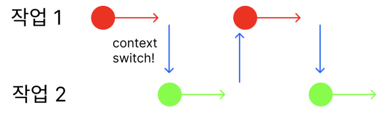 | 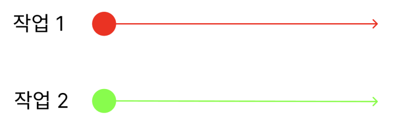 |
| ------------------------------------ | ------------------------------------ |

그림 하나로 표현하자면 이런거다.
동시성은 말 그대로 "동시에 실행되는 것처럼 보이도록 하는것"이다. 실제로 동시에 실행하는것이 아니기 때문에 컨텍스트 스위칭같은 작업이 필요하다.
여러 개의 작업을 아주 잘게 나누어 동시에 실행되는 것처럼 보이게 하는 것이기에, 싱글 코어에서도 동작이 가능하다.

이와 반대로, 병렬성은 실제도 동시에 실행하는 것을 의미한다.

조금 뜬금없을 수 있다.
제목에 동시성이라는 단어가 있다는 이유로 동시성과 병렬성을 이야기했기 때문이다. 왜 React에서 "동시성" 이라는 단어가 나오게 된걸까?
무엇을 위해 동시성을 지원하고자 스케줄러를 만든 것일까?
이를 이해하기 위해서는 먼저 "Block Rendering"문제에 대해 이해해야 한다.

<hr/>

### 1. Block Rendering 문제

리액트의 렌더링을 이야기 하기 전에, 브라우저 이야기를 먼저 해보자.
브라우저의 렌더링 작업이 어떻게 이루어질까?

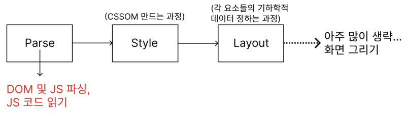 
<br/>

정말정말 많이 생략하자면 이런 구조이다.
맨 처음 파싱 과정에서 DOM을 파싱하여 C++객체로 만드는 과정이 진행되는데, 여기서 JS 코드도 읽는 과정이 진행된다.
React코드가 읽힌다는 말이다.
그런데, 이 과정은 한 번 시작하면 작업이 다 끝나기까지 멈추지 않는다.

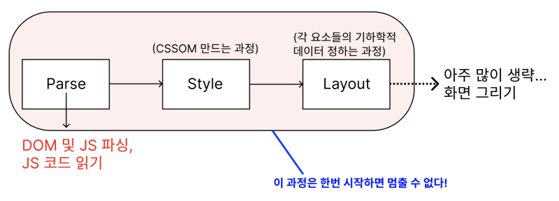 
<br/>

React 코드를 통해 뭔가 변경점이 발생한다? 렌더링 파이프라인이 끝나기 전까지 멈출 수가 없다는 이야기이다.
이렇게 React가 브라우저의 동작에 종속적인 이유로 인해 한계에 부딫히는 것은 어쩔 수가 없다.

그런데 이 때, 렌더링 연산을 하는 과정이 조금 길어진다고 해보자. 어떻게 될까?
블로킹 렌더링이기에 당연하게도 프레임 드롭은 엄청나게 발생하게 된다. UX가 아주 좋지 못할 것이다.

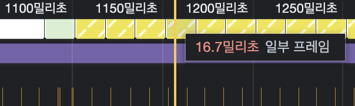 
<br/>

아래는 간단하게 짜 본 예제이다.
"변한내용" 컴포넌트 렌더 시간에 딜레이를 걸었다.

 
<br/>

```js
performance.now() - startTime < 10
```

"가나다라" 문자열을 입력하는데 input을 입력하는것도 같이 딜레이가 생겨 아주 좋지 못한 UX가 완성되었다.
왜 이런 문제가 발생하는걸까?
각 텍스트가 들어올때마다 계속 딜레이를 기다리고 컴포넌트 출력하기를 반복하기에 이런 문제가 발생하는 것이다.

이러한 문제를 바로 이 글의 주제 중 하나인 "동시성 렌더링"이 해결해줄 수 있다!

동시성 렌더링이 정확히 어떤 느낌인지 그림으로 그려보겠다.

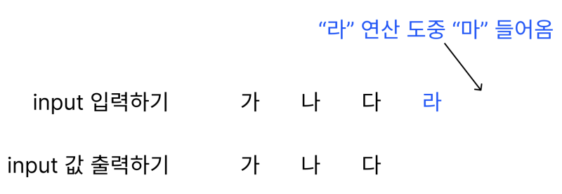 
<br/>

위처렴 input에 "라" 텍스트가 들어왔고, "라"텍스트를 그리려던 도중 "마"라는 텍스트가 input에 들어왔다.

<hr/>

18버전의 block Rendering형식의 리액트였다면 input이 멈추는 현상을 사용자가 경험했겠지만, 동시성 렌더링의 경우는 아래와 같이 동작한다.

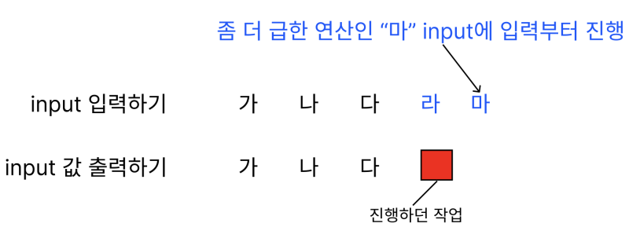 
<br/>

더 급한 연산인 "마" 텍스트를 input에 집어넣는 작업부터 진행하는 것이다.

<hr/>

이후에는 아까 진행하다 말았던 "라" 그리기 작업을 새로 진행해야 하는 작업에 rebase한 뒤 한꺼번에 진행하게 된다.

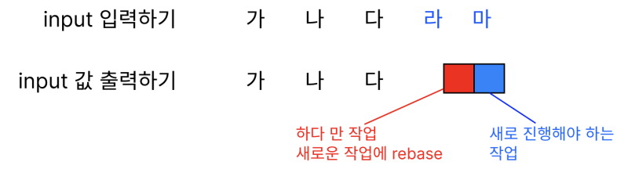 
<br/>

해야 하는 모든 작업을 나중에 처리하는것이 아닌, 필요한 작업을 한번에 묶어서 "마지막 결과만" 처리하는 방법인 것이다.

<hr/>

최종적으로는 아래와 같이 렌더링되는 방식이 "동시성 렌더링" 이다.

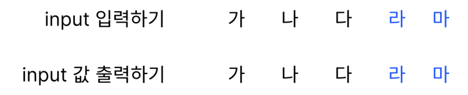 
<br/>

<hr/>

그렇다면 위에 있던 예제는 어떻게 개선할 수 있을까?
바로 "useTransition" 이라는 훅을 이용해 개선 가능하다. 이는 우선순위를 후순위로 미룰 수 있는 훅이다!

```js
const [_, startTransition] = useTransition();

const handleText = (event: ChangeEvent<HTMLInputElement>) =>
    startTransition(() => {
      setText(event.target.value);
    });

// ...
<input type="text" onChange={handleText} />
```

이렇게 되면 아래와 같이 사용이 가능하다!

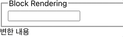 
<br/>

<hr/>

그럼 이 startTransition은 대체 어떻게 동시성 렌더링을 구현한 것일까?

이는 [React Working Group](https://github.com/reactwg/react-18/discussions/65)에 들어가서 보면 확인할 수 있다.

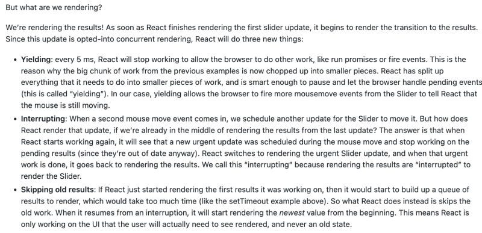 
<br/>

3가지 작업을 하는 것이다.

> 1.  Yielding : 5ms마다 한번씩 React 멈추기(libevent같은 비동기처리 라이브러리가 프로미스같은거 처리할수도 있고 중요 작업이 있을수도 있으니깐)
> 2.  Interrupting : 우선순위 높은 작업 만나면 중단하기
> 3.  이전 결과 건너뛰기 : 최종 상태만 반영하도록 중간에 하던작업 건너뛰기

이 3개의 작업을 하기 위해서 즉, React에서 동시성을 위한 아키텍처를 어떻게 설계하였을까?

<hr/>

### 2. 스케줄러 : 동시성을 위한 React의 멘탈 모델

가장 먼저 필요한건 스케줄러일 것이다. 우선순위가 높은 작업을 만나면 중단하고 그 작업을 먼저 수행하는 등의 컨텍스트 스위칭이 필요하기 때문이다.
그럼 두 가지가 필요하다.
하나는 스레드를 블록하지 않는 루프, 다른 하나는 루프 안에서 탈출할 수 있는 방법이다.

<hr/>

### 2-1) Stack Reconcilation에서 고려한 방법과 한계

15버전의 stack reconcilation의 경우 재귀 연산을 하였기 때문에, 메인 스레드가 블록될 수 밖에 없었다.
그리고 이 시기에는 react의 렌더 과정이 크게 두 레이어로 분리되어 있었다.

1. Stack Reconciler
2. Renderer

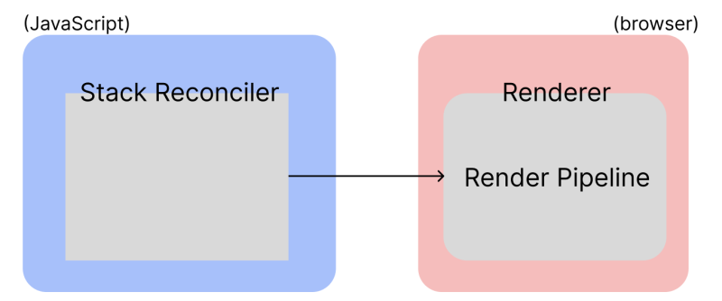 
<br/>

위 그림을 보면 알 수 있겠지만, 렌더러 즉, 브라우저단으로 넘어가서 렌더링 파이프라인이 시작되는 순간, 그 이후의 작업은 멈출 방법이 없다.
브라우저가 하는 일이기 때문이다.
그렇기에 Stack Reconcilation 이후 renderer 과정 시작 전에 한번 멈추는 작업이 필요하다.
렌더링 파이프라인에 직접 관여하고자 하는 상황인지라, 이를 위해 2가지 방법을 고려했다.

1. requestAnimationFrames 사용하기
2. requestIdleCallback 사용하기

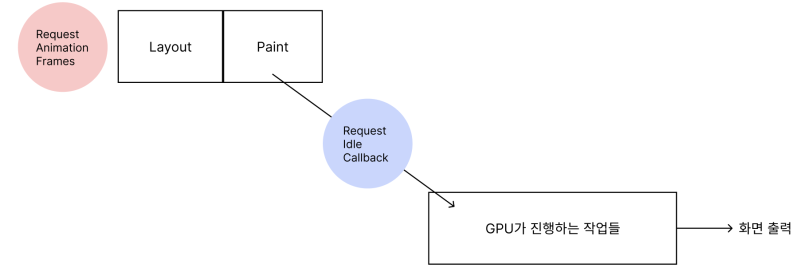 
<br/>

<hr/>

### 2-2) Stack Reconcilation에서 고려한 방법1 : requestAnimationFrame 사용하기

첫 번째로 requestAnimationFrame이다. 레이아웃을 계산하기 전에 DOM을 수정해 반영할 수 있도록 requestAnimationFrame()을 사용해 렌더링 파이프라인 과정에 관여하고자 하였으나, 그럴 수 없었다. Layout 과정과 Paint 과정이 남은 시간이 얼마인지 알 방법이 없기 때문이다.

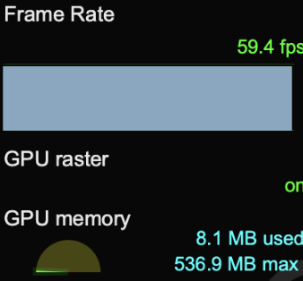 
<br/>

일반적인 브라우저의 프레임률은 60FPS정도 된다.
이 말은 곧 1초에 60개의 화면을 찍어내야 한다는 이야기이고, 실제 시간으로 계산하면 16.67ms가 나온다.

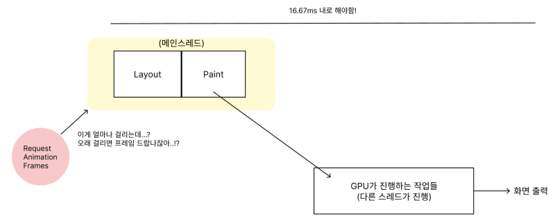 
<br/>

RequestAnimationFrame은 이후 작업(paint까지)이 얼마나 걸릴지 알 방법이 없기에, 이는 좋은 방법이 아니다.

<hr/>

### 2-3) Stack Reconcilation에서 고려한 방법2 : 사용하기

결국 requestAnimationFrame을 사용하는 방법은 포기하고 찾은 방법이 requestIdleCallback을 사용하는 방법이다.
이 경우 requestAnimationFrame과는 다르게 얼마 정도의 시간이 남았는지 파악할 수 있다.
메인스레드가 쉬고있는 상황인지 알 수 있는 것이다.

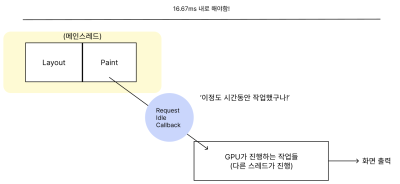 
<br/>

이런식으로 사용하는 것이다.

```js
let job = null
let count = 0

function jobLoop(deadline) {
  console.info("jobInfo")
  if (count++ > 1000) {
    console.clear()
    count = 0
  }
  while (job && deadline.timeRemaining() > 0) {
    // 할 일 있으면서 idle상태일때 job 하고 다음 job 할당해라
    job = performJob(job)
  }

  requestIdleCallback(jobLoop)
}

function performJob(job) {
  console.info(job)
  if (job && job.value < 10) {
    return { value: job.value + 1 }
  }
  return null
}

// 유휴시간이면 jobLoop 실행해라
requestIdleCallback(jobLoop)
```

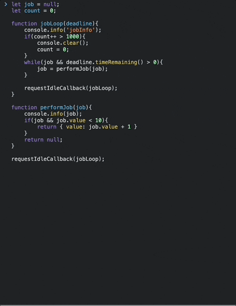 
<div>예제 출처 : <a href=" https://tv.naver.com/v/23652451#comment_focus">https://tv.naver.com/v/23652451#comment_focus</a> </div>
<br/>

jobLoop 함수가 브라우저가 유휴상태일 때마다 호출되어 performJob 함수를 실행하고, job을 수행한 뒤 다음 job을 미리 할당, 이후 다음 유휴상태일때 다시 jobLoop가 돌게 만드는 코드이다.

문제가 없어 보이는 동작이지만, React는 requestIdleCallback 사용을 포기했다.

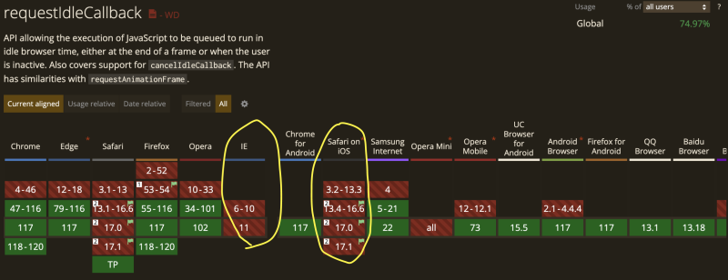 
<br/>

IE와 Safari가 지원을 안했기 때문이다 ㅋㅋㅋㅋㅋㅋ
사실 이 문제 뿐만 아니라 Callback 호출 주기가 불안정했던 문제와, 브라우저 탭 전환 시 비활성 탭 호출 주기 낮아지는 문제도 있었기에 다른 방법을 고려해야만 했다.

<hr/>

### 2-4) Stack Reconcilation에서 고려한 방법3 : 스케줄러 직접 만들기

결국 React팀이 선택한 방법은 스케줄러를 직접 만드는 것이다.

우선순위를 "Lane"이라는 이름으로 만들어 자체 제작한 우선순위 큐를 사용한다.
우리는 이렇게 만들어진 스케줄러의 코드를 분석할것이다.

<hr/>

### 3. 동시성을 위해 탄생한 React팀의 새로운 스케줄러

바로 위에서 requestIdleCallback을 이용해 스케줄러가 어떤 느낌으로 구성되어있는지를 이야기했다. React팀은 새로운 스케줄러를 requestIdleCallback을 사용때 유사한 방식인데, 여러 작업이 자발적으로 자원을 양보하고 협력하여 실행을 조절하도록 하는 "협력적 스케줄링" 방식의 스케줄러를 만들었다.

자, 그럼 한 가지 생각해보자.
위에서 requestIdleCallback을 사용한 경우는 "브라우저"환경에서 렌더링 파이프라인 도중에 무언가를 할 수 있는 방법이었다.
우리는 React에서 즉, JavaScript에서 렌더 작업을 멈추고 시작하고 해야 한다.
requestIdleCallback은 브라우저가 16.67 ms동안 한 프레임 찍어내는 과정에서 유휴상태를 활용하는 것이었다면, JavaScript에서는 어떻게 이 유휴상태를 판단할 수 있을까?

맞다. 자바스크립트에게는 이벤트루프가 있다.
해야 하는 작업을 잘게잘게 쪼개서 이벤트루프로 보내버리는 것이다.
그럼 main Call Stack이 비워지게 된다면 이벤트루프로 가게 될 것이고, 여기에 있는 작업을 진행하게 될 것이다.
이 때, setTimeout대신 setImmediate를 사용하는데 4ms clamping이 있어서 setImmediate를 사용한단다.
실제 주석에 나와있는 내용이다.
~~(setImmediate도 실제로는 즉시실행 아니고 4ms 정도 걸리는걸로 아는데 아닌가...?)~~

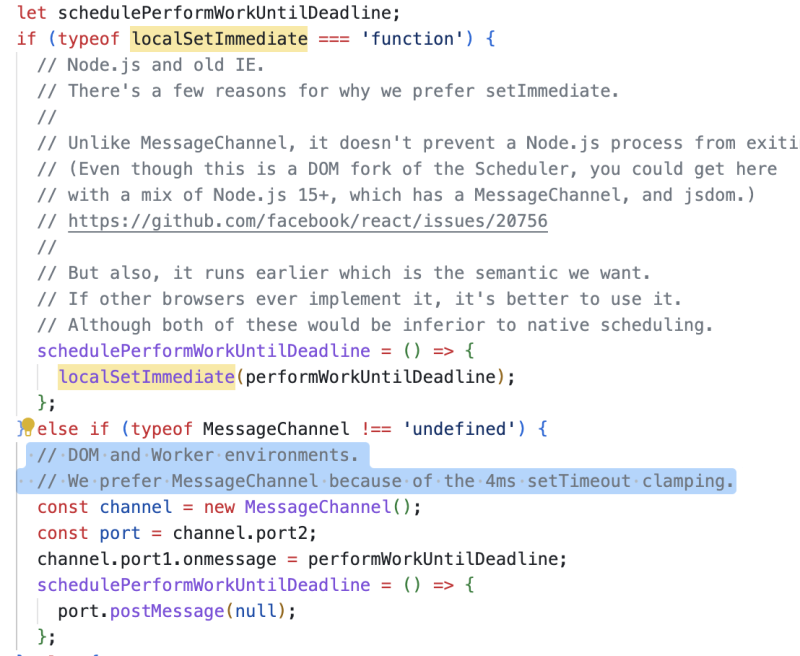 
<br/>

<hr/>

아무튼 아래 사진을 보자.

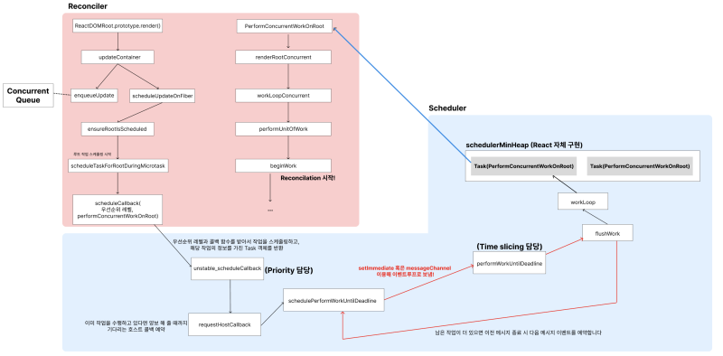 
<br/>

이게 Scheduler와 Reconcilation의 전체 흐름도이다.
이 흐름도의 React코드들을 분석해보자.

<hr/>

### 4. 동시성 구현을 위한 React의 스케줄러

 
<br/>

ReactDOMRoot.prototype.render()를 이용해 이벤트를 예약하게 된다.
이벤트를 예약하며 이런저런 코드들을 거치는데, 결국에는 scheduleCallback이라는 함수를 통해 PerformConcurrentWorkOnRoot 함수와 그 이벤트의 우선순위를 스케줄러로 넘기게 된다. 그 이후에 schedulePerformWorkUntilDeadline 을 거치며 이벤트 루프로 넘어가게 된다.
여기서 Message Channel 혹은 setImmediate를 통해 performWorkUnitDeadline을 호출하게 되는데, 여기서 필요한 작업을 flush하게 된다.

그 뒤에는 맨 처음 이야기했던 requestIdleCallback을 사용하는 방식대로 CPU에게 얼마나 작업을 할당받는지에 따라 workLoop가 돌게 된다.
위에서 작성했던 예제인 requestIdleCallback을 사용했을 때를 떠올리면 이해하기 편할 것 같다.

<hr/>

이후 할당받은 시간을 다 썼는데도 아직 작업이 남았다면 flushWork에서 남은 작업이 있는지 확인하고, 있다면 schedulePerformWorkUntilDeadLine()을 다시 호출하며 루프가 형성되게 된다.

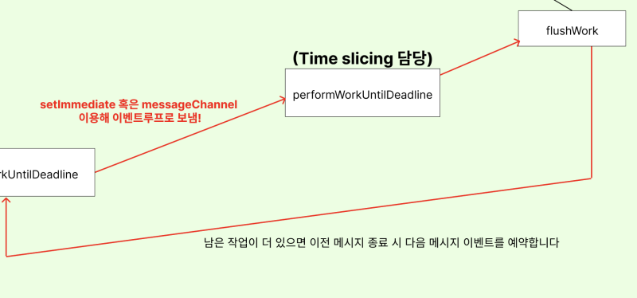 
<i>흐름도 확대사진</i>
<br/>

<hr/>

그렇다면, 이 "스케줄러" 가 동작하게 하는 핵심 동작에는 뭐가 있을까?
조금 생각해보면 명확하게 두 개가 있다.

1. 작업의 Priority 정하기
2. Time Slicing 하기

JS로 만든 React의 스케줄러에서는 어떻게 이 기능을 구현했을까?
아래 그림을 보자.

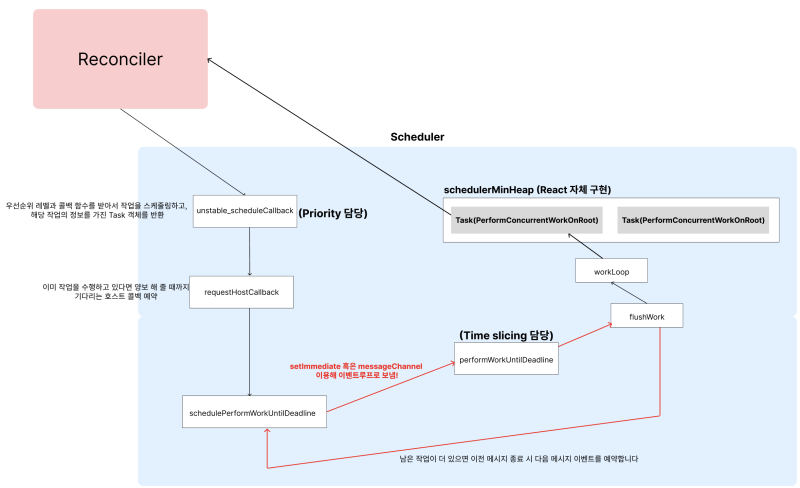 
<br/>

unstable_scheduleCallback에서 Priority를 정하는 기능이 구현되어 있고, performWorkUntilDeadline함수에서 Time Slicing이 구현되어 있다.

그리고 flushWork와 workLoop라는 함수도 스케줄러에 굉장히 핵심적인 로직들인데, 이 두 코드도 포함해서 4개의 함수들을 한번 분석해보자.

<hr/>

### 4-1) React Scheduler의 Priority 구현 : [unstable_scheduleCallback(priorityLevel, callback, option)](https://github.com/facebook/react/blob/main/packages/scheduler/src/forks/Scheduler.js#L343-L427)

아래 코드가 바로 React 에서 Priority기능을 담당하는 unstable_scheduleCallback 함수이다.

```js
function unstable_scheduleCallback(
  priorityLevel: PriorityLevel,
  callback: Callback,
  options?: {delay: number},
): Task {
  var currentTime = getCurrentTime();

  var startTime;
  if (typeof options === 'object' && options !== null) {
    var delay = options.delay;
    if (typeof delay === 'number' && delay > 0) {
      startTime = currentTime + delay;
    } else {
      startTime = currentTime;
    }
  } else {
    startTime = currentTime;
  }

  var timeout;
  switch (priorityLevel) {
    case ImmediatePriority:
      timeout = IMMEDIATE_PRIORITY_TIMEOUT;
      break;
    case UserBlockingPriority:
      timeout = USER_BLOCKING_PRIORITY_TIMEOUT;
      break;
    case IdlePriority:
      timeout = IDLE_PRIORITY_TIMEOUT;
      break;
    case LowPriority:
      timeout = LOW_PRIORITY_TIMEOUT;
      break;
    case NormalPriority:
    default:
      timeout = NORMAL_PRIORITY_TIMEOUT;
      break;
  }

  var expirationTime = startTime + timeout;

  var newTask: Task = {
    id: taskIdCounter++,
    callback,
    priorityLevel,
    startTime,
    expirationTime,
    sortIndex: -1,
  };
  if (enableProfiling) {
    newTask.isQueued = false;
  }

  if (startTime > currentTime) {
    // This is a delayed task.
    newTask.sortIndex = startTime;
    push(timerQueue, newTask);
    if (peek(taskQueue) === null && newTask === peek(timerQueue)) {
      // All tasks are delayed, and this is the task with the earliest delay.
      if (isHostTimeoutScheduled) {
        // Cancel an existing timeout.
        cancelHostTimeout();
      } else {
        isHostTimeoutScheduled = true;
      }
      // Schedule a timeout.
      requestHostTimeout(handleTimeout, startTime - currentTime);
    }
  } else {
    newTask.sortIndex = expirationTime;
    push(taskQueue, newTask);
    if (enableProfiling) {
      markTaskStart(newTask, currentTime);
      newTask.isQueued = true;
    }
    // Schedule a host callback, if needed. If we're already performing work,
    // wait until the next time we yield.
    if (!isHostCallbackScheduled && !isPerformingWork) {
      isHostCallbackScheduled = true;
      requestHostCallback();
    }
  }

  return newTask;
}
```

<br/>
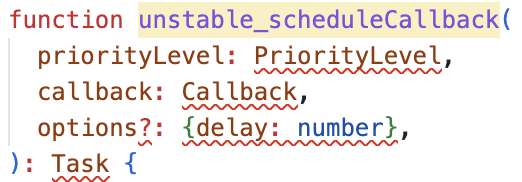 
<br/><br/>

함수 선언부부터 보면 알 수 있겠지만 priorityLevel과 callback 즉, 콜백과 콜백의 우선순위를 동시에 받고 있다.
이렇게 받은 작업을 스케줄링하고, 해당 작업의 정보를 가진 Task 객체를 반환하는 함수가 바로 unstable_scheduleCallback함수이다.

먼저 위에서 입력받는 priorityLevel의 경우 작업의 우선순위를 나타내는데, 이 우선순위에 따라 타임아웃 값이 설정된다.

<hr/>

이해를 돕기 위해 우리가 사용하는 메서드들을 추가적으로 이야기하자면,
만약 우리가 일반적으로 사용하는 suspense나 useTransition의 경우, 우선순위가 매우 낮게 설정되기 때문에(우선순위가 같으며 똑같이 매우 낮다.), 타임아웃이 매우 길게 잡힐 것이다.
우선순위가 낮으니 늦게 처리되도 상관 없기 때문이다.

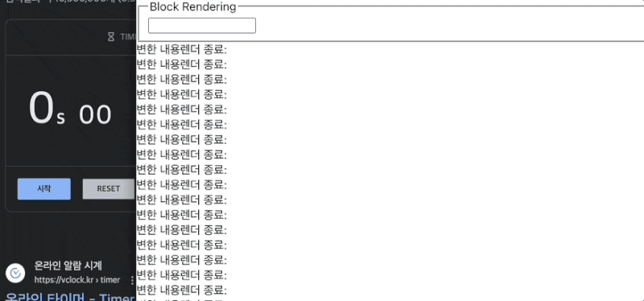 
<br/>

실제로 돌려보면 타임아웃은 최대 한 5초정도 되는 것 같다.(예상)

<hr/>

시작 시간은 현재 시간(getCurrentTime())을 기반으로 계산되는데, 옵션에 뭐가 들어왔는지에 따라 지연(delay)가 설정될 수 있다.
만료시간의 경우 expirationTime인데, var expirationTime = startTime + timeout; 코드를 보면 알 수 있겠지만, 시작 시간과 타임아웃 시간을 더해 만료시간을 정한다.

이렇게 값들을 정하고 아래와 같은 형태로 하나의
Task를 만들게 된다.

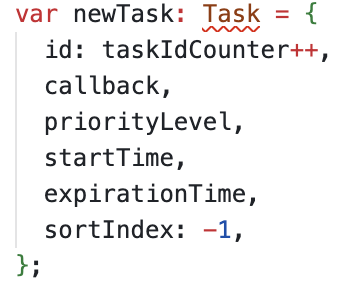 
<br/>

이렇게 만들어진 작업이 만약 지연된 작업이라면, 가장 먼저 실행될 작업으로 설정하여 TimerQueue에 들어가게 된다.

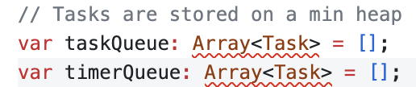 
<br/>

여기서 말하는 타이머 큐는 일단 배열로, 최종적으로는 우선순위를 위해 만들어진 React 자체 구현 최소힙에 들어가게 된다.
그럼 왜 이렇게 자체 구현 최소힙을 사용하려는걸까?
위에서 이야기했던 것처럼 Execution Context가 쌓이는 Call Stack을 먹지 않기 위해서이다 ㅎㅎ..

그 외로, 작업이 즉시 실행된다면 이를 taskQueue에 추가하고, 즉시 실행될 수 있도록 스케줄링하게 된다.
이렇게 작업이 스케줄되면 해당 작업의 정보를 담은 Task를 반환하게 된다.

이렇게 unstable_scheduleCallback(priorityLevel, callback, option) 함수가 Priority를 위해 구현된 함수임을 확인할 수 있었다.

<hr/>

### 4-2) React Scheduler의 Time Slicing 구현 : [performWorkUntilDeadline()](https://github.com/facebook/react/blob/main/packages/scheduler/src/forks/Scheduler.js#L555-L584)

다음은 performWorkUntilDeadline() 함수이다.

아래 코드가 실제 React의 performWorkUntilDeadline() 함수이다.

```js
let isMessageLoopRunning = false
let needsPaint = false
// ...

const performWorkUntilDeadline = () => {
  if (isMessageLoopRunning) {
    const currentTime = getCurrentTime()
    // Keep track of the start time so we can measure how long the main thread
    // has been blocked.
    startTime = currentTime

    // If a scheduler task throws, exit the current browser task so the
    // error can be observed.
    //
    // Intentionally not using a try-catch, since that makes some debugging
    // techniques harder. Instead, if `flushWork` errors, then `hasMoreWork` will
    // remain true, and we'll continue the work loop.
    let hasMoreWork = true
    try {
      hasMoreWork = flushWork(currentTime)
    } finally {
      if (hasMoreWork) {
        // If there's more work, schedule the next message event at the end
        // of the preceding one.
        schedulePerformWorkUntilDeadline()
      } else {
        isMessageLoopRunning = false
      }
    }
  }
  // Yielding to the browser will give it a chance to paint, so we can
  // reset this.
  needsPaint = false
}
```

우선 코드 처음부터 보면 알 수 있지만, getCurrentTime()을 이용해 현재시간을 가져와 startTime을 할당하는 것을 볼 수 있다.
이 코드는 메인스레드가 차단된 시간을 측정하기 위한 코드이다.

이후에 스케줄러 작업이 오류를 던지는 것이 아니라면 flushSync()를 호출하여 작업을 수행하게 되는데, 이 때 try-finally블록을 사용하지 않고 예외를 던지게 된다.(이게 디버깅 기술에 더 용이하단다)
이후 남은 작업 여부를 hasMoreWork 변수에 저장하고, 만약 더 많은 작업이 남아있는 경우 다음 메시지 이벤트를 스케줄하게 된다.
그게 아니라면 isMessageLoopRunning을 false로 바꾸며 메시지 루프를 중단해버린다.

마지막으로 브라우저가 그림을 그릴 수 있도록 needsPaint를 false로 바꾸며 함수가 종료된다.

이렇게 performWorkUntilDeadline() 함수가 현재 메시지 루프가 실행 중인지 확인하고, 실행 중이라면 일정 시간 동안 작업을 수행하는 함수라는것을 알 수 있었다. 이는 곧 Time Slicing을 위해 구현된 함수라는 이야기가 되는 것이다.

<hr/>

4-3) React Scheduler의 핵심 로직 : [flushWork](https://github.com/facebook/react/blob/main/packages/scheduler/src/forks/Scheduler.js#L165-L207), [workLoop](https://github.com/facebook/react/blob/main/packages/scheduler/src/forks/Scheduler.js#L209-L274)

flushWork함수는 React의 작업을 처리하고 예외 처리 및 성능 측정을 포함하여 작업을 관리하는 그런 함수이다.
간단하게 설명하면 workLoop을 호출해주는 친구인데, workLoop가 스케줄러의 핵심적인 로직을 담당하는 함수이다.

아래는 실제 React의 flushWork 함수이다.

```js
function flushWork(initialTime: number) {
  if (enableProfiling) {
    markSchedulerUnsuspended(initialTime);
  }

  // We'll need a host callback the next time work is scheduled.
  isHostCallbackScheduled = false;
  if (isHostTimeoutScheduled) {
    // We scheduled a timeout but it's no longer needed. Cancel it.
    isHostTimeoutScheduled = false;
    cancelHostTimeout();
  }

  isPerformingWork = true;
  const previousPriorityLevel = currentPriorityLevel;
  try {
    if (enableProfiling) {
      try {
        return workLoop(initialTime);
      } catch (error) {
        if (currentTask !== null) {
          const currentTime = getCurrentTime();
          // $FlowFixMe[incompatible-call] found when upgrading Flow
          markTaskErrored(currentTask, currentTime);
          // $FlowFixMe[incompatible-use] found when upgrading Flow
          currentTask.isQueued = false;
        }
        throw error;
      }
    } else {
      // No catch in prod code path.
      return workLoop(initialTime);
    }
  } finally {
    currentTask = null;
    currentPriorityLevel = previousPriorityLevel;
    isPerformingWork = false;
    if (enableProfiling) {
      const currentTime = getCurrentTime();
      markSchedulerSuspended(currentTime);
    }
  }
}
```

flushWork가 받는 인자를 보면 initialTime이란 값을 받는데, 이는 작업의 시작 시간에 대한 값이다. 이 값은 작업의 진행 시간을 측정하고, 작업이 블로킹된 시간을 계산하고자 받는 것인데, 이를 받아서 프로파일링 도중 작업이 얼마나 걸렸는지 측정하는데 사용하게 된다.

그 외로는 사실상 workLoop을 호출하는게 전부이다.

```js
// ...
try {
  return workLoop(initialTime);
} catch (error) {
// ...
```

이제 workLoop함수를 보자.
위에서 이야기했던 것처럼 스케줄러의 가장 핵심적인 로직이다.

```js
function workLoop(initialTime: number) {
  let currentTime = initialTime;
  advanceTimers(currentTime);
  currentTask = peek(taskQueue);
  while (
    currentTask !== null &&
    !(enableSchedulerDebugging && isSchedulerPaused)
  ) {
    if (currentTask.expirationTime > currentTime && shouldYieldToHost()) {
      // This currentTask hasn't expired, and we've reached the deadline.
      break;
    }
    // $FlowFixMe[incompatible-use] found when upgrading Flow
    const callback = currentTask.callback;
    if (typeof callback === 'function') {
      // $FlowFixMe[incompatible-use] found when upgrading Flow
      currentTask.callback = null;
      // $FlowFixMe[incompatible-use] found when upgrading Flow
      currentPriorityLevel = currentTask.priorityLevel;
      // $FlowFixMe[incompatible-use] found when upgrading Flow
      const didUserCallbackTimeout = currentTask.expirationTime <= currentTime;
      if (enableProfiling) {
        // $FlowFixMe[incompatible-call] found when upgrading Flow
        markTaskRun(currentTask, currentTime);
      }
      const continuationCallback = callback(didUserCallbackTimeout);
      currentTime = getCurrentTime();
      if (typeof continuationCallback === 'function') {
        // If a continuation is returned, immediately yield to the main thread
        // regardless of how much time is left in the current time slice.
        // $FlowFixMe[incompatible-use] found when upgrading Flow
        currentTask.callback = continuationCallback;
        if (enableProfiling) {
          // $FlowFixMe[incompatible-call] found when upgrading Flow
          markTaskYield(currentTask, currentTime);
        }
        advanceTimers(currentTime);
        return true;
      } else {
        if (enableProfiling) {
          // $FlowFixMe[incompatible-call] found when upgrading Flow
          markTaskCompleted(currentTask, currentTime);
          // $FlowFixMe[incompatible-use] found when upgrading Flow
          currentTask.isQueued = false;
        }
        if (currentTask === peek(taskQueue)) {
          pop(taskQueue);
        }
        advanceTimers(currentTime);
      }
    } else {
      pop(taskQueue);
    }
    currentTask = peek(taskQueue);
  }
  // Return whether there's additional work
  if (currentTask !== null) {
    return true;
  } else {
    const firstTimer = peek(timerQueue);
    if (firstTimer !== null) {
      requestHostTimeout(handleTimeout, firstTimer.startTime - currentTime);
    }
    return false;
  }
}
```

먼저 봐야 할 코드는 **currentTask = peek(taskQueue)** 바로 이 코드이다.

우리가 위에서 막 다뤘던 우선순위큐에서 태스크를 꺼내오는 것이다.

<hr/>

이후 이 작업을 돌릴건데, 아래 코드를 보자.

```js
while (
  currentTask !== null &&
  !(enableSchedulerDebugging && isSchedulerPaused)
) {
  // ...
}
```

현재 작업이 존재하고, 스케줄러가 일시 중지되지 않은 동안에 루프가 계속 돌게된다.
이 글의 초반에 requestIdleCallback으로 짜여진 코드를 봤을 때 처럼 말이다.

그렇게 막 코드를 돌리다가 루프가 중단되는 경우가 있다.
if (currentTask.expirationTime > currentTime && shouldYieldToHost()) 코드를 만났을 경우 데, 작업 만료 시간이 현재 시간보다 크고 호스트에게 양보해야 하는 시간일 경우에 대한 조건이다. 이럴 경우 하던 작업을 나중에 다시 처리하게 된다.

​그런데 하던 작업이 다 안끝났는데 shouldYieldtoHost()를 만나 하던 작업을 더 해야하는 경우도 있을 것이다.
이를 판별하는 코드가 아래 코드이다.

```js
if (currentTask !== null) {
  return true
} else {
  const firstTimer = peek(timerQueue)
  if (firstTimer !== null) {
    requestHostTimeout(handleTimeout, firstTimer.startTime - currentTime)
  }
  return false
}
```

**else부분을 보면 되는데, 하고있는 작업을 꺼내 requestHostTimeout()에 담아 다시한번 작업을 담게 된다.**

```js
function requestHostTimeout(
  callback: (currentTime: number) => void,
  ms: number,
) {
  // $FlowFixMe[not-a-function] nullable value
  taskTimeoutID = localSetTimeout(() => {
    callback(getCurrentTime());
  }, ms);
}
```

이게 실제 requestHostTimeout() 코드이다. 사실상 재귀호출이라고 봐도 될 것 같다.

이후 우선순위가 정해진 이 작업은 "최소힙"이기에 우선순위에 따라 잘 배정될 것이다.
반대로 더 할 작업이 없다면 return true를 반환하며 workLoop가 끝나게 될 것이다.

이렇게 workLoop는 여태 모아왔던 작업들을 실제로 우선순위에 따라 수행하는 역할을 하는 핵심적인 함수이다.

<hr/>

### 4-4) 정리

여기까지 내용이 워낙 많다보니 최대한 요약해보겠다.
React에서 스케줄링되는 React의 작업은 모두 우선순위가 정해져 있다.
이 모든 "작업" 들의 우선순위는 "현재시간 + 우선순위에 따른 추가 시간"으로 만들어진 "만료시간"(실제 시간)을 기준으로 이루어지는데, 만료시간이 짧을수록 우선순위가 높은 우선순위이다. React에서 만든 우선순위 큐가, 최소힙이기 때문이다.
특정 작업을 하다 높은 우선순위의 작업이 들어오면 멈추고 더 높은 우선순위의 작업을 하도록 동작하는데, 만약 작업을 하다가 Timeout으로 인해 작업을 다 못했을 경우 작업을 더 이어나가야 할 것이다.
이 경우 requestHostTimeout() 에 작업을 담아 다시 요청하게 된다.

여기까지 모두 끝났다면 다음은 Reconciler로 함수들로 들어가게 된다.

<hr/>

### 5. Reconciler와 Fiber 아키텍처

React의 Scheduler 내용을 위에서 다뤄보았고, 이제 Reconciler로 다시 돌아오게 된다.

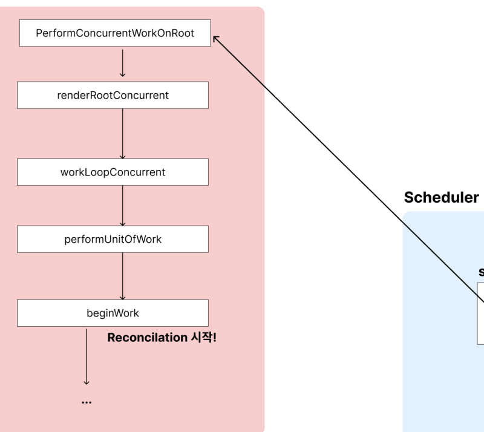 
<br/>

이제 진짜로 Reconcilation과정이 다시 시작되는 것인데,

이 내용은 이전에 작성했던 [Fiber 아키텍처의 개념과 Fiber Reconcilation 이해하기](https://blog.woochan.info/blog/reconcilation) 글에서 다뤘었다.
이 글의 주제는 아니기에 다루지는 않지만, 실제로 Performance Tab에서 확인해보면 아래와 같은 순서로 호출되는 것을 확인할 수 있다.
performWorkUntilDeadline, flushWork, workLoop 모두 위에서 다룬 친구들이다.

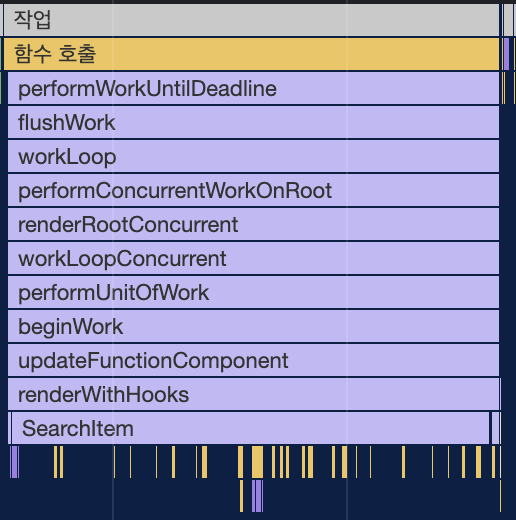 
<br/>

여기까지 React의 스케줄러가 어떻게 동작하는지 한번 알아봤다.
스케줄러를 통해 들어간 작업에서 reconcilation이 어떻게 일어나는지 알고싶다면 [Fiber 아키텍처의 개념과 Fiber Reconcilation 이해하기](https://blog.woochan.info/blog/reconcilation) 이 글을 참고하면 될 것 같다.

<hr/>

6. 느낀점

사실 원래 이 글은 useTransition이나 useDefferredValue같은 내용을 공부해보고 React의 동시성을 주제로 글을 작성하려 했었다.
그런데 막상 어떻게 쓰는지 사용방법만 작성하고자 하려니 '난 이게 어떻게 동작하는지도 제대로 모르는데... 어떤 도구인지도 제대로 모르면서 도구 사용법같은 글을 쓰는게 과연 맞나?' 라는 생각이 들었다.
마침 추석 연휴겠다 제대로 이해해보고자 하는 욕심에...
스케줄러 코드를 살짝 열어보았다가 어느새 오기 생겨서 며칠 내내 이것만 보고있고... 그러다 보니 자연스럽게 주제가 스케줄러 분석으로 바뀌어 버렸다.
~~(그래도 취업한게 아닌, 우테코 하고있는 지금같은 때 아니면 이런거 언제 공부해보겠냐 하는 생각으로 했는데... 이게 맞나 싶긴 하다ㅋㅋㅋㅋ)~~
그래도 확실한건, 스케줄러 공부하고 나니 이제 Suspense 왜 쓰는지 확실하게 꺠달았다.

<hr/>

<i style="font-size:0.7rem; text-align:right">
참고

> https://github.com/reactwg/react-18/discussions/65 >https://tv.naver.com/v/23652451 >https://github.com/facebook/react/blob/main >https://jser.dev/react/2022/03/16/how-react-scheduler-works/ >https://sckimynwa.medium.com/concept-of-react-scheduler-2c887cbfe5a8 >https://caniuse.com/requestidlecallback >https://developer.mozilla.org/ko/docs/Web/API/window/requestAnimationFrame >https://yceffort.kr/2021/08/requestIdlecallback >https://goidle.github.io/react/in-depth-react18-lane/ > </i>
