React를 사용하다 보면 React Fiber 라는 이름을 들어봤을 것이다.
React는 Fiber라는 아키텍처를 React 16버전부터 채택하였고, 지금도 지속적으로 업데이트되고 있다.
기존의 아키텍처에 어떤 문제가 있었길래 16버전부터 갑자기 Fiber 아키텍처를 채택한 이유가 뭘까?
이 글에서는 React의 Fiber라는 것에 대해 포스팅을 해보려 하는데, 이를 이해하기 위해선 먼저 Reconcilation이 무엇인지, 15버전까지의 Stack Reconcilation이 무엇인지 알아야 한다.

### 1. Reconcilation이란?

먼저 React의 Reconcilation이 대체 무엇인지 한번 알아보자.
아래 코드를 보자.
React 코드를 작성하다 보면 한번쯤은 반드시 만나봤을 코드일 것이다.

```js
ReactDOM.render(<App />, document.getElementById("root"))
```

<App/>은 우리가 작성한 엘리먼트일텐데, 이 "엘리먼트" 라는건 정확하게 무엇일까?
리액트 공식문서에서는 이를 [아래와 같이](https://legacy.reactjs.org/blog/2015/12/18/react-components-elements-and-instances.html#elements-describe-the-tree) 설명하고 있다.

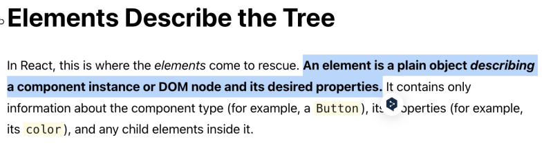 
<br/>

우리가 만든 이 엘리먼트는 단순하게 어떤 속성을 갖고 있는지, 어떤 children을 갖고 있는지 등에 대한 내용을 나타내는 하나의 객체인 것이다.
우리가 `<div>` 라는 태그를 쓰던, `<Div>`라는 React 컴포넌트(함수컴포넌트 or 클래스 컴포넌트)를 만들어 쓰던, 이는 모두 **단순한 객체** 라는것이 핵심이다. 결국 화면에 어떻게 렌더링을 해야 하는지에 대한 설명들일 뿐이다. 이렇게 객체로 구성한 뒤에 React에서 Tree를 구축 하고 파싱을 해서 "어떤 부분을 수정해야 하는구나" 판단이 된 뒤에야 실제 렌더링이 일어나게 된다.

그럼 "어떤 부분이 어떻게 다른가"를 판별하기 위해 꼭 필요한 과정이 무엇일까?
당연히 모든 엘리먼트들을 돌고 돌아 기본적인 DOM태그를 얻어내는 과정이 필요할 것이다.
아래와 같은 코드가 있다고 해보자.

```js
// App.js

// ...
<Hello>
  <Button>I am button!</Button>
</Hello>
// ...
```

```js
const Hello = props => {
  return <div className="hello">{props.children}</div>
}
```

당연하게도, React는 어떤 엘리먼트들이 렌더링되어야 하는지 알아야 할 것이다.
따라서 React는 render()호출 뒤에 최종적인 자식 요소가 무엇인지 알아내기 위해 재귀적으로 React 내의 트리를 탐색하며 기본적인 DOM Tag를 얻어낸다. 그게 위 코드에서와 같이 div 태그같은 경우를 말하는 것이다.
이렇게 가장 기본적인 DOM Tag를 얻어낸 뒤 기존 뷰와 다른점을 찾아내는 과정을 React에서는 "Reconcilation" 이라고 부른다.

우리가 사용하는 React에서는 ReactDOM.render()나 setState()가 호출되면 이 reconcilation 과정을 React가 수행하게 되는데, 이렇게 얻어낸 기본적인 DOM Tag들을 기반으로 기존에 렌더링되었던 트리와 새 트리를 비교하여 변경된 사항들을 확인하게 된다. (그 뒤로는 당연하게도 변경사항을 트리에 반영할 것이다.)
이렇게 Reconcilation이 진행된 뒤에, 실제 DOM에 변경되어야 할 최소 변화들을 적용하게 되는 것이다.

<hr/>

### 2. Stack Reconcilation

그렇다면 이제 Fiber 아키텍처 이전의 reconcilation 과정에 대해 알아보자.
이름은 Stack Reconcilation이다.
이 "Stack Reconcilation" 에 대해 이해하기 위해서는 먼저 JavaScript의 Execution Context와 Call Stack에 대한 이해가 필요하다..
이 글의 핵심 주제는 아니기 때문에, 예전에 이에 대해 썼던 [글 링크](https://blog.naver.com/dlaxodud2388/222655214381)를 남기겠다.

간단하게 요약하자면, JavaScript의 ExecutionContext는 함수가 호출되었을 때 Call Stack에 쌓이게 된다. (전역 Execution Context, eval 제외)

Stack Reconciler가 어떤 순서로 리렌더링을 처리하는지 보자. 크게 3가지 과정으로 나뉜다.

1. 모든 DOM트리 맨 위에서부터 재귀 형식으로 컴포넌트 만날때마다 ".render()" 호출하기
2. Tree 변경사항 확인하고, 업데이트 필요한 컴포넌트 확인하고 해당 컴포넌트 자식들도 업데이트 해야하는지 확인하기
3. 컴포넌트들 하나씩 업데이트하기

여기서 가장 핵심적으로 봐야 할 내용은 1번이다.

재귀를 돌면서 컴포넌트를 만날 때마다 .render() 를 담아뒀다가 한번에 호출하는데, 이 "순서"에 핵심이 있다.
순차적으로 만나는 컴포넌트들을 돌며 스택에 담아두고 render를 호출하는 방식의 FILO(First In Last Out) 방식이기 때문에 "Stack reconcilation"인 것이기 때문이다.

아래와 같은 컴포넌트가 있다면?

```js
function Example() {
  return (
    <Zero>
      <One />
      <Two />
    </Zero>
  )
}
```

이는 아래와 같은 순서로 담긴 render들이 호출될 것이다.

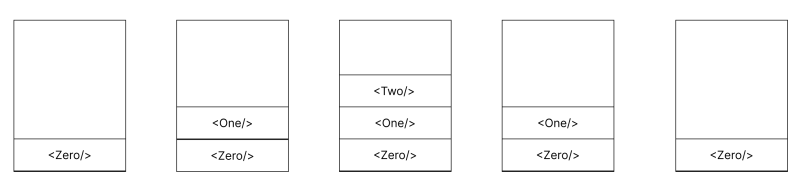 
<br/>

호출된 순서가 고정되어 있으니 JavaScript엔진의 Call Stack에도 아래와 같은 순서로 쌓이게 될 것이다.

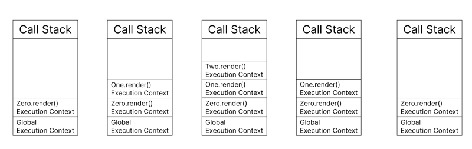 
<br/>

이렇게 보면 합리적인 방법처럼 보일 수도 있지만, 문제점이 있다.
이건 Andrew Clark이 react-fiber-architecture에 남긴 글이다.

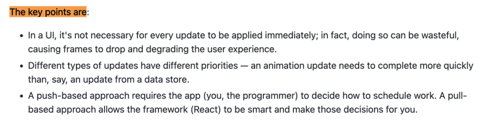 
<a href="https://github.com/acdlite/react-fiber-architecture" style="font-size:0.7rem">https://github.com/acdlite/react-fiber-architecture</a>
<br/>

변경사항이 발생할 때마다 업데이트를 반영하는건 리소스를 낭비하는 것이기에, 프레임이 드랍이 일어날 수 있다는 이야기이다.
이는 곧 사용자 경험 저하로 이어지게 될 것이다.
또한, 애니메이션 업데이트는 데이터 저장소 업데이트보다 빨리 완료되야 한다는 이야기도 있다. 업데이트 종류마다 우선 순위가 달라야 한다는 이야기이다. 이도 프레임 드랍에 관한 이야기이다.

프레임 드랍이 대체 어떤 문제가 있길래 그런 것일까?
요즘의 일반적인 모니터들은 초당 60프레임(60 FPS)정도로로 화면을 재생한다.
이 말은 즉 1/60(16.67) ms 간격으로 새 프레임이 나타난다는 이야기이다. 즉, React는 16ms보다 빠르게 리렌더를 하지 않는다면 프레임 드랍이 일어날 수 밖에 없다는 이야기이다. 프레임 드랍이 되면 당연히 사용자는 버벅거리는 화면을 보게 될 것이다.
단순한 텍스트를 리렌더하는거라면 별 문제가 없다. 그러나 애니메이션이라면 이야기가 달라진다. reconciliation 알고리즘이 업데이트가 있을 때마다 **React 내 트리를 다 순회하고 렌더링을 하는데 16ms가 넘어버린다면?** 자연스럽게 프레임이 드랍되고 애니메이션이 버벅거리는 화면을 사용자는 보게 될 것이다.

**이 문제 때문에 React Fiber reconcilation 알고리즘이 탄생하게 된 것이다!**

이제 Fiber에 대해 글을 다룰 계획인데, 여기서부터는 JS의 Call Stack, Execution Context에 대한 이해가 없다면 Fiber를 이해할 수 없다.

Execution Context에 대해 함께 다루면 글이 너무 장황해질 것 같아... 예전에 썼던 글 링크만 남겨두겠다.

[[JavaScript] ES6의 Execution Context(실행 컨텍스트)의 동작 방식과 Lexical Nesting Structure(Scope chain)](https://blog.woochan.info/blog/execution-context)

<hr/>

### 3. Fiber란?

이제 그럼 기존 아키텍처의 Stack reconcilation에서 Fiber 아키텍처의 reconcilation 알고리즘으로 개선하기 위해 어떤 요구사항이 있는지를 알아보자.
이건 Andrew Clark의 [레포지토리](https://github.com/acdlite/react-fiber-architecture)를 찾아가면 직접 볼 수 있다!

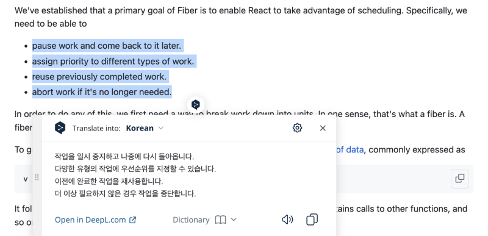 
<br/>

위 사진처럼 4가지 요구사항이 존재한다.

1. 작업 일시 중지 후 나중에 다시 시작
2. 작업별 우선 순위 지정
3. 이전에 완료된 작업 재사용
4. 더이상 필요하지 않은 경우 작업 중단

이 작업을 수행하기 위해서는 작업을 단위로 세분화 할 수 있는 방법이 필요하다. 여기서 말하는 이 "작업의 단위"를 Fiber라고 부른다.
그런데, 조금 이상한 점을 느낄 수 있다. React는 결국 JS코드를 실행시키게 된다. 작업 우선순위를 정하고 하려면 이는 곧 JS엔진을 거쳐 무언가를 해야하는데, 뭔가 이상하다.

JavaScript의 구조를 조금만 생각해보자. 당장 Call Stack과 Execution Context만 생각해봐도 작업 일시 중지 후 나중에 다시 시작? 가능할까? 라는 생각이 든다. JS엔진 특성상 스케줄링 순서를 직접 정하는건 불가능한 이야기처럼 보인다.
순서는 고정될 수 밖에 없는 것 같은데, 어떻게 이를 구현할 수 있는 것일까?

그걸 위해 React팀은 context switch와 JS의 Call Stack을 JS로 구현했다.
그게 바로 Fiber 아키텍처이다. (OS에서 다루는 경량화 스레드 Fiber를 알아보자.)

이 Fiber 아키텍처의 모든 Fiber 노드들은 모두 "workLoop()" 라는 함수에서 동작한다.
이게 실제 [workLoop함수](https://github.com/facebook/react/blob/f765f022534958bcf49120bf23bc1aa665e8f651/packages/react-reconciler/src/ReactFiberScheduler.js?source=post_page---------------------------#L1136-L1148)이다.
이 말인 즉, Call Stack에 올라가있는 workLoop Execution Context에 JS로 스케줄링 알고리즘과 Call Stack이 구현되어 관리된다는 이야기이다.

요약하자면, Fiber 아키텍처는 JS로 Scheduling 기능이 포함된 가상의 비동기적인 stack 프레임 모델을 구축한 것이라고 보면 된다.

이 때, 이 Fiber에 Reconcilation을 처리하기 위해 존재하는 Fiber Tree의 경우 Stack Reconcilation을 할 때 처럼 Tree가 recursion으로 구현된 것이 아닌, LinkedList로 구현되어 있다.**(정확히는 LCRS트리라고 불리며, Left Children Right Sibiling의 약자이다.)**
Fiber Tree를 구성하는 LCRS트리의 각각의 노드들에는 Type, key, child, sibiling, memoized같이 각 컴포넌트에 대한 정보들이 들어가있다.
(여기서, memoized된걸 확인했다면 리렌더 시 기존에 메모이제이션 해뒀던 걸 다시 가져오게 되는 것이다.)

<hr/>

### 4. Fiber Reconcilation - 선행 지식

그렇다면 이제 Fiber를 이용해 어떻게 재조정 과정이 일어나는지 확인해보자.
Fiber의 동작 과정을 이해하기 위해서는 몇가지 언급하고 가야 할 것이 필요하다.
총 다섯개이다.

- workInProgress
- performUnitOfWork
- beginWork
- completeUnitOfWork
- completeWork

위 5가지를 하나하나 설명하겠다.

### 4-1) [workInProgress](https://github.com/facebook/react/blob/95a313ec0b957f71798a69d8e83408f40e76765b/packages/react-reconciler/src/ReactFiber.js#L321)

fiber들이 작업에 들어가게 되는 Tree이다. **(정확히는 Tree가 아니라 LinkedList로 구현되어 있다. LCRS 트리라고도 부르는 구조이기에, 이 글에서는 줄여서 그냥 트리라고 부르며 설명하겠다.)**
fiber가 작업에 들어가면 workInProgress Tree로 들어가게 된다.
기존의 화면에 떠있는 정보들을 담고 있는 tree를 current Tree라고 부르는데, work-in-progress Tree는 이를 복제해서 만든다.
어차피 fiber node들은 자바스크립트 객체들이라서 Commit단계가 수행되기 전까지 비동기적으로 계속 변동이 가능하다.
(render phase 이후 commit phase과정을 거친다.)

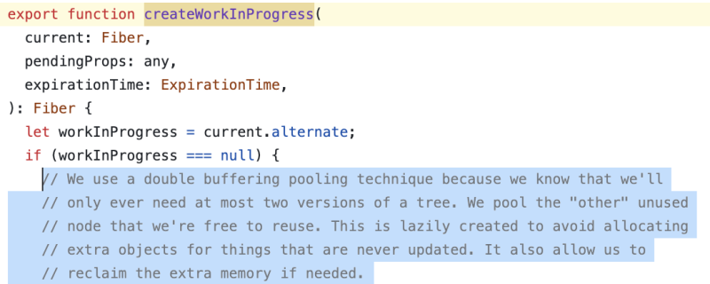 
<br/>

이 createWorkInProgress를 보면 위와 같은 주석을 확인할 수 있다.
react에서는 어차피 두 개 버전의 트리만 필요하기 때문에, 이 workInProgress Tree에 대해 버퍼링 풀이 2개가 있다는 이야기가 있다.
(\* 버퍼 풀 (buffer pool)은 RAM에서 데이터가 접근될 때 해당 데이터를 캐시하는 영역이다.)
주석에서는 업데이트되지 않은 항목에 대해 추가 개체 할당을 피하기 위해 lazy create가 된다는 이야기가 쓰여 있다. 이를 통해 메모리 회수도 할 수 있다는 이야기가 쓰여 있다.

<hr/>

### 4-2) [performUnitOfWork](https://github.com/facebook/react/blob/95a313ec0b957f71798a69d8e83408f40e76765b/packages/react-reconciler/src/ReactFiberScheduler.js#L1056)

workInProgress 트리에서 fiber 노드를 수신하고 beginWork 함수를 호출하여 작업을 시작하는 함수이다.

<hr/>

### 4-3) [beginWork](https://github.com/facebook/react/blob/95a313ec0b957f71798a69d8e83408f40e76765b/packages/react-reconciler/src/ReactFiberBeginWork.js#L1382)

말 그대로 작업을 시작하는 것이다. 컴포넌트들을 스택에 막 쌓아버리는 그런 함수이다.
우리가 위에서 봤던 stack reconcilation처럼 한 fiber의 가상 스택 프레임에 집어넣는 그런 함수이다.

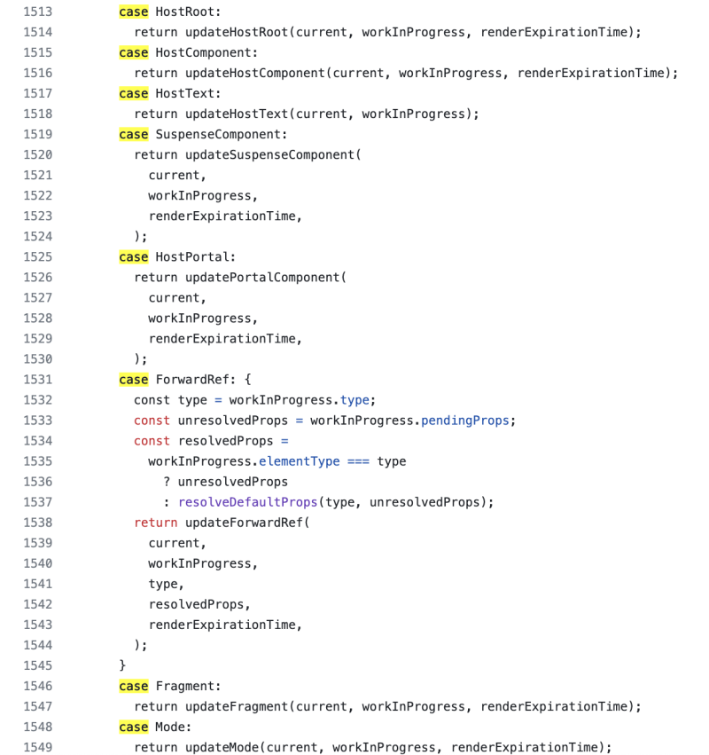 
<br/>

<hr/>

### 4-4) [completeUnitOfWork](https://github.com/facebook/react/blob/95a313ec0b957f71798a69d8e83408f40e76765b/packages/react-reconciler/src/ReactFiberScheduler.js#L879)

workInProgress 트리의 노드에서 자식 노드가 없을 경우 사용되는 메서드이다.
completeUnitOfWork의 경우 작업을 한 뒤 형제 노드가 있는지를 확인하게 된다. 만약 있다면 React는 이 형제로부터 다시 작업이 시작된다. 이 형제 노드에 자식 노드들이 있다면 그쪽으로 이어서 탐색하게 될 것이다. 이렇게 트리를 작업해 나가는 것이다.
그림으로 나타내자면 아래와 같을 것이다.

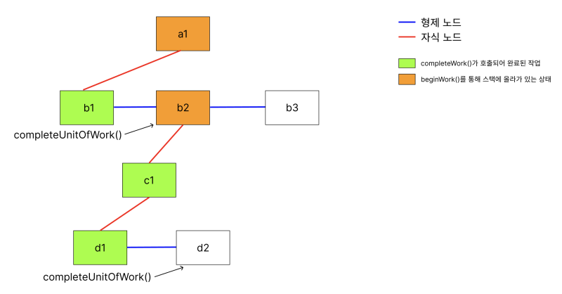 
<br/>

부모에 대한 작업은 모든 작업들을 끝낸 뒤 수행하는것이 핵심이다.

<hr/>

### 4-5) [completeWork](https://github.com/facebook/react/blob/cbbc2b6c4d0d8519145560bd8183ecde55168b12/packages/react-reconciler/src/ReactFiberCompleteWork.js#L532)

작업이 끝났다는걸 확정하는 함수이다.
만약 여기서 무언가 변경점이 있다면, 이를 하나 하나 모아준다.
이를 "Effect" 라고 하는데, 이는 EffectList에 담겨 한번에 처리한다.
처리한다는 이야기는 실제 DOM에 반영한다는 이야기이다!
[https://github.com/facebook/react/blob/9198a5cec0936a21a5ba194a22fcbac03eba5d1d/packages/react-dom/src/client/DOMPropertyOperations.js#L156-L158](https://github.com/facebook/react/blob/9198a5cec0936a21a5ba194a22fcbac03eba5d1d/packages/react-dom/src/client/DOMPropertyOperations.js#L156-L158)
여기에 실제 코드가 있다.

<hr/>

### 5. Fiber Reconcilation - Render Phase

이제 Fiber의 Render Phase를 한번 보자.
초기의 Fiber Node Tree가 아래와 같다고 해보자.
(그림 그리다 잘못그려서 b1부터 시작함... b1이 시작점입니다...)

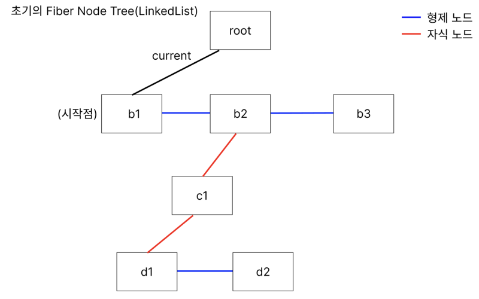 
<br/>

변경점이 b2컴포넌트에 생겼다고 가정하겠다.

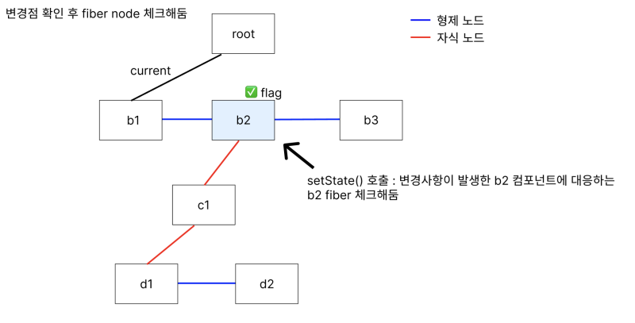 
<br/>

그럼 이제 변경사항이 생겼으니 우리의 React는 그 컴포넌트에 해당하는 fiber node를 체크해둔다.
이후에 바로 Render Phase가 시작된다!

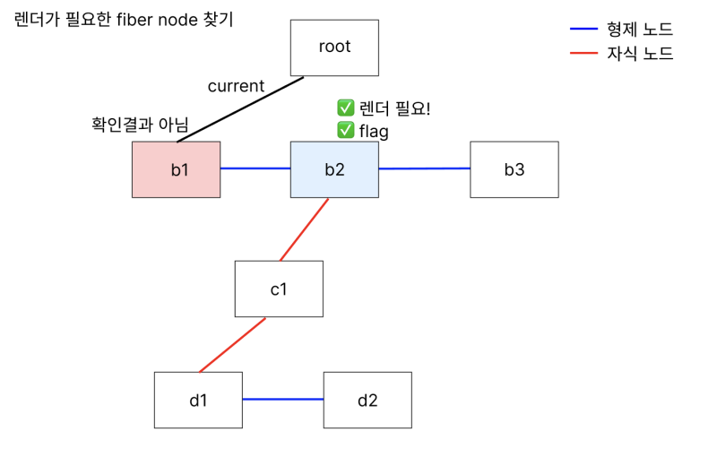 
<br/>

이제 React 입장에서 가장 먼저 해야 할 일은 "그래서 렌더링이 필요한가?"를 체크하는 일이다.
똑같이 트리를 순회하면서 어디서부터 렌더가 필요한지를 체크해야 한다.
체크가 완료되었다면 이제 거기서부터 beginWork()가 호출된다.

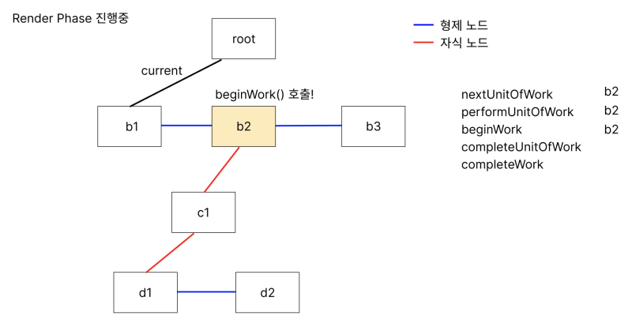 
<br/>

nextUnitOfWork는 그냥 변수이다. 이터레이터에서 next()하면 넘어가던것처럼 그냥 다음 탐색 노드 집어넣는다고 생각하면 된다.
일단 여기서 complete할 수 있을까? 당연히 없다. 왜냐? 우리는 가장 기본적인 DOM element를 얻어야 하기 때문이다. (헷갈리다면 글 시작 부분에서 이야기했던 내용을 다시 보자.) 자식 노드로 내려간다.

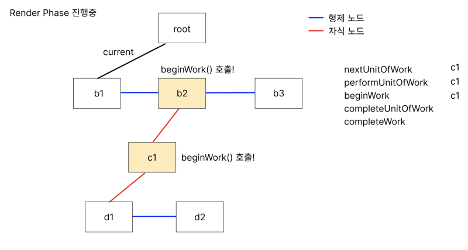 
<br/>

여기서도 complete 할 수 없다. 한번 더 자식으로 내려간다.
여기서는 더이상 자식이 없다! 따라서 기본적인 DOM Element를 얻을 수 있고, complete할 수 있다.

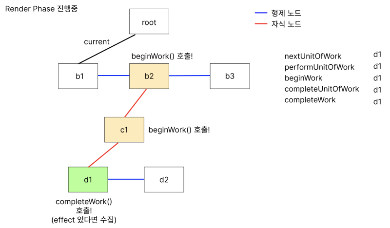 
<br/>

이 다음도 동일하다.
d2도 자식이 없기 때문에 completeWork()를 호출할 수 있다.

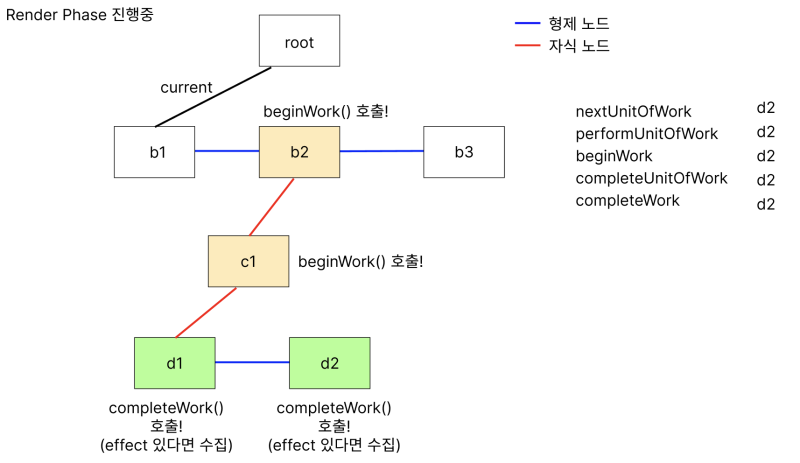 
<br/>

그런데 만약 d2가 메모이제이션된 컴포넌트라면?

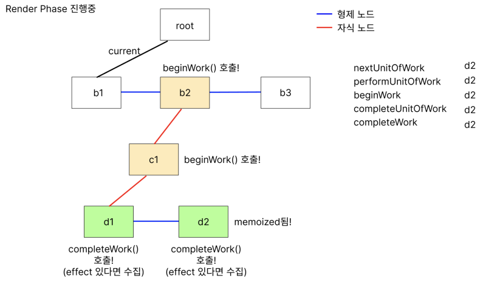 
<br/>

이렇게 memoization된 컴포넌트라면 React가 비교 후 판단하여 새로운 Component를 부를지 말지를 결정하게 된다.
비교 결과가 true이면 기존에 만들었던 fiber를 그대로 사용하게 되는 것이다.

아무튼, 이렇게 기본적인 DOM Element들을 얻어냈으니? 자연스럽게 부모 노드인 c1도 completeWork()를 호출할 수 있다.

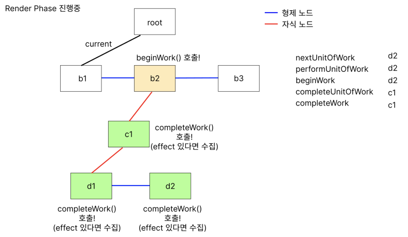 
<br/>

b2 부모 노드도 마찬가지이다.

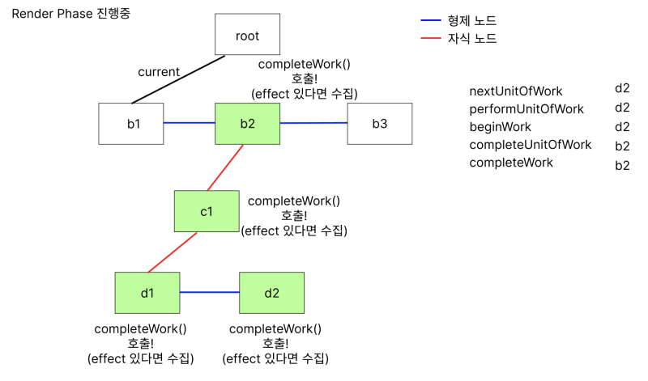 
<br/>

gif로도 정리해보았다!

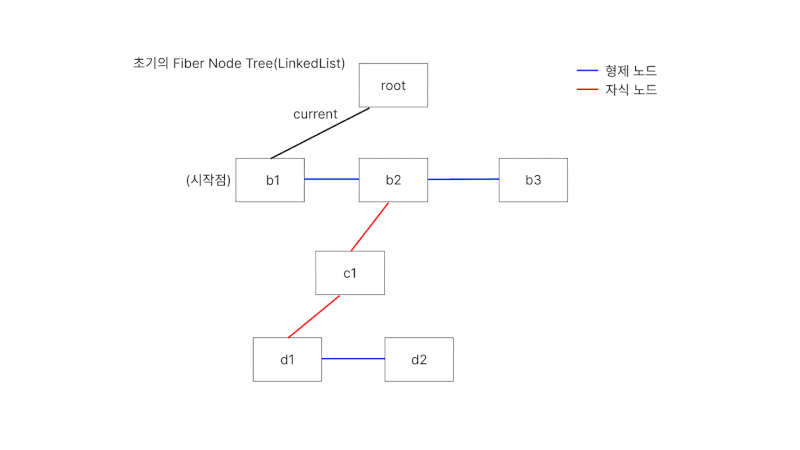 
<br/>

<hr/>

### 6. Fiber Reconcilation - Commit Phase

이제 render phase가 끝났으니 commit phase만 남는다!

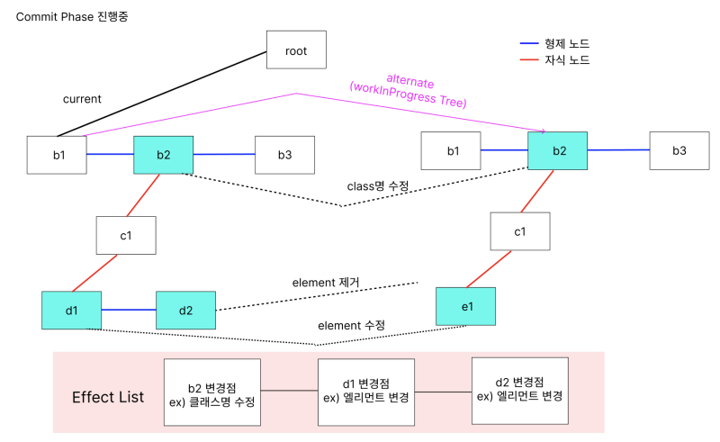 
<br/>

위와 같이 alternate의 레퍼런스를 우리의 workInProgress로 옮겨주고, Render Phase에서 모았던 Effect들을 하나씩 반영을 하게 된다.
effect를 반영하는 실제 코드는 [이 링크](https://github.com/facebook/react/blob/9198a5cec0936a21a5ba194a22fcbac03eba5d1d/packages/react-dom/src/client/DOMPropertyOperations.js#L156-L158)에 있다.
이후에는 아래와 같이 root의 current 레퍼런스를 기존의 alternate(workInProgress)쪽으로 옮겨주면 commit phase의 과정이 모두 끝난다.

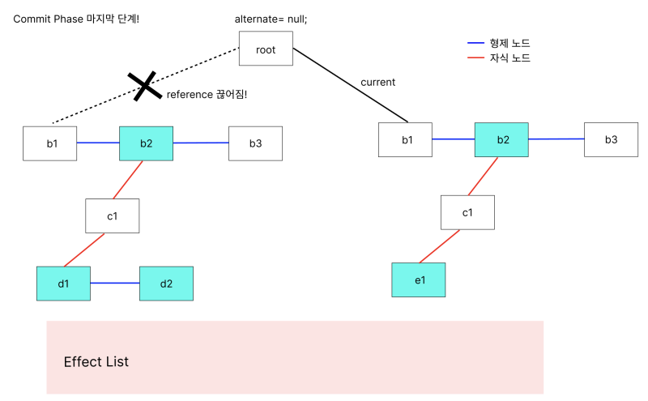 
<br/>

여기까지 fiber알고리즘의 모든 과정이 끝이 났다!

최종적인 구조는 아래와 같을 것이다.

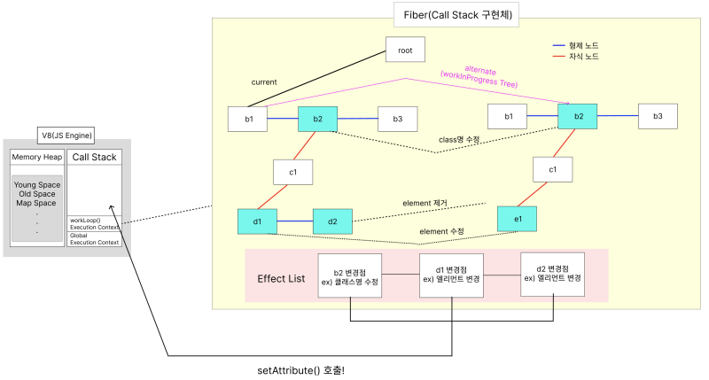 
<br/>

<hr/>

### 7. 느낀점

확실히 공부하기 쉽지 않았다. 공부를 해서 정리하긴 했지만 아직 완벽하게 이해하지 못했다고 생각되는 부분들이 꽤 보여 작성하지 못한 부분이 많다. 차차 공부해나가면서 글을 보충해나갈 계획이다.

공부하며 당황스러웠던 부분이 있었는데, 알면 알아갈수록 점차 내가 알고 있던 "Virtual DOM"이라는 개념이 너무나도 흔들렸던 점이다.
reconcilation을 위한 fiber tree의 존재에 대해 알게되고, "내가 지금까지 알고있던 ReactElement를 과연 VirtualDOM이라 이야기할 수 있는건가?" 라는 생각이 계속해서 들었다.
그러다 Naver D2에 Fiber 아키텍처를 분석한 글이 있길래 이를 읽던 중 내가 하던 고민과 똑같은 이야기가 쓰여있던 것을 확인할 수 있었다.

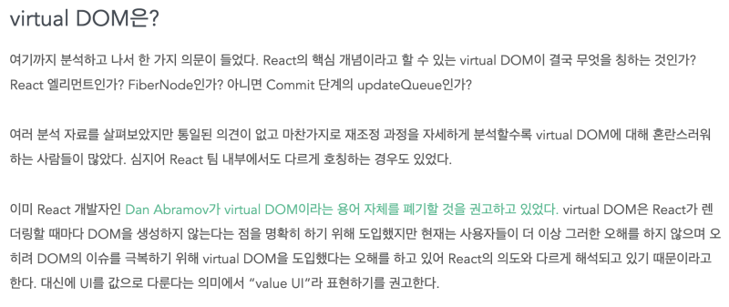 
<br/>

virtual DOM이라는 단어는 리액트 초창기에 "리액트는 렌더링할떄마다 DOM 안생성해요~!" 라고 이야기할라고 **"용어"** 를 도입한건데, 지금에 와서는 DOM이슈 극복할라고 "Vitrual DOM"이라는걸 만들었다는 것처럼 오해되고 있다는 이야기였다.

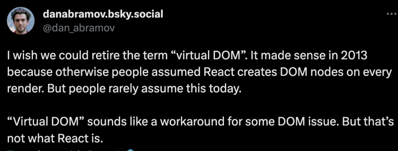 
<br/>

그래서 뭔가 찝찝하긴 한데 Dan abramov선생님이 그러니깐... **"valueUI"** ... 전혀 입에 붙지 않은다😇 차차 노력해봐야겠다.

<hr/>

<i style="font-size:0.7rem; text-align:right">

참고
https://github.com/acdlite/react-fiber-architecture
https://www.youtube.com/watch?v=ZCuYPiUIONs
https://legacy.reactjs.org/blog/2015/12/18/react-components-elements-and-instances.html#elements-describe-the-tree
https://indepth.dev/posts/1008/inside-fiber-in-depth-overview-of-the-new-reconciliation-algorithm-in-react
https://medium.com/react-in-depth/inside-fiber-in-depth-overview-of-the-new-reconciliation-algorithm-in-react-e1c04700ef6e
https://blog.mathpresso.com/react-deep-dive-fiber-88860f6edbd0
https://blog.logrocket.com/deep-dive-react-fiber/
https://d2.naver.com/helloworld/2690975
https://segmentfault.com/a/1190000040445026/en

</i>

[](https://hits.seeyoufarm.com)
