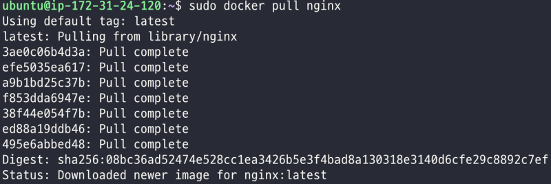
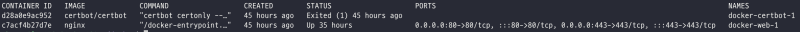
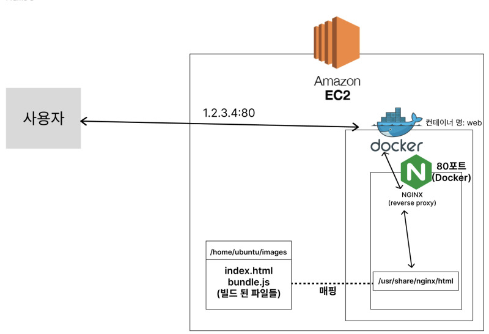
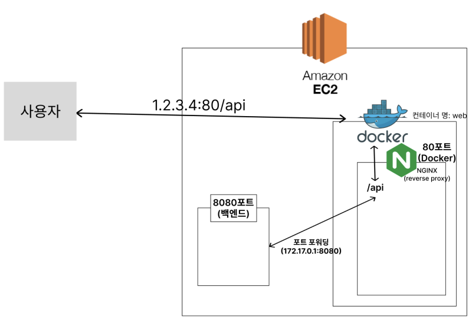

[](https://hits.seeyoufarm.com)

최근 우테코에서 팀 프로젝트를 진행하며 프론트엔드 배포 환경을 구축해보았다.

팀당 EC2가 3대씩 주어지는 상황으로(public 두 대, private 한 대), 백엔드 팀원들과 합의 하에 CI/CD를 담당할 Jenkins, 백엔드 + 프론트엔드, DB 이렇게 EC2 각 3대를 할당했다.

그래서 우선 ec2 한 대에 nginx를 깔아두고 막 이것저것 설정해두고 했었는데, 하다보니 보기에 아주 어지러웠다.
어떤 파일은 /etc/nginx/conf.d/nginx.conf에, 어떤 파일은 /etc/nginx/sites-available/default에, 서빙해줄 파일들은 /var/www/html에 있고 로그들이 들어가있는 파일은 또 다른 경로에 있었다.
Nginx를 설치하니 이 못된 Nginx는 필요한 파일들을 여기저기 흩뿌리고 다니니, **이런 경로들을 하나하나 찾아서 막 수정해주려니 아주 어지러웠다.**

그래서 EC2의 Docker에 Nginx를 올렸다. 이후 Docker 컨테이너에 올라간 Nginx를 Reverse Proxy로 사용하여 React의 빌드 파일을 서빙해주도록 하였다.
이 구조를 구성하기 위해 nginx와 docker를 세팅해보자! (구조 그림은 제일 아래에 있다.)

<hr/>

### 1. Docker 설치

먼저 Docker부터 설치해주자.
apt package의 index부터 업데이트해주고 아래 패키지들을 설치해주자.

```bash
sudo apt-get update
sudo apt-get install \
    ca-certificates \
    curl \
    gnupg \
    lsb-release
```

Docker의 GPG키도 등록해야 한다.

```bash
curl -fsSL https://download.docker.com/linux/ubuntu/gpg | sudo gpg --dearmor -o /usr/share/keyrings/docker-archive-keyring.gpg
```

Docker를 Ubuntu 운영 체제에 설치하기 위해 필요한 GPG(GNU Privacy Guard) 키를 다운로드한 뒤, 특정 경로에 저장하는 명령어이다.

Docker를 Ubuntu 운영 체제에 설치하기 위해서는 Docker의 APT 저장소도 추가해야 한다.
아래 명령어를 쳐 주자.

```bash
echo \
    "deb [arch=amd64 signed-by=/usr/share/keyrings/docker-archive-keyring.gpg] https://download.docker.com/linux/ubuntu \
    $(lsb_release -cs) stable" | sudo tee /etc/apt/sources.list.d/docker.list > /dev/null
```

`sudo tee /etc/apt/sources.list.d/docker.list > /dev/null` 부분이 Docker 저장소 정보를 `/etc/apt/sources.list.d/docker.list` 파일에 덮어쓰는 명령어인데, `sources.list.d/` 가 npm 의 package.json같은 거라고 생각하면 편할 것 같다.

여기까지 했다면 이제 docker를 설치하자.

```bash
sudo apt-get update
sudo apt-get install docker-ce docker-ce-cli containerd.io
docker --version
```

이렇게 확인해보면 아래와 같이 버전이 뜨는걸 확인할 수 있다.

```bash
Docker version 20.10.24, build 297e128
```

<hr/>

### 2. Docker Compose 설치

도커를 사용하기 전에, 도커에 여러 컨테이너를 올려 사용하려면 Compose가 있어야 한다.
아래와 같이 설치해주자.

```bash
sudo apt-get update
sudo apt-get install docker-compose-plugin
docker compose version
```

버전을 확인하면 아래와 같이 뜨는걸 확인할 수 있다.

```bash
Docker Compose version v2.17.2
```

<hr/>

### 3. Nginx 이미지 pull

여기까지 다 되었다면 nginx 이미지를 pull 해야한다.

```bash
sudo docker pull nginx
```

 
<br/>

잘 되었는지는 아래와 같이 확인할 수 있다.

```bash
docker images
```

<hr/>

### 4. Docker-Compose.yml 작성

이제 docker compose 파일을 작성해주자.
먼저 아래와 같이 작성하고 차차 설명하겠다.

```bash
version: "3"
services:
  web:
    image: nginx
    restart: always
    ports:
      - 80:80
      - 443:443
    volumes:
      - ./nginx.conf:/etc/nginx/conf.d/default.conf
      - /home/ubuntu/frontend:/usr/share/nginx/html
      - /home/ubuntu/images:/usr/share/nginx/html/img
```

우선 "service" 부분은 컨테이너를 정의하는 부분이다.

그 안에 web이라는 부분은 컨테이너의 이름을 web이라고 정한 것이다.

image 부분은 컨테이너에서 사용할 이미지를 지정하는 부분이다. nginx를 사용한다는 이야기이다.

restart:always는 컨테이너 종료 시 재시작에 관한 설정이다.
예를 들자면, "web" 컨테이너(서비스) 가 잘 돌다가 갑자기 문제가 발생하여 컨테이너가 강제종료되었다고 해보자. 이 때 다시 실행할 것인지에 대한 설정이다. always이기 때문에 컨테이너가 갑자기 종료됨을 감지하면 자동으로 컨테이너를 다시 시작하도록 한다.

ports 부분은 ec2와 컨테이너의 포트를 매핑하는 부분에 대한 설정이다.
만약 public IP가 1.2.3.4인 ec2에 http 요청이 온다면 80번 포트로 요청이 올 것이고, 이를 도커가 잡아서 docker내 web 컨테이너의 80번 포트로 매핑해주는 것이다.
왼쪽이 내 로컬, 오른쪽이 도커 컨테이너의 포트이다. 이 때 왼쪽 포트가 충돌이 나면 안되기에, 동일한 호스트 포트에 여러 개의 컨테이너를 바인딩할 수 없도록 보호되어있다.

volumes 설정 부분은 컨테이너와 우리 ec2(호스트) 간의 파일 시스템을 공유하는 방법을 지정하는 속성이다.

`/home/ubuntu/frontend:/usr/share/nginx/html` 와 같은 경우 우리 ec2의 `~/frontend`경로와 도커 내 `/usr/share/nginx/html` 경로가 매핑되어 있는것인데, `/usr/share/nginx/html` 경로는 nginx가 html을 서빙해주는 경로이다. 이는 수정할 수 있는데, 이건 이따 nginx.conf에서 추가로 작성할 수 있다.

`- ./nginx.conf:/etc/nginx/conf.d/default.conf` 부분의 경우, 곧 작성할 `nginx.conf` 파일을 도커 컨테이너의 `/etc/nginx/conf.d/default.conf`에 매핑하는 코드이다.

도커 위에 nginx를 올린 이유인 "nginx가 속성 파일들 여기저기 흩뿌리고 다녀서" 를 한번에 해결할 수 있는 코드이다.
nginx.conf는 아래에서 알아보자.

<hr/>

### 5. Nginx.conf 작성

이제 Docker 컨테이너 내부 nginx 속성을 지정해줄 nginx.conf 파일을 작성해주자.

그냥 nginx 설정할 때 /etc/nginx/conf.d/nginx.conf에 쓰던 것 처럼 작성해주면 된다.

```nginx
server {
  listen 80;

  location / {
    root /usr/share/nginx/html/;
    include /etc/nginx/mime.types;
    try_files $uri $uri/ /index.html;
  }
  location /api {
    rewrite ^/api(.*) $1 break;
    proxy_pass http://172.17.0.1:8080;
    proxy_set_header Host $host;
    proxy_set_header X-Real-IP $remote_addr;
  }
  location /img {
    alias /usr/share/nginx/html/img;
    try_files $uri $uri.png $uri.jpg $uri.jpeg =404;
  }
}
```

똑같이 "80포트로 왔을때 여기에서 캐치함" 인 `listen 80;` 을 작성해두고, 어떤 경로로 왔을 때 어떤 동작을 해줄지에 대한 코드들을 작성해준다.
`location /` 등과 같이 써주면 된다.
여기서 써주는 경로들은 우리가 아까 작성했던 docker-compose.yml 파일에서 매핑했던 그 경로를 작성하면 된다.

딱 하나 주의할 점이 있는데, location /api 부분처럼 포트 포워딩이 필요한 부분이라면 proxy_pass 부분에 ec2의 public URL을 적는 것이 아닌 `"172.17.0.1:포트;"`와 같이 작성 해 주어야 한다.
`172.17.0.1`은 도커의 기본 네트워크 브리지의 게이트웨이 주소로, 우리 도커 호스트(ec2)와 연결된 브리지에 할당된 주소이다.
따라서 저렇게 포트 포워딩 해줘야 한다.

이렇게 작성해주고 나면 모든 설정이 끝났다!

<hr/>

### 6. 도커 컨테이너 실행

이제 도커 컨테이너를 실행할 수 있다!

아래 명령어를 쳐서 실행해보자.

```bash
sudo docker compose up -d
```

컨테이너들을 보려면 아래와 같이 치면 된다. 여기서 컨테이너의 아이디들을 확인할 수 있다.

```bash
sudo docker ps # running 상태만 보여줌
sudo docker ps -a # exited, created 상태의 컨테이너도 같이 보여줌
```

 
<br/>

위와 같이 말이다.

컨테이너들을 내리려면 아래와 같이 하면 된다.

```bash
sudo docker rm -f {컨테이너ID}
```

최종적으로는 아래와 같은 구조도가 나온다!

|  |  |
| ---------------------------------------------------- | ---------------------------------------------------- |
