최근 우테코에서 미션을 진행하며 TypeScript + React를 사용하고 있다.

자주 사용하다보니 타입스크립트 컴파일러의 동작 방식이 궁금해졌다.

"tsc" 라는 명령어를 사용해 .ts파일에서 .js파일이 만들어지는 전반적인 과정을 한번 정리해 보려고 한다.

간단하게 컴파일 과정에 대해 요약하자면 아래와 같은 순서로 이루어진다.

> 1.  tsconfig.json 파일 읽기
> 2.  PreProcess 과정 (import 된 파일들 다 읽어오기)
> 3.  Parse (타입스크립트 파일 AST로 변환)
> 4.  Binder (타입스크립트 AST 기반으로 symbol table 생성, flow node 데이터 생성)
> 5.  Checker (AST, Symbol Table 이용하여 타입 체킹(binder에서 생성) )
> 6.  Transform & Emit (타입스크립트 AST 재변환 후 결과 파일 반환)

### 1. tsconfig.json 파일 읽기

먼저, 타입스크립트 컴파일러는 tsconfig.json 파일을 읽는다. ts -> js로 어떻게 변환할지를 지정하는 설정파일이기에 어찌보면 제일 먼저 읽는건 당연하다. 아래 파일처럼 타입스크립트로 만들어진 프로젝트에 있는 tsconfig.json을 말하는 것이다.

```ts
{
  "compilerOptions": {
    "target": "es5",
    "lib": [
      "dom",
      "dom.iterable",
      "esnext"
    ],
    "allowJs": true,
    "skipLibCheck": true,
    "esModuleInterop": true,
    "allowSyntheticDefaultImports": true,
    "strict": true,
    "forceConsistentCasingInFileNames": true,
    "noFallthroughCasesInSwitch": true,
    "module": "esnext",
    "moduleResolution": "node",
    "resolveJsonModule": true,
    "isolatedModules": true,
    "noEmit": true,
    "jsx": "react-jsx"
  },
  "include": [
    "src"
  ]
}
```

### 2. PreProcess 과정

root가 되는 파일부터 시작해 import, export 로 연결되어있는 모든 파일들을 찾아내는 과정이다.

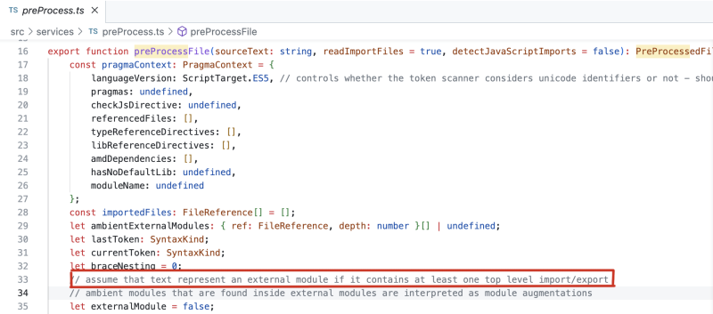 
<br/>

위 사진은 실제 Microsoft의 TypeScript 오픈소스 코드이다.

코드 안에 import/export 라는 텍스트가 들어있으면, 이 텍스트는 무조건 '외부 모듈' 이라고 나타낸다는 말이 주석으로 쓰여있다.

(https://github.com/microsoft/TypeScript/blob/main/src/services/preProcess.ts#L33)

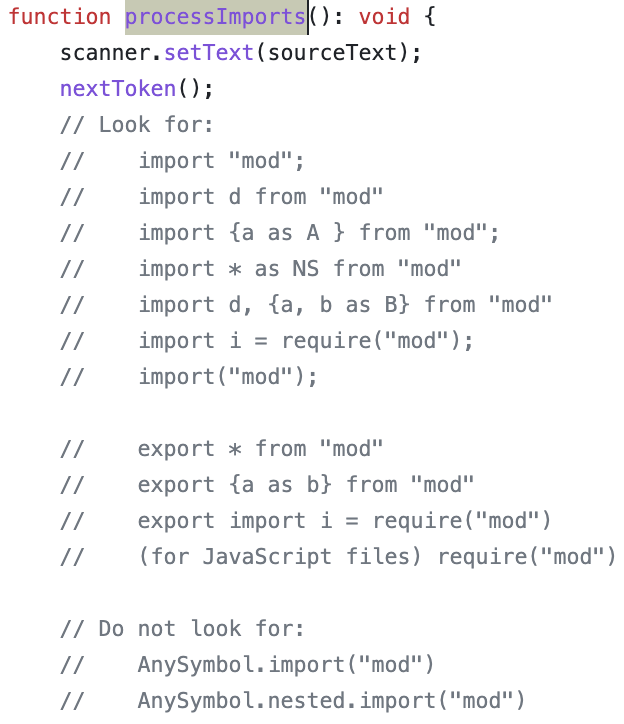 
<br/>

코드 밑부분도 추가로 살펴보면, 이런 것들을 찾는단다.
이렇게 찾아낸 파일들은 아래와 같은 방식으로 내보낸다.

```ts
return {
  referencedFiles: pragmaContext.referencedFiles,
  typeReferenceDirectives: pragmaContext.typeReferenceDirectives,
  libReferenceDirectives: pragmaContext.libReferenceDirectives,
  importedFiles,
  isLibFile: !!pragmaContext.hasNoDefaultLib,
  ambientExternalModules: ambientModuleNames,
}
```

참고로 아직 js로 변환된 코드를 다루는 것이 아니니 ts파일로 처리하는 것이다.
이렇게 root가 되는 파일과 엮여있는 모든 파일들을 찾는 과정이 끝났으면, 이제 Parse 과정이 시작된다!

<hr/>

### 3. Parse 과정

포스팅하면서 정말 오랜만에 쓰는 단어이다.
수많은 타입스크립트 파일들을 AST(Abstract Syntax Tree)로 만드는 과정이다.
AST에 대해 간단하게만 설명하자면, 우리가 쓴 소스코드를 문법에 맞게 노드들로 쪼개서 만든 트리이다.

아래와 같은 코드가 있다고 하고, 예시를 한 번 들어보겠다.

```ts
const example: number = 123
function exampleFunction(num: number) {
  console.log(num)
}
exampleFunction()
```

위와 같은 코드를 읽는다 했을 때, 우리는 이 코드를 크게 3개의 구문으로 분할할 수 있다.

1. const exmaple:number = 123;
2. function exampleFunction(){ console.log('hello!'); }
3. exampleFunction();

그리고 이 구문들을 하나하나 분해하기 시작할 것이다. 위 예시중 1번만 한 번 확인해보자.
const example:number = 123; 을 아래와 같이 분해하는 것이다.

> 1.  const
> 2.  example
> 3.  :
> 4.  number
> 5.  =
> 6.  123

이렇게 만드는 작업을 Scanner라는 게 한다. (사실상 v8과 동일하다. 다른점이라면 스캐너 코드가 ts라는거 정도...?)

아래는 실제 scanner 코드이다.

| 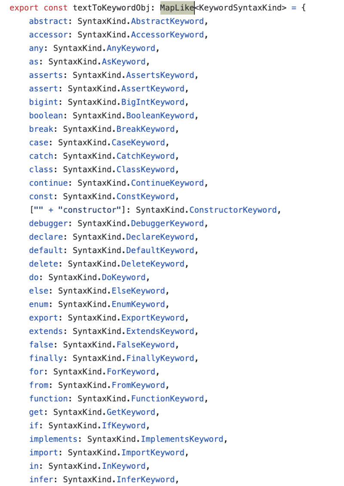 | 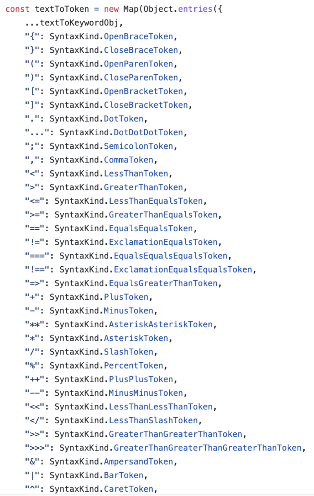 |
| ---------------------------------------- | ---------------------------------------- |

https://github.com/microsoft/TypeScript/blob/main/src/compiler/scanner.ts

이렇게 분해해 확인한 각각의 코드들은 토큰화된다.

토큰의 종류는 아래와 같다.

1. Const Keyword
2. WhitespaceTrivia
3. Identifier
4. ColonToken
5. WhitespaceTrivia
6. StringKeyword
7. WhitespaceTrivia
8. EqualToken
9. WhitespaceTrivia
10. StringLiteral

아까 위에서 작성했던 코드인 **const example:number = 123;** 코드는 아래와 같이 토큰화된다.

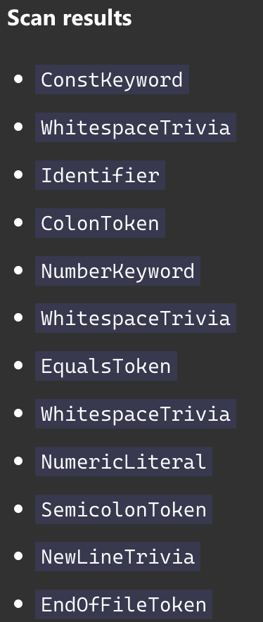 
<br/>

모두 보면 정신이 나가버릴 수도 있으니 그만 넘어가자.

이렇게 만든 토큰들을 이용해 최종적으로는 아래와 같이 변환되며, 이를 AST(Abstract Syntax Tree) 라고 한다!

| 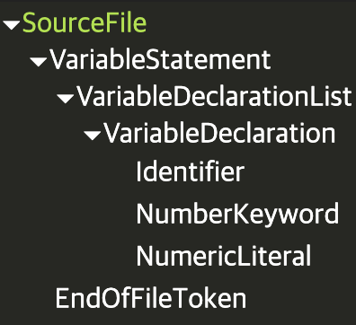 | 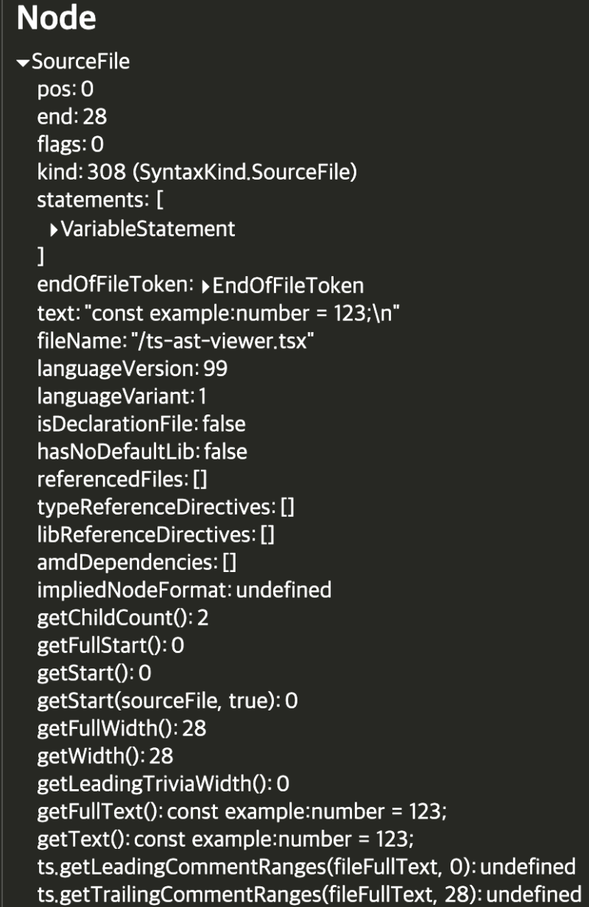 |
| ---------------------------------------- | ---------------------------------------- |

[링크](https://ts-ast-viewer.com/#code/MYewdgzgLgBApgDwIYFsAOAbOAuMBXFAIzgCcYBeGARgCYBmAbgCgg)

여기까지의 과정은 사실상 V8엔진이랑 큰 차이가 없다.

이 Parse 과정에서 나는 오류들이 바로 "SyntaxError" 타입의 오류인 것이다.

<hr/>

### 4. Binder 과정

이제부터 타입 체킹 과정이 시작된다. 그런데 생각해보자. 타입 체킹을 위해 우리가 위에서 만들었던 모든 파일들의 AST를 순회하며 타입 체킹을 하는게 과연 옳을까? AST에서 한 노드를 타입체킹하려면 부모 노드를 확인하고 부모 노드의 부모 노드도 확인하고... 를 반복해야 한다.
그렇게 되면 너무나도 비용이 커질 것이다. 타입 체킹이 필요한 부분만 추려 검사하는게 당연히 효율적일 것이다.
타입 검사를 위한 준비과정이 바로 Binder 과정인데, 우리가 위에서 만들었던 모든 파일들의 신택스 트리들(AST들)을 이용하여 타입을 분석하기 위한 계층 구조를 만드는 과정이다.

이 binder 과정에는 크게 네 가지 책임이 존재한다.

1. 어디에 어떤 식별자가 존재하는지 심볼 테이블을 만들기
2. 타입 내로잉을 위한 flow node 만들기
3. Syntax tree의 각 노드에 부모 노드 설정하기
4. script vs module 적합성 검사

위 4가지를 한 뒤 최종적으로는 Symbol Table이라는걸 구성하게 된다.

그렇다면 Symbol이라는 걸 만드는 방법에 대해 알아보자!

<hr/>

#### 4-1. Symbol Table

우선 아래는 예시 코드이다.

```ts
// 출처: tsconf 2021 (https://www.youtube.com/watch?v=X8k_4tZ16qU)

const msg: string = "Hello, world"
welcome(msg)

function welcome(str: string) {
  console.log(str)
}
```

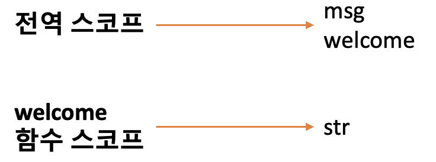 
<br/>

우선 위 코드에서 보면 알 수 있겠지만, 변수 이름 msg와 welcome함수 호출에 대한 코드는 전역 스코프 부분에 위치한다.
그리고 매개변수 str은 함수 스코프에 위치하는 걸 확인할 수 있다.

binder는 이들을 순회하며 어디에 어떤 identifier가 있는지를 확인한다. (example, welcome, str, console, log같은걸 모두 identifier라고 보면 된다.)
가장 먼저 만나게 되는 identifier는 "msg" 변수이다.
"msg"변수는 0번째 줄에 const로 선언되어 있는 변수기에, 선언된 줄(인덱스)과 "BlockScopedVariable"를 아래와 같이 기록해둔다.

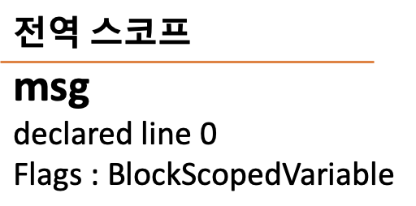 
<br/>

그 다음으로는 welcome(msg) 라는 코드를 만나는데, 일단 "welcome" 이라는 identifier는 정의되지 않은 식별자로서 호출되었기에 일단 다음 줄로 넘어간다.

이후에 welcome 함수에 대한 정의가 발견된다!
welcome은 3번째 줄에 선언된 함수임을 알았으니 msg 변수처럼 3번째 줄에 선언되었음과 flag에 "Function"을 기록해둔다.

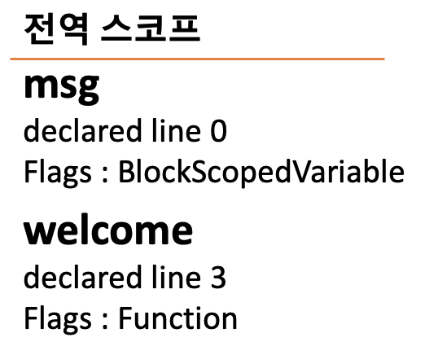 
<br/>

이제 welcome 함수 내부를 확인한다.
우선 welcome 함수의 부모 스코프는 Global에서 호출했으니 당연히 Global로 가게 될 것이다. 우선 이를 기록해둔다.
그리고 매개변수 str도 만나게 될 것이다.
이 또한 변수이므로 아래와 같이 함께 기록해둔다.

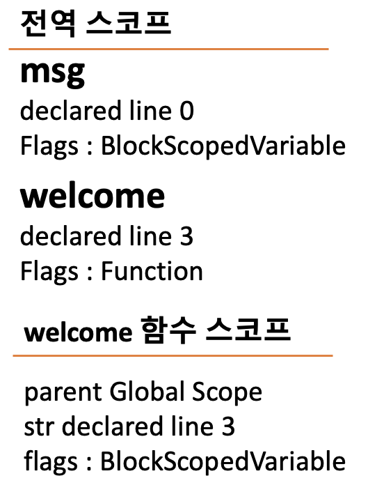 
<br/>
<br/>

이렇게 만든 데이터들을 각각 **"Symbol"** 이라 부르는데, 이 Symbol들을 묶어 Symbol Table들을 만드는 것이다.

| 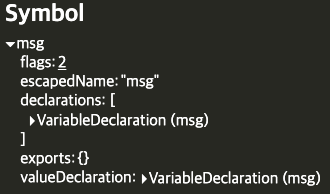 | 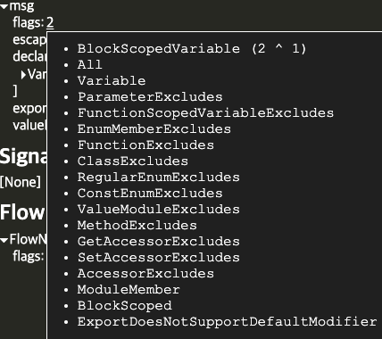 |
| ------------------------------------------ | ------------------------------------------ |

이게 나중에 AST에 들어가게 되는 최종적인 Symbol이다.

<hr/>

#### 4-2. Flow node, Flow Container

binder과정에서는 flow node와 flow container라는 개념이 존재한다.
바로 타입 내로잉을 위해 존재하는 개념이다!

```ts
// 출처: tsconf 2021 (https://www.youtube.com/watch?v=X8k_4tZ16qU)

function logValue(a: string | number) {
  if (typeof a === "string") {
    return a
  } else {
    return a
  }
  return a
}
```

위와 같은 코드가 있다고 쳐보자.

당장 우리는 저 코드를 보면 어떤 상황에서의 x가 어떤 타입을 갖게 될 지 알 수 있겠지만, 컴퓨터는 그렇지 못하다.
**typeof x === "string"** 같은 코드를 우리는 **"flow condition"** 이라고 부르며, 이런 플로우들을 검사하는 스코프?(위치..?) 자체를 **"flow container"** 라고 부른다.
따라서 타입스크립트는 가장 깊이 있는 x 부분에서 함수의 윗부분으로 올라가며 타입을 확정짓는 방식으로 동작한다.
위 코드와 함께 아래 그래프를 보자.

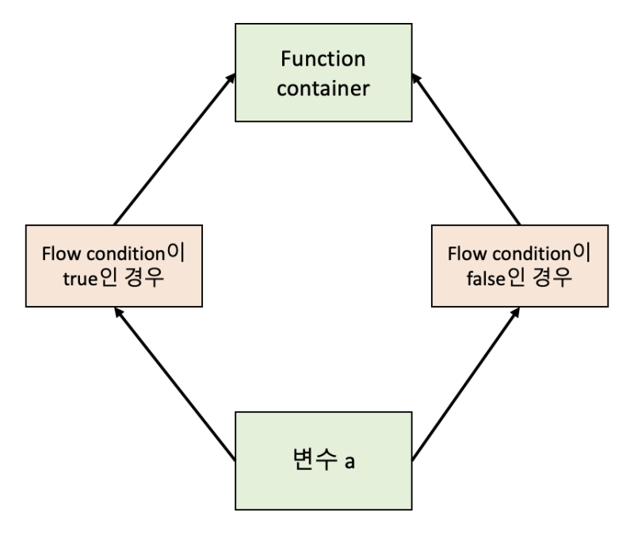 
<br/>

보면 flow condition이 true인 경우와 false인 경우 둘로 나뉘어 flow container가 두 개 생긴 것을 확인할 수 있다.
이 **컨테이너 내부에**서 변수 a가 어떤 타입인지 기억하게 되는 것이다.
위 코드를 예제로, 타입스크립트는 변수 a가 어떤 타입인지 bottom-up 방식으로 알게 된다.
flow container 내부에서 flow condition을 만나는 게 아니면 flow container의 시작 지점에서의 선언된 방식을 확인하는 것이다.

<hr/>

#### 4-3. binder 과정에서 걸러낼 수 있는 오류?

지금까지의 binder 과정을 보면 알 수 있겠지만, 전체적인 syntax tree를 맞춰가는 과정이 많았다.
따라서 이 과정에서는 AST를 기준으로 있을 수 있는 문제를 걸러낼 수 있는 것이다.
대표적으로는 아래와 같이 strict mode에 의한 부분이나, identifier 중복에 대한 문제가 있다.

```ts
const a = 123;
delete a; // strict mode 때문

const abc = 123;
const abc = 123; // 변수명 중복

class A = {};
type A = {}; // identifier 중복
```

<hr/>

### 5. Checker 과정

드디어 타입 체킹을 하는 과정이다.
이번에도 소스코드를 조금 뜯어볼 수 있으면 뜯어보고자 했으나, 볼 수도 없을 정도라 엄두가 안나더라.

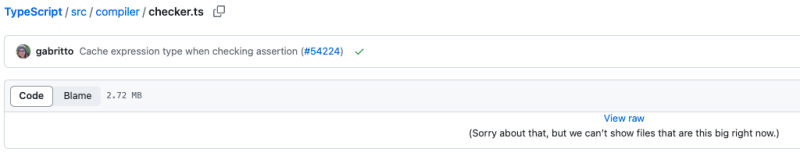 
<br/>

Checker 과정의 경우 AST와 우리가 위에서 만들었던 Symbol Table을 이용하여 타입 검사를 한다.
아래와 같은 경우는 구조적 타이핑에 맞게 검사가 이루어진다.

```ts
{name: string} = {name: 123}
```

먼저 값이 object 형태인지, 필드값이 옳은지, 값의 타입이 일치하는지 순서대로 비교하는 방식을 구조적 타이핑이라고 한다.
타입이 일치하는지에 대한 비교할 때, 타입에 대한 정의는 아래에 모두 정의되어있다!
https://github.com/microsoft/TypeScript/blob/main/src/compiler/types.ts

위와 같은 케이스 말고 문맥상 타이핑에 맞게 검사가 이루어지는 경우도 있다.

```ts
type Adder = {
  inc(n: number): number
}

const adder: Adder = {
  inc(n) {
    return n + 1
  },
}
```

타입의 결정이 문맥에 맞게 이루어 진다는 것이다.
위에 4번에서 이야기했던대로, 타입스크립트는 n의 타입을 찾아나갈 것이다.
파라미터에서 타입을 찾으려 했지만 타입을 찾지 못했고 그 상위로 가 Adder라는 타입을 발견하게 된다.
이후 Adder에 inc라는 필드값이 있는지 확인한 뒤, number 타입을 얻어가는 것이다.
이를 보면 알 수 있지만, 타입스크립트에서는 타입을 찾지 못한다면 AST를 타고타고 계속 올라가게 될 것이다.
만약 여기서 찾지 못한다면 오류를 내게 되는 것이다!

<hr/>

### 6. Transform & Emit 과정

타입스크립트 코드를 자바스크립트 코드로 바꾸기 위해 가장 먼저 해야 할 일은 바로 AST를 변경하는 것이다.
타입스크립트의 AST를 갖고 있으니 자바스크립트의 AST 형태로 변환하는 것이다. (사실상 원래 있던 AST에서 타입에 대한 정보를 제거한다고 보면 된다.)
그 외로 코드에 플래그를 하나씩 집어넣는데, 바로 어떤 형태의 문법인지를 기입해둔다. 이 동작은 "treefacts" 라는 것이 진행한다.

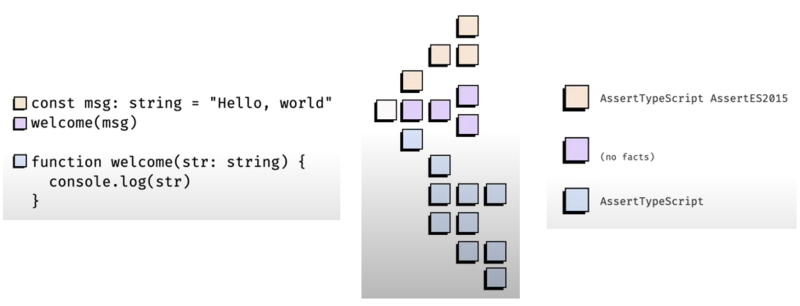 
<br/>

위와 같이 어떤 몇버전의 문법인지를 기록해두는 것인데, transform 과정을 진행하는 transformer는 맨 처음 tsconfig.json에서 읽었던 대로 target 속성에 들어간 값에 따라 treefacts 를 거친 저 결과물을 AST로 변환하게 되는 것이다.

이 AST는 Emit과정을 통해 최종적인 js 파일, .d.ts파일 혹은 .map 파일의 형태로 반환되는 것이다!
Emit을 하는 과정에 대한 코드는 아래에 있다.
https://github.com/microsoft/TypeScript/blob/main/src/compiler/emitter.ts

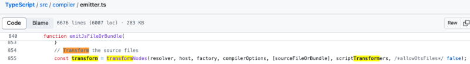 
<br/>

보면 emitter 파일에서 transformNodes를 불러와 transform 과정을 거친 뒤 바로 emit을 진행하는 걸 확인할 수 있다.

이렇게 타입스크립트의 모든 컴파일 과정이 끝난다.

**(번외)** 3번의 Parser 코드 뜯어보다 새롭게 알게 된 내용이 하나 있는데, ts Scanner와 Parser의 코드에서는 var 변수를 정말 많이 선언하길래 '왜지...?' 생각했는데, 바로 이유를 찾았다 ㅋㅋㅋ
https://github.com/microsoft/TypeScript/issues/52924

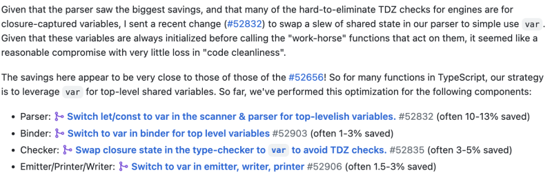 
<br/>

let이나 const를 쓰게 되면 TDZ 검사로 인해 성능이 떨어지기 때문이란다.😅 개인적으로는 이런 이유로 var을 쓸 수 있구나 하면서 감탄했다.

<hr/>

<i style="font-size:0.7rem; text-align:right">

참고
https://www.youtube.com/watch?v=X8k_4tZ16qU
https://github.com/microsoft/TypeScript/tree/main
https://basarat.gitbook.io/typescript/overview

</i>

[](https://hits.seeyoufarm.com)
